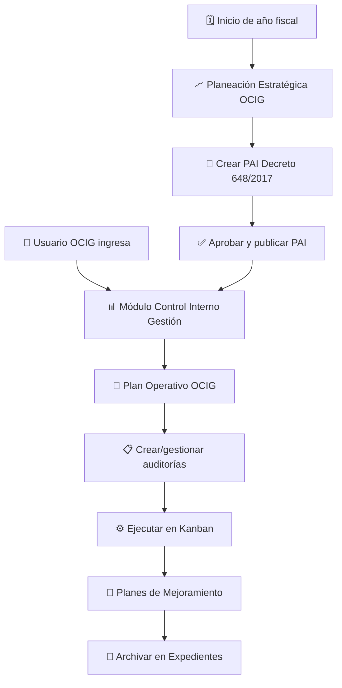

# Priorización del Plan Operativo OCIG

## Fecha: 31 Enero 2026

---

## 🎯 OBJETIVO DE LA REORGANIZACIÓN

Se ha completado la **reorganización del flujo de trabajo** para establecer claramente que:

✅ **El PLAN OPERATIVO es LO PRIMERO** - El módulo principal de trabajo diario  
📋 **El Plan Estratégico (PAI) es COMPLEMENTARIO** - Planificación anual estratégica

---

## 📊 NUEVA JERARQUÍA DE TRABAJO OCIG

### 1️⃣ PLAN OPERATIVO OCIG (PRINCIPAL - LO PRIMERO)

**Ubicación:** `/components/esap/control-interno/` → Módulo "Control Interno Gestión"

**Ruta de acceso:** Backoffice → Control Interno Gestión → Plan Operativo OCIG

**🎯 Propósito:**
- Este es el **módulo principal** donde se trabaja día a día
- Gestión operativa de auditorías individuales
- Planificación, ejecución y seguimiento de auditorías del año en curso

**✨ Funcionalidades clave:**
1. **Universo Auditable** - DÓNDE se puede auditar
2. **Plan Operativo** - QUÉ procesos se auditarán
3. **Programa Anual** - CUÁNDO auditar (calendario)
4. **Listas de Chequeo** - Requisitos y cumplimiento
5. **Ejecución de Auditorías** - Proceso completo (Kanban)
6. **Planes de Mejoramiento** - Hallazgos y acciones
7. **Expedientes** - Archivo documental

**🔄 Flujo principal:**
```
PLANEAR → EJECUTAR → INFORMAR → MEJORAR
```

**👥 Usuarios principales:**
- Jefe OCI
- Auditores Líderes
- Auditores Internos
- Personal OCIG (uso diario)

---

### 2️⃣ PLANEACIÓN ESTRATÉGICA OCIG (COMPLEMENTARIO)

**Ubicación:** `/components/esap/control-interno-gestion/` → Módulo independiente

**Ruta de acceso:** URL directa: `?view=planeacion-estrategica-ocig`

**🎯 Propósito:**
- Módulo **complementario** para planificación anual estratégica
- Plan Anual de Auditoría Interna (PAI) según Decreto 648/2017
- Documento oficial para entes de control

**✨ Funcionalidades clave:**
1. **Wizard PAI** - Creación del Plan Anual (6 pasos)
2. **Universo Auditable Institucional** - Multi-anual
3. **Evaluación de Riesgos** - Matriz de riesgos estratégicos
4. **Recursos OCI** - Equipo humano y presupuesto
5. **Cronograma de Auditorías** - Distribución anual
6. **Matriz Decreto 648/2017** - Cumplimiento normativo
7. **Exportación** - PDF corporativo + Excel EMFO-001

**📅 Frecuencia de uso:**
- **1 vez al año** - Creación del PAI (enero-febrero)
- **Mensual** - Seguimiento y ajustes
- **Ocasional** - Exportaciones para entes de control

**👥 Usuarios principales:**
- Jefe OCI (principalmente)
- Auditor Líder (apoyo)
- Ocasionalmente auditores

---

## 🔀 COMPARACIÓN DIRECTA

| Aspecto | Plan Operativo OCIG | Planeación Estratégica OCIG |
|---------|---------------------|------------------------------|
| **Prioridad** | ⭐⭐⭐ PRINCIPAL | ⭐⭐ COMPLEMENTARIA |
| **Frecuencia** | Diaria | Anual |
| **Alcance** | Auditorías año actual | Planificación multi-anual |
| **Foco** | OPERATIVO (táctico) | ESTRATÉGICO |
| **Inicio rápido** | ✅ Sí - Desde UI | ⚠️ Wizard 6 pasos |
| **Usuarios** | Todo equipo OCIG | Principalmente Jefe OCI |
| **Integración** | Total con Kanban/Expedientes | Independiente |
| **Exportación** | Excel/PDF operativos | PDF Decreto 648 + EMFO-001 |
| **Normativa** | Procedimientos internos | Decreto 648/2017 |
| **Entregable** | Informes de auditoría | Documento PAI oficial |

---

## 🚀 FLUJO DE TRABAJO REORGANIZADO

### ✅ CORRECTO (Nueva priorización)



### ❌ INCORRECTO (Flujo anterior - eliminado)

```
PAI → Plan Operativo (esto ya no es así)
```

---

## 📁 ARCHIVOS ACTUALIZADOS

### Control Interno (Plan Operativo - PRINCIPAL)

```
/components/esap/control-interno/
  ├── ControlInternoFull.tsx               ← ✅ Menú: "Plan Operativo OCIG"
  ├── PlanificacionModuleRediseno.tsx      ← ✅ Header actualizado
  ├── GestionAuditoriasKanbanSimple.tsx
  ├── PlanesMejoramientoModuleRediseno.tsx
  └── ExpedientesModulePremium.tsx
```

### Control Interno Gestión (Planeación Estratégica - COMPLEMENTARIO)

```
/components/esap/control-interno-gestion/
  ├── ControlInternoGestionFull.tsx        ← ✅ Identificado como complementario
  └── plan-anual-auditoria/
      ├── PlanAnualAuditoriaModule.tsx
      ├── wizard/
      │   ├── WizardCrearPAI.tsx
      │   ├── Paso1DatosGenerales.tsx
      │   ├── Paso2UniversoAuditable.tsx
      │   ├── Paso3EvaluacionRiesgos.tsx
      │   ├── Paso4RecursosOCI.tsx
      │   ├── Paso5CronogramaAuditorias.tsx
      │   └── Paso6MatrizDecreto648.tsx
      └── services/
          ├── exportarPDFCorporativo.ts
          └── exportarExcelEMFO001.ts
```

### App Principal

```
/App.tsx                                   ← ✅ Comentarios actualizados
```

---

## 🎨 CAMBIOS EN LA INTERFAZ

### Módulo Control Interno (Plan Operativo)

**Menú lateral:**
```
📋 Plan Operativo OCIG
   Universo • Programa Anual • Cronograma
```

**Tabs internos:**
1. Universo Auditable (45 procesos)
2. Plan Operativo (24 auditorías)
3. Programa Anual (16 calendarizadas)

**Acción principal:**
```
[+ Nueva Auditoría] → Formulario unificado → Inicio inmediato
```

---

### Módulo Planeación Estratégica (PAI)

**Acceso:**
```
URL directa: ?view=planeacion-estrategica-ocig
```

**Dashboard principal:**
```
📋 Plan Anual de Auditoría
   Decreto 648/2017 | EMFO001 V.6
   [Ingresar →]
```

**Acción principal:**
```
[Crear Nuevo PAI] → Wizard 6 pasos → Exportar PDF/Excel
```

---

## 💡 MENSAJES CLAVE PARA USUARIOS

### Para el equipo OCIG (uso diario):

> **"Tu trabajo comienza aquí: Plan Operativo OCIG"**
> 
> Accede al módulo **Control Interno Gestión** donde encontrarás:
> - ✅ Creación rápida de auditorías
> - ✅ Tablero Kanban para seguimiento
> - ✅ Gestión de hallazgos y planes de mejoramiento
> - ✅ Expedientes documentales

### Para el Jefe OCI (planificación estratégica):

> **"Una vez al año: Crea tu PAI en Planeación Estratégica OCIG"**
> 
> Al inicio del año fiscal, accede al módulo de **Planeación Estratégica OCIG** para:
> - 📝 Crear el Plan Anual de Auditoría Interna (PAI)
> - 📊 Cumplir con el Decreto 648/2017
> - 📄 Generar documentos oficiales (PDF + Excel EMFO-001)
> - ✅ Presentar a entes de control

---

## 🔧 CONSIDERACIONES TÉCNICAS

### Separación de contextos

**Plan Operativo (Control Interno):**
- Contextos: `ControlInternoContext`, `IntegracionAuditoriasPlanesContext`
- Estados: Auditorías activas, hallazgos, tareas, expedientes
- Integración: Total con Kanban, Listas de chequeo, Comunicaciones

**Planeación Estratégica (Control Interno Gestión):**
- Estado: Plan Anual independiente
- Exportación: PDF corporativo + Excel normativo
- Integración: Mínima (solo consulta para referencia)

### Navegación

**Plan Operativo:**
```typescript
// Acceso desde sidebar
onModuleChange('control-interno')
// → Automáticamente muestra el módulo completo con tabs
```

**Planeación Estratégica:**
```typescript
// Acceso desde URL o botón especial
setVistaActual('planeacion-estrategica-ocig')
// → Vista independiente con wizard PAI
```

---

## 📋 PRÓXIMOS PASOS SUGERIDOS

### Corto plazo (inmediato):
- [x] ✅ Actualizar nomenclatura en código
- [x] ✅ Clarificar comentarios y documentación
- [ ] ⏳ Agregar tooltips educativos en UI
- [ ] ⏳ Crear tutorial de onboarding

### Mediano plazo (1-2 meses):
- [ ] Agregar botón de acceso directo al PAI desde Plan Operativo
- [ ] Implementar sincronización ligera entre PAI y Plan Operativo
- [ ] Dashboard comparativo PAI vs Ejecución real

### Largo plazo (3-6 meses):
- [ ] Indicadores de cumplimiento PAI en Plan Operativo
- [ ] Exportación consolidada anual
- [ ] Integración con sistemas externos (SUIT, CGR)

---

## 📖 CONCLUSIÓN

La reorganización establece claramente que:

1. **Plan Operativo OCIG** = Módulo principal de trabajo diario (LO PRIMERO)
2. **Planeación Estratégica OCIG** = Módulo complementario anual (COMPLEMENTARIO)

Esta separación mejora:
- ✅ **Claridad conceptual** - Cada usuario sabe dónde trabajar
- ✅ **Eficiencia operativa** - Acceso rápido a funciones diarias
- ✅ **Cumplimiento normativo** - PAI estructurado según Decreto 648/2017
- ✅ **Escalabilidad** - Desarrollo independiente de cada módulo

---

**Última actualización:** 31 Enero 2026  
**Responsable:** Equipo de Desarrollo Backoffice ESAP
