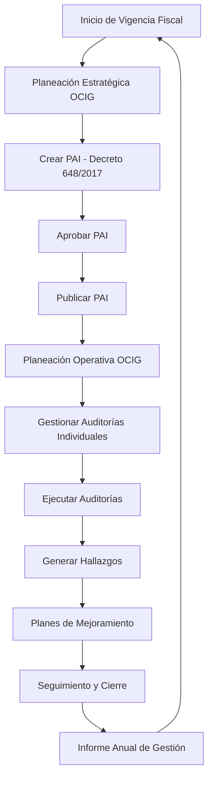

# Separación de Módulos: Planeación Estratégica vs Planeación Operativa OCIG

## Fecha: 31 Enero 2026

---

## 📋 Resumen Ejecutivo

Se ha completado exitosamente la **separación y clarificación** de dos módulos distintos relacionados con la planificación de auditorías en la OCIG:

1. **Planeación Estratégica OCIG** - Módulo independiente
2. **Planeación Operativa OCIG** - Parte del módulo de Control Interno

Esta separación elimina confusiones y establece límites claros entre la planificación anual estratégica y la gestión operativa de auditorías.

---

## 🎯 1. PLANEACIÓN ESTRATÉGICA OCIG (Módulo Independiente)

### Ubicación
```
/components/esap/control-interno-gestion/
```

### Propósito
**Planificación anual estratégica de la OCIG** - Define el marco general de auditoría para todo el año fiscal.

### Componentes Principales

#### A. Plan Anual de Auditoría Interna (PAI)
- **Normativa**: Decreto 648/2017
- **Formato oficial**: EMFO001 V.6
- **Función**: Planificación estratégica anual de toda la OCIG

#### B. Características
- ✅ Universo auditable institucional completo
- ✅ Matriz de riesgos integral
- ✅ Evaluación de recursos y capacidades OCIG
- ✅ Asignación de roles según Decreto 648/2017:
  - Jefe OCIG
  - Auditor Líder
  - Auditor Auxiliar
  - Auditor Especializado
  - Auditor Externo
- ✅ Cronograma maestro anual (22 actividades mínimas)
- ✅ Exportación a Excel (formato oficial EMFO001)
- ✅ Exportación a PDF corporativo ESAP

### Wizard de Creación (6 Pasos)

1. **Paso 1: Datos Generales**
   - Vigencia fiscal
   - Responsables
   - Aprobaciones

2. **Paso 2: Universo Auditable**
   - Identificación de procesos institucionales
   - Clasificación por categorías

3. **Paso 3: Evaluación de Riesgos**
   - Matriz de riesgos institucional
   - Priorización basada en riesgo

4. **Paso 4: Recursos OCIG**
   - Personal disponible
   - Capacidades técnicas
   - Presupuesto asignado

5. **Paso 5: Cronograma de Auditorías**
   - Calendarización anual
   - Asignación de equipos
   - Estimación de tiempos

6. **Paso 6: Matriz Decreto 648**
   - Validación de cumplimiento normativo
   - Asignación de roles oficiales
   - Distribución de actividades

### Acceso desde App.tsx
```typescript
case 'control-interno-gestion':
  return (
    <ControlInternoGestionFull
      usuarioActual={{...}}
      onPlanCreado={(plan) => {...}}
      onPlanActualizado={(plan) => {...}}
      onPlanExportado={(planId, formato) => {...}}
    />
  );
```

---

## 📊 2. PLANEACIÓN OPERATIVA OCIG (Dentro de Control Interno)

### Ubicación
```
/components/esap/control-interno/PlanificacionModuleRediseno.tsx
```

### Propósito
**Gestión operativa de auditorías individuales** - Administra las auditorías específicas que se ejecutarán durante el año.

### Componentes Principales

#### A. Tabs del Módulo

1. **Universo Auditable**
   - Identifica DÓNDE se puede auditar
   - Vista de procesos disponibles para auditar
   - Gestión de inventario de procesos

2. **Plan Operativo**
   - Define QUÉ procesos se auditarán
   - Selección de auditorías específicas
   - Priorización operativa

3. **Programa Anual**
   - Calendariza CUÁNDO auditar
   - Programación temporal
   - Seguimiento de ejecución

#### B. Características
- ✅ Dashboard con 6 KPIs analíticos
- ✅ Filtros avanzados (año, estado, área)
- ✅ Gestión de auditorías individuales
- ✅ Integración con flujo operativo:
  - Planeación → Ejecución → Informes → Hallazgos → Mejoramiento
- ✅ Formulario unificado de creación de auditorías
- ✅ Seguimiento de cumplimiento de programa

### Formulario Unificado de Auditorías
```typescript
<FormularioAuditoriaUnificado
  mode="create"
  initialData={{
    vinculadaPlanAnual: true,
    planAnualAño: 2025
  }}
  onSubmit={(data) => handleCrearAuditoria(data)}
/>
```

---

## 🔄 3. Diferencias Clave

| Aspecto | Planeación Estratégica | Planeación Operativa |
|---------|------------------------|----------------------|
| **Alcance** | Institucional - Todo el año | Operacional - Auditorías individuales |
| **Nivel** | Estratégico | Táctico/Operativo |
| **Frecuencia** | Anual | Continua |
| **Normativa** | Decreto 648/2017 estricto | Lineamientos internos |
| **Formato** | EMFO001 V.6 oficial | Formatos internos flexibles |
| **Roles** | 5 roles oficiales del Decreto | Asignaciones operativas |
| **Cronograma** | 22 actividades mínimas anuales | Cronogramas por auditoría |
| **Riesgos** | Matriz institucional completa | Riesgos específicos por proceso |
| **Recursos** | Capacidad total OCIG | Asignación por auditoría |
| **Exportación** | Excel oficial + PDF corporativo | Reportes operativos |
| **Aprobación** | Jefe OCIG + Representante Legal | Jefe OCIG |

---

## 📱 4. Flujo de Trabajo Integrado

### Ciclo Anual Completo



### Relación entre Módulos

1. **Inicio del Año (Enero-Febrero)**
   - Se crea el **Plan Anual de Auditoría (PAI)** en *Planeación Estratégica*
   - Se define universo auditable, riesgos, recursos
   - Se exporta EMFO001 V.6 para aprobación oficial

2. **Durante el Año (Marzo-Diciembre)**
   - Se gestionan auditorías individuales en *Planeación Operativa*
   - Se crean, programan y ejecutan auditorías
   - Se vinculan auditorías al PAI aprobado

3. **Cierre del Año (Diciembre)**
   - Se verifica cumplimiento del PAI
   - Se generan informes de gestión
   - Se prepara insumo para PAI del siguiente año

---

## 🎨 5. Diseño Visual

### Planeación Estratégica OCIG
- **Color principal**: Azul ESAP (#003DA5)
- **Icono**: TrendingUp (📈)
- **Estilo**: Corporativo formal, wizard paso a paso
- **Énfasis**: Cumplimiento normativo

### Planeación Operativa OCIG
- **Color principal**: Azul ESAP (#003DA5)
- **Icono**: ClipboardList (📋)
- **Estilo**: Dashboard dinámico con tabs
- **Énfasis**: Eficiencia operativa

---

## 🔐 6. Permisos y Roles

### Planeación Estratégica OCIG
- **Creación PAI**: Solo Jefe OCIG
- **Edición PAI**: Jefe OCIG + Auditor Líder (si delegado)
- **Aprobación PAI**: Jefe OCIG + Representante Legal
- **Consulta PAI**: Todos los miembros OCIG

### Planeación Operativa OCIG
- **Creación auditorías**: Jefe OCIG + Auditor Líder
- **Edición auditorías**: Auditor asignado + superiores
- **Programación**: Jefe OCIG
- **Consulta**: Todos los miembros OCIG + áreas auditadas

---

## 📚 7. Archivos Actualizados

### Planeación Estratégica OCIG
```
/components/esap/control-interno-gestion/
├── ControlInternoGestionFull.tsx          [ACTUALIZADO]
├── index.ts
└── plan-anual-auditoria/
    ├── PlanAnualAuditoriaModule.tsx
    ├── wizard/
    │   ├── WizardCrearPAI.tsx
    │   ├── Paso1DatosGenerales.tsx
    │   ├── Paso2UniversoAuditable.tsx
    │   ├── Paso3EvaluacionRiesgos.tsx
    │   ├── Paso4RecursosOCI.tsx
    │   ├── Paso5CronogramaAuditorias.tsx
    │   └── Paso6MatrizDecreto648.tsx
    ├── services/
    │   ├── exportarPDFCorporativo.ts
    │   └── exportarExcelEMFO001.ts
    └── types/
        └── index.ts
```

### Planeación Operativa OCIG
```
/components/esap/control-interno/
├── ControlInternoFull.tsx                 [ACTUALIZADO]
├── PlanificacionModuleRediseno.tsx        [ACTUALIZADO]
├── PlanAnualModule.tsx
├── UniversoAuditorias.tsx
├── ProgramaAnualCIG.tsx
└── FormularioAuditoriaUnificado.tsx
```

---

## ✅ 8. Validaciones Implementadas

### Planeación Estratégica (Decreto 648/2017)
- ✅ Mínimo 22 actividades en cronograma
- ✅ Asignación de 5 roles oficiales obligatorios
- ✅ Cobertura mínima del 60% del universo auditable
- ✅ Distribución equitativa de carga de trabajo
- ✅ Validación de capacidades técnicas del equipo
- ✅ Cumplimiento de plazos normativos

### Planeación Operativa
- ✅ Auditoría vinculada a PAI aprobado
- ✅ Recursos disponibles para ejecución
- ✅ Fechas coherentes con programa anual
- ✅ Equipo auditor completo asignado
- ✅ Presupuesto asignado

---

## 🚀 9. Próximos Pasos Recomendados

### Corto Plazo
1. ✅ **Separación completada** - Módulos independientes
2. 🔄 Pruebas de integración entre módulos
3. 📝 Documentación de usuario final
4. 🎓 Capacitación a equipo OCIG

### Mediano Plazo
1. 🔗 Integración con sistema de gestión documental
2. 📊 Reportes de cumplimiento automáticos
3. 🔔 Notificaciones automáticas de vencimientos
4. 📈 Dashboard ejecutivo consolidado

### Largo Plazo
1. 🤖 Inteligencia artificial para sugerencias de auditorías
2. 📉 Análisis predictivo de riesgos
3. 🌐 Portal público de transparencia OCIG
4. 📱 App móvil para auditores en campo

---

## 📖 10. Conclusión

La separación exitosa de **Planeación Estratégica OCIG** y **Planeación Operativa OCIG** proporciona:

✅ **Claridad conceptual**: Cada módulo tiene un propósito definido
✅ **Cumplimiento normativo**: PAI según Decreto 648/2017
✅ **Eficiencia operativa**: Gestión ágil de auditorías
✅ **Trazabilidad completa**: Desde planificación hasta cierre
✅ **Escalabilidad**: Arquitectura preparada para crecimiento

Ambos módulos trabajan en conjunto para garantizar una gestión integral y eficiente del Sistema de Control Interno de la ESAP.

---

**Documentado por**: Sistema ESAP Backoffice  
**Fecha**: 31 Enero 2026  
**Versión**: 1.0
