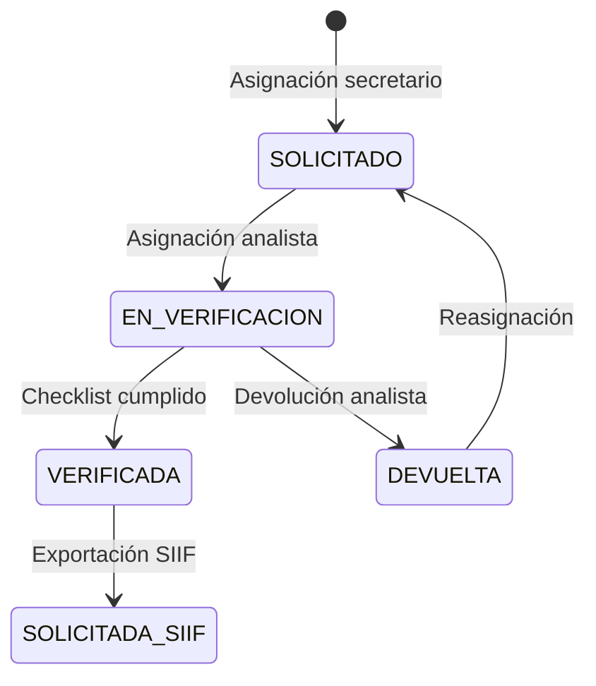

# HU_RF-REV-001 — Verificar y crear comisión en SIIF Nación (ESAP)

## 1. Introducción

**Contexto:** SuperApp ESAP, módulo de viáticos, Etapa 5.

**Objetivo:** Permitir al Analista de Viáticos verificar expedientes y generar exportación para SIIF Nación.

**Alcance:** RF-REV-001, RF-REV-003, RF-SOL-001.

## 2. Historias de Usuario

- Como Analista de Viáticos, quiero ver mi bandeja de solicitudes asignadas para iniciar la verificación.
- Como Analista de Viáticos, quiero registrar un checklist de verificación (liquidación, seguridad social, itinerario, RUT facturador).
- Como Analista de Viáticos, quiero generar y descargar un CSV sanitizado para cargar en el portal SIIF Nación.
- Como Analista de Viáticos, quiero devolver solicitudes al enlace con observaciones cuando encuentre inconsistencias.

## 3. Requisitos Funcionales

### RF-REV-001

- Verificación de fondo del expediente.
- Generación de archivo plano CSV para SIIF.
- Transición de estado a SOLICITADA_SIIF.

### RF-REV-003

- Consulta y registro de RUT de facturación electrónica.
- Campo `consulta_rut_facturador` en solicitudes_comision.

### RF-SOL-001

- Objeto de comisión sanitizado (sin tildes, eñes, máx 250 caracteres).
- Formato CSV plano delimitado por punto y coma.

## 4. Arquitectura

### Backend (NestJS/TypeORM)

```
src/
├── common/
│   └── sod.guard.ts          # Guard Segregación de Funciones
├── dto/
│   ├── verify-audit.dto.ts
│   ├── devolver-analista.dto.ts
│   └── siif-export-response.dto.ts
├── entities/
│   └── solicitud-comision.entity.ts  # +4 columnas SIIF
├── modules/travel-expenses/
│   ├── travel-expenses.controller.ts # +4 endpoints
│   └── travel-expenses.service.ts    # +4 métodos
└── db/migrations/
    ├── 427_rol_analista_y_permisos_etapa5.sql
    └── 428_columnas_trazabilidad_siif_etapa5.sql
```

### Frontend (React/TypeScript)

```
src/
├── types/viaticos.ts               # +ESTADO_SOLICITADA_SIIF, interfaces nuevas
├── services/api/viaticosService.ts # +4 métodos API
├── components/
│   ├── AnalystInbox.tsx            # Bandeja entrada analista
│   └── VerificacionSIIFModal.tsx   # Modal 3 secciones + devolver
```

## 5. Base de Datos

### Migración 427

- Reutiliza rol existente `ANALISTA` (migración 024).
- Agrega permisos: `travel_expenses:read_assigned`, `travel_expenses:verify_request`, `travel_expenses:export_siif`, `travel_expenses:return_assigned`.

### Migración 428

- Columnas en `solicitudes_comision`: `siif_exportado`, `fecha_exportacion_siif`, `usuario_exportador_id`, `consulta_rut_facturador`

## 6. Flujo de Estados (Etapa 5)



## 7. Seguridad

- SoD: El analista no puede auto-auditarse si es el comisionado o el creador.
- SUPER_ADMIN tiene inmunidad total.
- Permisos granulares por endpoint.

## 8. Pruebas

### Backend

- SodGuard: 14 pruebas (super admin, comisionado, creador, usuario limpio)
- Service: 22 pruebas (verificarAuditoria, devolverAnalista, exportarSIIF, validarSoD)
- Controller: 12 pruebas (4 endpoints × 3 casos cada uno)

### Frontend

- AnalystInbox: carga, filtro, apertura modal
- VerificacionSIIFModal: checklist, copiar, descargar CSV, devolver

## 9. Despliegue

1. Ejecutar migración 427 (rol y permisos).
2. Ejecutar migración 428 (columnas trazabilidad).
3. Desplegar backend.
4. Desplegar frontend.

## 10. Referencias

- RF-REV-001, RF-REV-003, RF-SOL-001
- Decreto 314 de 2026
- Manual SIIF Nación - Ministerio de Hacienda
