# DIAGRAMAS ADICIONALES DE ARQUITECTURA - PLATAFORMA ESAP

## 1. DIAGRAMAS POR MICROSERVICIO

### 1.1 Auth Service - Arquitectura Interna

**Código PlantUML:**
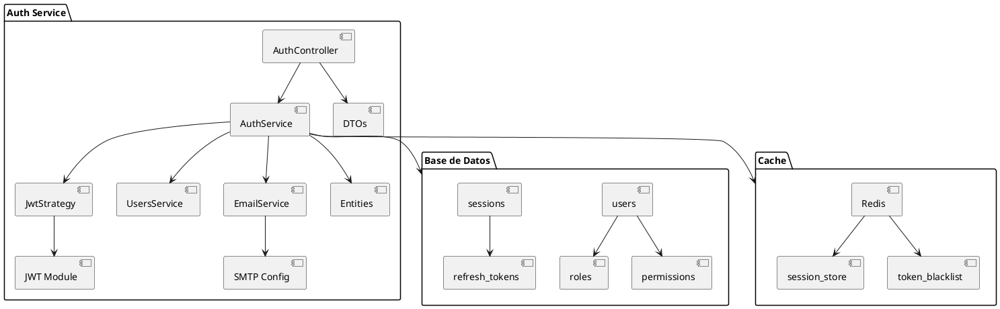

**Explicación:** Arquitectura interna del Auth Service mostrando la estructura completa de componentes para autenticación y autorización. El AuthController maneja endpoints REST como login/register, el AuthService implementa la lógica de negocio para validación de credenciales y generación de tokens JWT. La JwtStrategy valida tokens en requests entrantes, mientras UsersService gestiona operaciones CRUD de usuarios y roles. El EmailService maneja envío de correos para recuperación de contraseña. La persistencia se realiza en PostgreSQL con esquemas para usuarios, roles, permisos y sesiones, complementado por Redis para cache de sesiones activas y lista negra de tokens revocados.

### 1.2 Academic Registration Service - Flujo de Certificados

**Código PlantUML:**
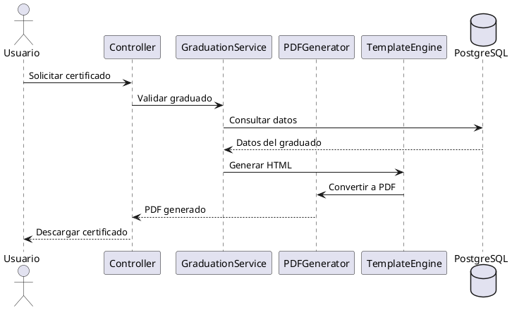

**Explicación:** Diagrama de secuencia que muestra el flujo completo de generación de certificados de graduación. El proceso inicia con la solicitud del usuario al Controller, que valida la elegibilidad consultando el GraduationService. Los datos del graduado se obtienen de PostgreSQL, luego se genera el HTML mediante TemplateEngine y finalmente se convierte a PDF con PDFGenerator para descarga por el usuario.

### 1.3 Certification Service - Arquitectura Interna

**Código PlantUML:**
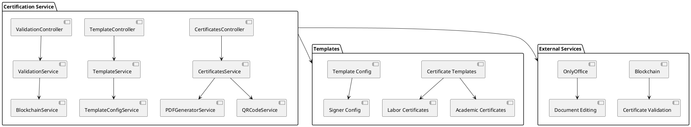

**Explicación:** Arquitectura interna del Certification Service especializado en emisión y validación de certificados. Incluye controllers para gestión de certificados y plantillas, servicios para generación de PDFs y códigos QR, integración con blockchain para validación inmutable, y conexión con OnlyOffice para edición de plantillas.

### 1.4 Internal Control Service - Arquitectura Interna

**Código PlantUML:**
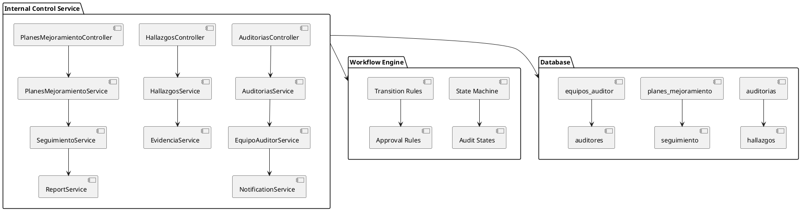

**Explicación:** Arquitectura interna del Internal Control Service para gestión de auditorías institucionales. Incluye controllers para auditorías, hallazgos y planes de mejoramiento, motor de workflows con máquina de estados, servicios de notificaciones y reportes, conectando con base de datos especializada en procesos de control interno.

### 1.5 Disciplinary Control Service - Arquitectura Interna

**Código PlantUML:**
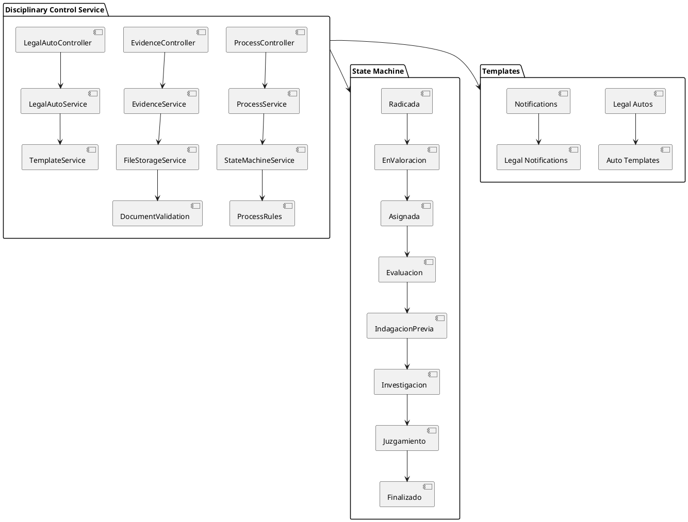

**Explicación:** Arquitectura interna del Disciplinary Control Service para procesos disciplinarios formales. Incluye controllers para procesos, evidencias y autos legales, máquina de estados completa del proceso disciplinario, servicios de validación documental y plantillas legales especializadas.

### 1.6 Notification Service - Arquitectura Interna

**Código PlantUML:**
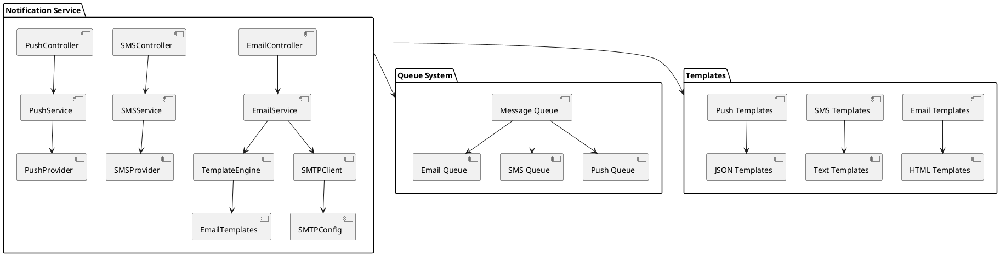

**Explicación:** Arquitectura interna del Notification Service para comunicaciones multi-canal. Incluye controllers para email, SMS y push notifications, sistema de colas para procesamiento asíncrono, motor de plantillas dinámicas, y configuración de proveedores externos (SMTP, SMS gateways).

### 1.7 API Gateway - Arquitectura Interna

**Código PlantUML:**
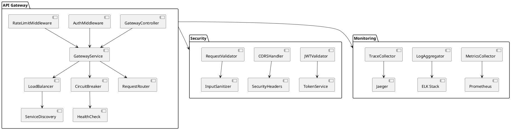

**Explicación:** Arquitectura interna del API Gateway como punto de entrada único del sistema. Incluye middlewares de autenticación y rate limiting, balanceo de carga, circuit breaker para resiliencia, validación de seguridad, y sistema completo de monitoreo con métricas, logs y tracing distribuido.

## 2. DIAGRAMAS POR MÓDULO FRONTEND

### 2.1 Módulo Control Interno - Arquitectura

**Código PlantUML:**
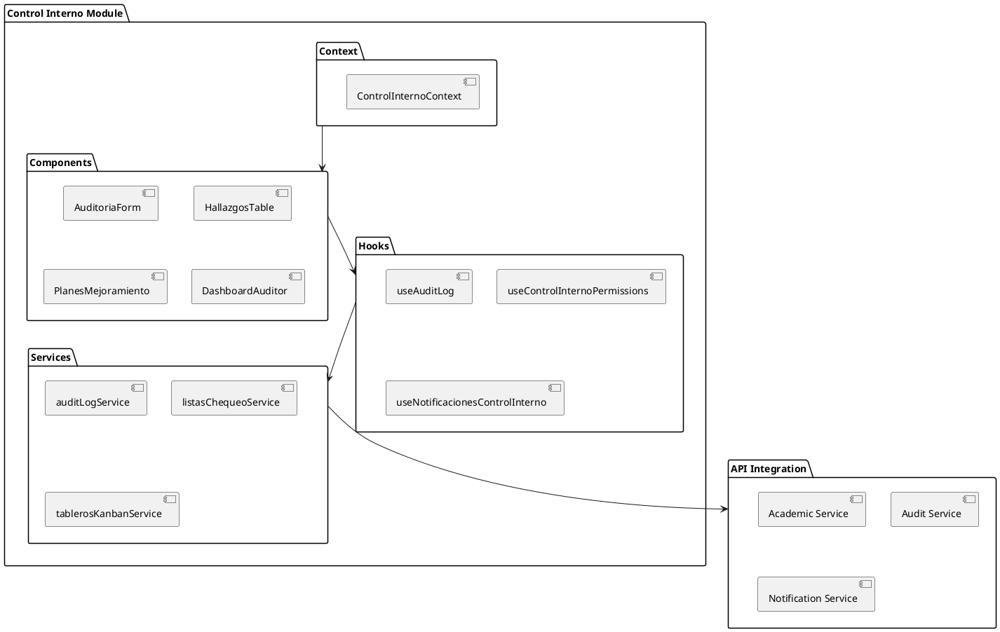

**Explicación:** Arquitectura del módulo frontend de Control Interno organizada por capas. Los componentes (AuditoriaForm, HallazgosTable, etc.) utilizan hooks personalizados (useAuditLog, useControlInternoPermissions) para lógica reutilizable. Los servicios (auditLogService, listasChequeoService) manejan llamadas API, mientras el ControlInternoContext proporciona estado global. Se integra con Academic Service, Audit Service y Notification Service del backend.

### 2.2 Módulo Disciplinario - Estados de Procesos

**Código PlantUML:**
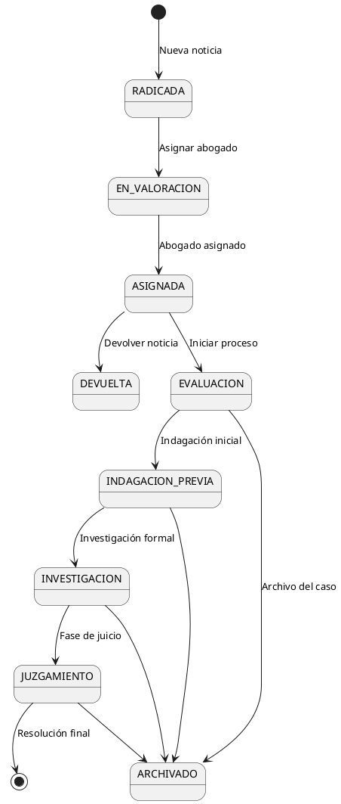

**Explicación:** Máquina de estados que representa el flujo completo del proceso disciplinario en ESAP. Comienza con RADICADA (noticia disciplinaria registrada), pasa por EN_VALORACION (asignación de abogado) y ASIGNADA (abogado confirmado). El proceso puede devolverse (DEVUELTA) o continuar a EVALUACION, INDAGACION_PREVIA, INVESTIGACION y JUZGAMIENTO. En cualquier etapa puede archivarse (ARCHIVADO) o llegar a resolución final.

## 3. DIAGRAMAS DE FLUJO ESPECÍFICOS

### 3.1 Flujo de Autenticación Completo

**Código PlantUML:**
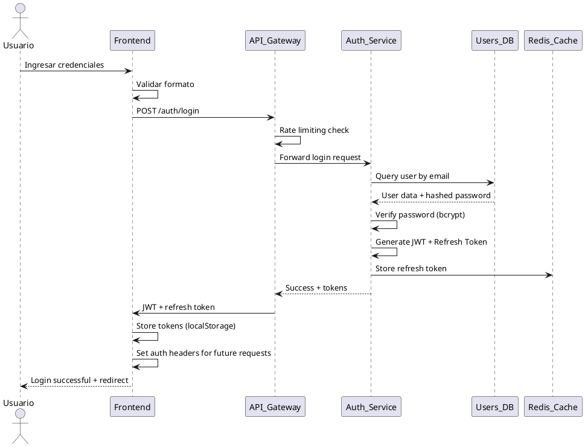

**Explicación:** Diagrama de secuencia detallado del flujo de autenticación completo. El usuario ingresa credenciales que se validan en frontend, luego pasan por rate limiting en API Gateway. El Auth Service consulta PostgreSQL para verificar credenciales, genera tokens JWT y refresh tokens, almacena el refresh en Redis, y devuelve tokens al frontend para almacenamiento seguro en localStorage.

### 3.2 Flujo de Aprobación del PTA

**Código PlantUML:**
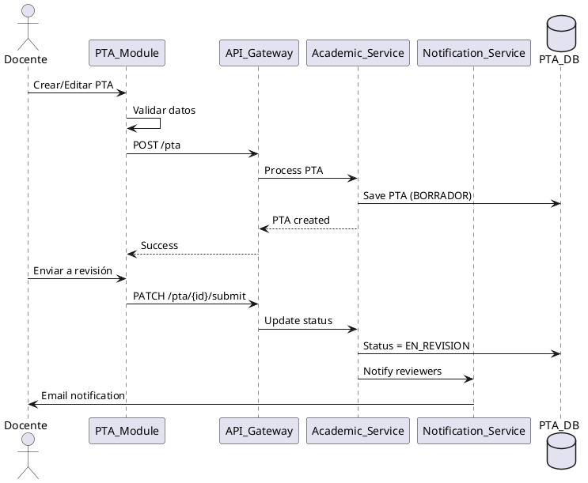

**Explicación:** Diagrama de secuencia del flujo de aprobación del PTA. El docente crea/edita el PTA en el módulo frontend, que valida datos localmente antes de enviar al API Gateway. El Academic Service guarda como BORRADOR en PostgreSQL. Al enviar a revisión, cambia status a EN_REVISION y notifica automáticamente a revisores mediante Notification Service.

## 4. DIAGRAMA GENERAL DE ARQUITECTURA COMPLETA (C4)

**Código PlantUML:**
```plantuml
@startuml Arquitectura General Completa
!include https://raw.githubusercontent.com/plantuml-stdlib/C4-PlantUML/master/C4_Context.puml
!include https://raw.githubusercontent.com/plantuml-stdlib/C4-PlantUML/master/C4_Container.puml

Person(user, "Usuario", "Docente, Administrativo, Estudiante")
System_Boundary(esap, "Plataforma ESAP") {
    Container(frontend, "Frontend React", "TypeScript, React", "SPA con micro-frontends")
    Container(api_gateway, "API Gateway", "NestJS", "Enrutamiento y autenticación")

    Container(auth_svc, "Auth Service", "NestJS", "Autenticación y autorización")
    Container(academic_svc, "Academic Registration", "NestJS", "Gestión académica")
    Container(cert_svc, "Certification Service", "NestJS", "Emisión de certificados")
    Container(audit_svc, "Internal Control", "NestJS", "Auditorías institucionales")
    Container(disciplinary_svc, "Disciplinary Control", "NestJS", "Procesos disciplinarios")
    Container(notification_svc, "Notification Service", "NestJS", "Sistema de notificaciones")

    ContainerDb(postgres, "PostgreSQL", "Base de datos", "Datos multi-tenant")
    ContainerDb(redis, "Redis", "Cache", "Sesiones y datos temporales")
}

System_Ext(onlyoffice, "OnlyOffice", "Documentos colaborativos")
System_Ext(smtp, "SMTP Server", "Envío de correos")

Rel(user, frontend, "Usa")
Rel(frontend, api_gateway, "HTTP/HTTPS", "API calls")
Rel(api_gateway, auth_svc, "Autentica")
Rel(api_gateway, academic_svc, "Gestión académica")
Rel(api_gateway, cert_svc, "Certificados")
Rel(api_gateway, audit_svc, "Auditorías")
Rel(api_gateway, disciplinary_svc, "Procesos disciplinarios")
Rel(api_gateway, notification_svc, "Notificaciones")

Rel(auth_svc, postgres, "Persistencia")
Rel(academic_svc, postgres, "Persistencia")
Rel(cert_svc, postgres, "Persistencia")
Rel(audit_svc, postgres, "Persistencia")
Rel(disciplinary_svc, postgres, "Persistencia")
Rel(notification_svc, postgres, "Persistencia")

Rel(frontend, redis, "Sesiones")
Rel(notification_svc, smtp, "Envío de correos")
Rel(frontend, onlyoffice, "Edición de documentos")
@enduml
```

**Explicación:** Diagrama C4 completo de la arquitectura general de ESAP mostrando el contexto del sistema. El usuario interactúa con el frontend React y portal público, que se comunican con el API Gateway. Este enruta requests a 8 microservicios especializados (Auth, Academic Registration, Certification, etc.) que persisten en PostgreSQL y Redis. Incluye integraciones con servicios externos como SMTP, OnlyOffice y blockchain.

## 5. DIAGRAMAS DE COMPONENTES DETALLADOS

### 5.1 Arquitectura de Componentes por Patrón Atomic Design

**Código PlantUML:**
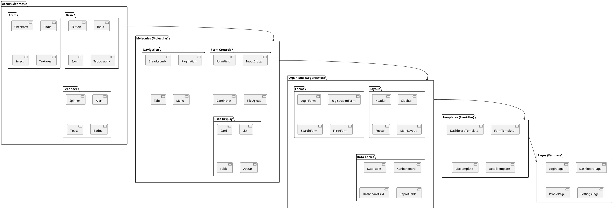

**Explicación:** Diagrama que ilustra la jerarquía completa de componentes UI siguiendo el patrón Atomic Design. Comienza con átomos básicos (Button, Input, Icon), evoluciona a moléculas (FormField, Card, Navigation), organismos (Header, DataTable, Forms), plantillas (DashboardTemplate, FormTemplate) y finalmente páginas completas (LoginPage, DashboardPage). Cada nivel aumenta en complejidad y especificidad funcional.

### 5.2 Diagrama de Integración de Servicios Backend

**Código PlantUML:**
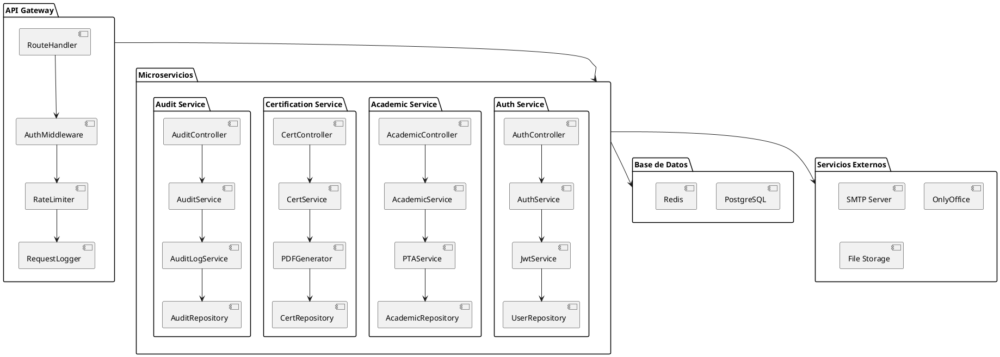

**Explicación:** Diagrama de integración que muestra cómo el API Gateway centraliza el acceso a microservicios con middlewares de autenticación, rate limiting y logging. Cada microservicio (Auth, Academic, Certification, Audit) tiene su estructura interna de controllers, servicios y repositorios. Todos persisten en PostgreSQL y Redis, con integraciones a servicios externos como SMTP, OnlyOffice y almacenamiento de archivos.

## 6. DIAGRAMAS DE FLUJO DE NEGOCIO

### 6.1 Flujo Completo de Gestión de Auditorías

**Código PlantUML:**
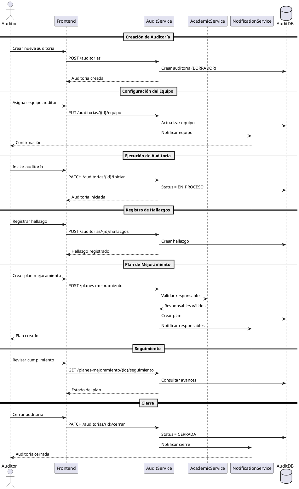

**Explicación:** Diagrama de secuencia completo del proceso de auditorías institucionales. Desde la creación y configuración del equipo auditor, pasando por la ejecución y registro de hallazgos, hasta la creación de planes de mejoramiento con responsables. Incluye seguimiento del cumplimiento y notificaciones automáticas en cada etapa crítica del proceso.

### 6.2 Flujo de Emisión de Certificados

**Código PlantUML:**
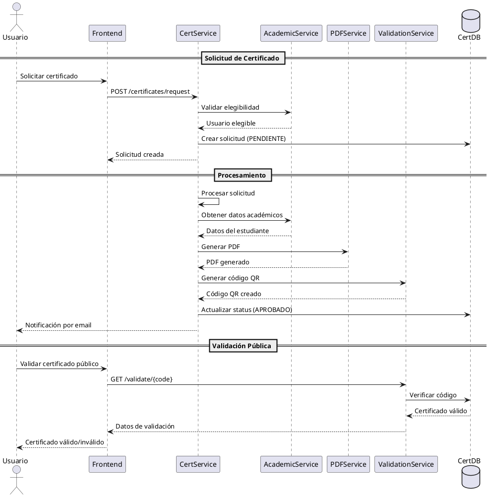

**Explicación:** Diagrama de secuencia del proceso completo de emisión de certificados. Desde la solicitud del usuario y validación de elegibilidad, pasando por obtención de datos académicos, generación de PDF con firmas digitales y códigos QR, hasta la validación pública mediante portal web. Incluye notificaciones automáticas y verificación de integridad blockchain.

---

*Estos diagramas adicionales proporcionan una visión más detallada y específica de diferentes aspectos del sistema ESAP, complementando los diagramas generales incluidos en la documentación principal.*