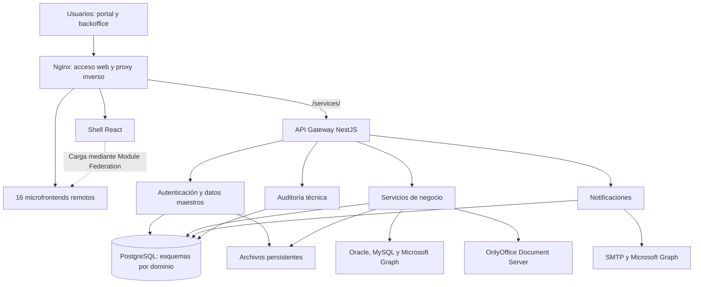

La **Plataforma ComUNIdadESAP** es una aplicación web para la gestión académica y administrativa de la Escuela Superior de Administración Pública. Su arquitectura combina una interfaz de usuario compuesta por microfrontends, servicios backend separados por responsabilidades y una base de datos PostgreSQL compartida, organizada mediante esquemas funcionales. El código, las configuraciones de infraestructura y la documentación se mantienen en un único repositorio Git.

Este documento describe la copia de trabajo revisada el **13 de septiembre de 2026**, cuya referencia Git es el commit `7d24d072`, del 11 de septiembre de 2026. La copia contiene cambios locales en PTA; por ello, esta descripción corresponde al código disponible y no certifica cuál versión está desplegada en los servidores. Las versiones tecnológicas indicadas proceden de manifiestos y Dockerfiles, y las capacidades descritas se contrastaron con configuración y código fuente.

**La arquitectura general se organiza en cinco capas.** La presentación se ejecuta en el navegador con React. Nginx entrega los archivos del frontend y canaliza las solicitudes HTTP. Un API Gateway implementado en NestJS distribuye esas solicitudes entre los servicios backend. Los servicios aplican reglas de negocio y acceden a PostgreSQL, archivos e integraciones externas. Docker Compose define cómo se ejecutan conjuntamente estos componentes.



El diagrama representa relaciones lógicas: los archivos JavaScript del shell y de los microfrontends se descargan desde Nginx y se ejecutan en el navegador. Los accesos a PostgreSQL corresponden a los servicios que tienen persistencia. El contenedor Redis también aparece en las configuraciones de infraestructura, aunque no se encontró un uso generalizado de un cliente Redis en el código backend revisado.

La composición permite construir aplicaciones de interfaz y servicios por separado. Sin embargo, existen dependencias compartidas: el shell conoce los remotos, varios módulos consumen datos maestros comunes y algunos servicios leen esquemas administrados por otros. La descripción más precisa es una **arquitectura modular de microfrontends y servicios HTTP, con persistencia compartida por esquemas**.

**La organización del código utiliza un monorepositorio.** El remoto `origin` de esta copia apunta a `https://github.com/hernan-Saroa/Plataformacomunidadesap.git`. Se verificó un repositorio principal y no se encontraron submódulos Git declarados. Las carpetas de los microfrontends y de los servicios son unidades de desarrollo dentro de ese repositorio; disponer de un `package.json` o un Dockerfile propio no las convierte en repositorios Git separados.

El inventario actual contiene:

| Elemento | Cantidad | Ubicación |
|---|---:|---|
| Repositorio Git principal | 1 | Raíz del proyecto |
| Aplicación contenedora o shell | 1 | `apps/shell/` |
| Microfrontends remotos | 16 | `apps/mfe-*/` |
| Aplicaciones frontend con manifiesto | 17 | Shell y remotos |
| Servicios backend | 14 | `backend/*/` |
| Paquetes compartidos | 3 | `packages/*/` |
| Flujos de GitHub Actions | 8 | `.github/workflows/` |

Los 14 servicios backend incluyen el API Gateway. Los otros 13 corresponden a servicios funcionales o transversales, con grados de implementación distintos. El README raíz todavía presenta un inventario anterior, por lo que las cantidades de este documento se obtienen de los directorios, los manifiestos, el registro de microfrontends y las matrices de construcción.

La distribución principal del repositorio es la siguiente:

```text
Plataformacomunidadesap/
├── .github/
│   └── workflows/              Automatización de construcción y publicación
├── apps/
│   ├── shell/                  Aplicación principal y navegación
│   ├── mfe-*/                  Dieciséis aplicaciones remotas por dominio
│   ├── config/                 Configuración utilizada por módulos
│   ├── services/               Clientes y servicios de interfaz
│   ├── hooks/                  Lógica reutilizable de React
│   ├── data/                   Datos auxiliares
│   └── utils/                  Utilidades transversales
├── backend/
│   ├── api-gateway/
│   └── *-service/              Servicios de negocio y soporte
├── packages/
│   ├── shared-ui/              Componentes de interfaz reutilizables
│   ├── shared-hooks/           Hooks compartidos
│   └── shared-types/           Tipos y permisos compartidos
├── db/
│   ├── init/                   Inicialización SQL
│   ├── migrations/             Evolución de esquemas y datos
│   ├── migrations_old/         Migraciones históricas
│   └── backups/                Respaldos presentes en la copia local
├── docker/nginx/              Configuración y arranque de Nginx
├── docs/                      Documentación técnica, funcional y de pruebas
├── scripts/                   Construcción, desarrollo y verificaciones
├── tests/integration/         Pruebas de integración
├── Plantillas/                Plantillas documentales
├── src/                       Código adicional fuera de los workspaces
├── build/                     Salida de compilación frontend
├── package.json               Workspaces, dependencias y comandos raíz
├── package-lock.json          Resolución de dependencias de workspaces
├── Dockerfile.frontend*       Variantes de imágenes frontend
├── docker-compose*.yml        Topologías y ambientes de ejecución
├── nginx*.conf*               Proxy, entrega de archivos y TLS
├── deploy.*                   Scripts de despliegue
└── migrate.*                  Scripts de migraciones
```

La raíz conserva archivos auxiliares, configuraciones anteriores y documentación histórica. Los comandos principales de frontend se dirigen a `apps/shell` y a `scripts/build-frontends.mjs`; no debe asumirse que el `src/` de la raíz sea la entrada vigente de toda la aplicación. Asimismo, `node_modules`, compilados, logs y respaldos presentes en disco deben distinguirse del código fuente y de los archivos efectivamente versionados.

**npm Workspaces administra el frontend y los paquetes compartidos.** El `package.json` raíz declara `apps/*` y `packages/*`. Los paquetes utilizan nombres del ámbito `@esap-mfe`, como `@esap-mfe/shell`, `@esap-mfe/pta` y `@esap-mfe/shared-ui`. La instalación raíz resuelve estos workspaces y sus dependencias mediante el lockfile principal.

Los servicios de `backend/` están fuera de esa declaración de workspaces. Cada servicio dispone de su propio manifiesto, lockfile, configuración de TypeScript, comandos NestJS y Dockerfile. Su instalación y compilación se administran por servicio, aunque todos se versionen en el mismo repositorio. No se observa un gestor central de monorepo como Nx o Turborepo: la coordinación se implementa con npm y scripts propios de Node.js.

Esta organización facilita modificar una funcionalidad que abarque interfaz, API y SQL en un mismo cambio de Git. A la vez, exige coordinar modificaciones de contratos y paquetes compartidos, porque pueden afectar a varios módulos.

**El frontend utiliza React, TypeScript y Vite.** React construye componentes y vistas interactivas; TypeScript define interfaces y comprueba tipos; Vite proporciona desarrollo y compilación. La transformación de React utiliza `@vitejs/plugin-react-swc`. La navegación se apoya en React Router, con `BrowserRouter` en la entrada del shell.

| Tecnología | Versión declarada o familia observada | Función en el proyecto |
|---|---|---|
| React y React DOM | `^18.3.1` | Componentes, renderizado y estado de interfaz |
| TypeScript | Familia 5.x; varios manifiestos indican `^5.7.3` | Tipado de frontend y backend |
| Vite | `6.3.5` en raíz; `^6.3.5` en aplicaciones | Servidor de desarrollo y compilación |
| Plugin React SWC | `^3.10.2` | Transformación del código React |
| Module Federation para Vite | `^1.4.1` | Exposición y carga de módulos remotos |
| React Router DOM | `^7.10.1` | Navegación cliente |
| Tailwind CSS | Familia 4.x | Estilos mediante clases utilitarias |
| Radix UI | Versiones específicas por componente | Diálogos, menús, selectores y otras primitivas |
| TanStack React Query | Dependencia declarada con `*` en raíz | Consultas, mutaciones y caché cliente en los módulos que lo utilizan |
| React Hook Form | `^7.55.0` en raíz | Gestión de formularios |
| Axios y Fetch | Según cliente de cada módulo | Solicitudes HTTP |
| Recharts | Familia 2.15.x | Gráficas y paneles de información |
| Lucide React | Versiones distintas entre raíz y módulos | Iconografía |
| Motion y Framer Motion | Rangos distintos por paquete | Animaciones y transiciones |
| Sonner, React Toastify y React Hot Toast | Según módulo | Mensajes y notificaciones visuales |

Estas versiones describen los rangos de los manifiestos, no una versión única garantizada para todas las instalaciones. Los lockfiles determinan la resolución concreta. En particular, existen dependencias con `*` y diferencias entre módulos. Tailwind tampoco tiene una integración idéntica en todas las aplicaciones: el shell contiene una hoja generada con cabecera de Tailwind 4.1.3, mientras PTA declara Tailwind y el plugin de Vite en la familia 4.1.12.

El proyecto complementa estas herramientas con `class-variance-authority`, `clsx` y `tailwind-merge` para variantes de componentes; bibliotecas de arrastre como DnD Kit y React DnD; utilidades de fechas; editores de texto enriquecido; mapas y herramientas documentales. Algunas dependencias y componentes corresponden a implementaciones heredadas, por lo que su presencia en el manifiesto no implica que toda pantalla activa las utilice.

**El shell concentra la experiencia común de acceso y navegación.** Su punto de entrada es `apps/shell/src/main.tsx`, que monta `App.tsx` dentro de `BrowserRouter` y carga los estilos. Desde esta aplicación se coordinan las vistas de portal y backoffice, la sesión, los accesos a módulos y elementos transversales como notificaciones. Se utilizan carga diferida con `React.lazy` y límites de espera con `Suspense` en partes de la composición.

Los microfrontends aportan las pantallas especializadas. El inventario registrado en `scripts/mfe.config.mjs` es:

| Aplicación | Responsabilidad funcional principal | Puerto de desarrollo registrado |
|---|---|---:|
| `shell` | Acceso, navegación y composición de la plataforma | 3000 |
| `mfe-estructura-org` | Estructura organizacional, sedes y dependencias | 3101 |
| `mfe-gestion-profesoral` | Vistas de gestión profesoral | 3102 |
| `mfe-programas-academicos` | Programas y catálogos académicos | 3103 |
| `mfe-gestion-personas` | Personas y datos asociados | 3104 |
| `mfe-auditoria` | Consulta de eventos y auditoría técnica | 3105 |
| `mfe-reportes` | Reportes y visualización de información | 3106 |
| `mfe-registro-academico` | Verificación de títulos y certificados de grado | 3107 |
| `mfe-certificados-laborales` | Solicitudes, emisión y verificación de certificados laborales | 3108 |
| `mfe-firma-electronica` | Interfaz de documentos, firmas e historial | 3109 |
| `mfe-control-interno` | Auditorías institucionales, hallazgos y mejoramiento | 3110 |
| `mfe-control-disciplinario` | Expedientes, actuaciones y documentos disciplinarios | 3111 |
| `mfe-gestion-legal` | Procesos jurídicos, comunicaciones y documentación legal | 3112 |
| `mfe-pta` | Plan de Trabajo Académico, portal docente y funcionalidades RUND | 3113 |
| `mfe-contratacion` | Procesos y seguimiento contractual | 3114 |
| `mfe-viaticos` | Comisiones, viáticos, tiquetes y liquidaciones | 3115 |
| `mfe-programacion-academica` | Oferta, grupos, horarios, aulas y asignaciones | 3116 |

La tabla identifica el ámbito de cada aplicación; no constituye una certificación de completitud funcional. Tampoco existe una correspondencia obligatoria de un microfrontend con un único backend: estructura organizacional y personas utilizan capacidades de autenticación y datos maestros, mientras reportería puede consultar varios dominios. No existe en el inventario un backend independiente denominado `firma-electronica-service` o `reportes-service`.

**Module Federation realiza la composición en tiempo de ejecución.** Cada remoto publica un archivo `remoteEntry.js` y expone componentes desde su `vite.config.ts`. El shell declara los remotos y puede importar sus componentes cuando los necesita. Se comparten expresamente `react`, `react-dom` y `react-router-dom` en la configuración de federación.

La ruta general de entrada de un remoto es `/remotes/<nombre-mfe>/assets/remoteEntry.js`. En desarrollo se antepone `http://localhost:<puerto>`, mientras que en compilación se utilizan rutas relativas al origen de la plataforma. Por ejemplo, el remoto PTA expone `./Module`, `./Portal` y `./AutogestionDocenteRUND`.

La compilación del shell se escribe en `build/`, y la de cada remoto en `build/remotes/<nombre-mfe>/`. El script central de compilación obtiene el inventario desde `mfe.config.mjs` y admite paralelismo mediante `FRONTEND_BUILD_PARALLELISM`. En desarrollo, `dev-all.mjs` coordina el shell y los remotos, con opciones para seleccionar aplicaciones o limitar cuáles permanecen en modo de reconstrucción continua.

La estructura interna habitual de una aplicación incluye `src/components`, `src/hooks`, `src/services`, `src/types`, `src/utils`, estilos y un `vite.config.ts`. Hay variaciones reales: ciertos módulos conservan clientes bajo `services/api` fuera de `src`, y existe código transversal bajo `apps/`. La organización combina extracción de paquetes comunes con código procedente de etapas anteriores de modularización.

**Los tres paquetes compartidos reducen repetición entre interfaces.** `shared-ui` contiene botones, formularios, diálogos, tablas, menús, paneles y componentes adaptativos. `shared-hooks` exporta utilidades como `useDebounce`, `useIsMobile`, `useKeyboardVisible` y `useResponsive`. `shared-types` declara interfaces de autenticación, usuarios, personas y permisos, entre otras.

Su resolución se apoya en workspaces y alias de Vite hacia el código fuente de `packages/`. Aunque algunos comentarios describen tipos compartidos entre frontend y backend, los manifiestos backend revisados no establecen una dependencia uniforme de ese paquete; por tanto, no debe suponerse que todos los contratos HTTP se generan o verifican automáticamente a partir de él.

**El estado de la interfaz combina varias estrategias.** Los componentes utilizan hooks de React para estado y efectos; los contextos agrupan información como permisos y notificaciones; y existen clientes, hooks y proveedores de TanStack Query para solicitudes y caché. El acceso a APIs pasa por utilidades como `environment.ts`, `apiClient.ts` y clientes específicos de cada dominio.

También permanecen servicios con almacenamiento local, datos de demostración y referencias a Supabase. PTA declara `@supabase/supabase-js`, pero su servicio denominado `supabase.service.ts` se identifica como un stub y la funcionalidad actual también consume APIs NestJS. La presencia de esas referencias no permite presentar Supabase como base de datos principal de toda la plataforma.

En la sincronización actual del PTA, `usePTARealtimeSync` realiza **polling HTTP**, con un intervalo predeterminado de diez segundos, consulta un contador y recupera eventos recientes. La lógica evita consultas cuando la pestaña está oculta o no hay conexión. El término «tiempo real» utilizado en nombres del módulo corresponde aquí a actualización periódica; no describe una conexión WebSocket.

**El backend utiliza NestJS sobre Node.js y Express.** Los manifiestos declaran NestJS 11, `@nestjs/platform-express`, TypeScript, RxJS y herramientas de validación. Los servicios con persistencia emplean TypeORM 0.3.x y el controlador PostgreSQL `pg` 8.x. La configuración se obtiene de variables de entorno mediante `@nestjs/config`, `dotenv` o lectura de `process.env`, según el servicio.

| Tecnología | Familia observada | Responsabilidad |
|---|---|---|
| Node.js | Node 20 Alpine en Dockerfiles revisados; Node 22+ indicado para desarrollo local | Ejecución de JavaScript y herramientas |
| NestJS | 11.x | Módulos, controladores, servicios e inyección de dependencias |
| Plataforma Express | Adaptador `@nestjs/platform-express` 11.x | Servidor HTTP y middleware |
| TypeORM | 0.3.x | Entidades, repositorios y acceso relacional |
| PostgreSQL / `pg` | PostgreSQL 16 en Compose; `pg` 8.x | Persistencia principal |
| Passport y Passport JWT | 0.7.x y 4.x | Estrategias de autenticación |
| `@nestjs/jwt` | 11.x | Emisión y validación de JWT |
| bcrypt / bcryptjs | Según servicio | Hash y comparación de contraseñas |
| class-validator / class-transformer | 0.14.x / 0.5.x | Validación y transformación de entradas |
| RxJS | 7.8.x | Observables e interceptores |
| NestJS Axios / Axios | Según servicio | Comunicación HTTP entre componentes |
| NestJS Schedule | 5.x en servicios que lo declaran | Tareas programadas |
| NestJS Swagger | 11.x en servicios que lo declaran | Descripción de APIs |
| Multer | 2.x en manifiestos que lo incluyen | Recepción de archivos |

La estructura backend sigue principalmente el flujo `Controller → Service → Repository/SQL`. Los controladores publican rutas, los DTO describen entradas, los servicios aplican reglas y coordinan operaciones, y las entidades/repositorios representan persistencia. Los módulos de NestJS registran e inyectan estas dependencias. Guards, interceptores y filtros atienden autenticación, auditoría y tratamiento de errores.

No todos los servicios organizan sus carpetas de la misma forma. PTA, contratación y programación académica agrupan funcionalidades en módulos de negocio; gestión legal y control disciplinario también utilizan carpetas amplias de `controllers`, `services`, `entities` y `dto` o `dtos`. Por ello, la base implementada es una arquitectura por capas con organización modular variable.

El inventario backend, con los puertos internos y prefijos del mapa del gateway, es:

| Servicio | Puerto | Prefijo principal | Responsabilidad verificada |
|---|---:|---|---|
| `api-gateway` | 3000 | Entrada general | Enrutamiento, autenticación transversal, proxy y auditoría de solicitudes |
| `auth-service` | 3001 | `auth` | Acceso, usuarios, roles, permisos, personas, estructura, programas, asignaturas y carpeta digital |
| `academic-registration-service` | 3002 | `registro-academico` | Graduados, certificados de grado, solicitudes, validación y conexiones Oracle/MySQL |
| `academic-work-plan-service` | 3003 | `pta` | PTA, aprobaciones, eventos, evidencias, banco docente, RUND y catálogos relacionados |
| `certification-service` | 3004 | `certificados` | Certificados laborales, plantillas, generación documental, validación e integración Oracle |
| `internal-disciplinary-control-service` | 3005 | `control-disciplinario` | Expedientes, actuaciones, autos, oficios y documentación disciplinaria |
| `interoperability-service` | 3006 | `interoperabilidad` | Servicio reservado para interoperabilidad; módulo raíz todavía básico |
| `internal-institutional-control-service` | 3007 | `control-institucional` | Auditorías institucionales, informes, hallazgos, evidencias y mejoramiento |
| `legal-management-service` | 3008 | `legal` | Expedientes jurídicos, comunicaciones, oficios y capacidades de seguimiento |
| `notifications-service` | 3009 | `notificaciones` | Correos y notificaciones persistidas |
| `travel-expenses-service` | 3010 | `viaticos` | Solicitudes de comisión, parámetros, liquidación, tiquetes y consolidación |
| `audit-service` | 3011 | `audit` | Registro y consulta de auditoría técnica |
| `hiring-service` | 3012 | `hiring` | Ciclo de contratación, aprobaciones y seguimiento |
| `academic-schedule-service` | 3013 | `programacion-academica` | Catálogo consultado, ofertas, grupos, horarios, aulas y asignaciones |

El gateway también admite alias, como `certificates` y variantes de gestión legal. Los puertos externos pueden cambiar por ambiente y no deben confundirse con los puertos internos de esta tabla. En particular, el shell y el gateway tienen como valor predeterminado 3000 en contextos distintos: al ejecutarlos directamente en el mismo equipo, la configuración debe asignarles puertos de host diferentes y ajustar la URL de API.

`interoperability-service` requiere una precisión: su `AppModule` revisado tiene `imports: []` y registra el controlador y servicio básicos de NestJS. Las integraciones reales encontradas están implementadas directamente en otros servicios; no corresponde atribuir a este componente una plataforma completa de integración ya operativa.

**El API Gateway proporciona un punto de entrada común a los servicios.** `backend/api-gateway/src/gateway/proxy.config.ts` relaciona prefijos funcionales con direcciones de destino. Estas direcciones se pueden sobrescribir mediante variables como `AUTH_SERVICE_URL` y `ACADEMIC_WORK_PLAN_SERVICE_URL`; los valores predeterminados distinguen localhost y nombres de contenedor.

El patrón principal de URL es `/{servicio}/api/v{version}/{ruta}`. Por ejemplo, `/auth/api/v1/users` se reenvía como `/users` a autenticación. Para una versión distinta de 1, el proxy conserva un prefijo como `/v2`. Este mecanismo permite direccionamiento versionado, pero la existencia de un endpoint v2 depende de que lo implemente el servicio destino.

El gateway usa NestJS Axios y RxJS para reenviar solicitudes. Maneja JSON, solicitudes multipart y descargas binarias, con streaming en rutas de archivos previstas. Además de las APIs, contempla rutas de archivos como `uploads`, `files`, autos y oficios. Un guard global verifica JWT con excepciones para rutas públicas, y un interceptor registra operaciones de modificación.

En la topología con Nginx frontal, una solicitud sigue este recorrido:

```text
Navegador
  /services/auth/api/v1/users
       ↓ Nginx elimina /services/
API Gateway
  /auth/api/v1/users
       ↓ Gateway resuelve auth y elimina el prefijo de servicio/v1
auth-service:3001
  /users
       ↓ Controlador, servicio y persistencia
PostgreSQL
```

La comunicación observada entre backend y clientes es principalmente HTTP. No se encontró una infraestructura central de mensajería con RabbitMQ, Kafka o transporte de microservicios NestJS en los componentes revisados. Los eventos funcionales de PTA y los registros de auditoría forman parte de la aplicación y su persistencia; no implican por sí mismos un bus de eventos distribuido.

**PostgreSQL concentra la persistencia relacional.** Los Compose base definen PostgreSQL 16 y una base denominada normalmente `esap_db`. La separación de información se realiza mediante esquemas. Entre los nombres encontrados en entidades, configuraciones o SQL están:

| Esquema | Información principal |
|---|---|
| `auth` | Usuarios, personas, roles, permisos y datos maestros |
| `academic_registration` | Graduados y certificados de grado |
| `academic_work_plan` | PTA, docentes, RUND, catálogos y aprobaciones |
| `academic-schedule` | Grupos, horarios y programación académica |
| `certification` | Certificación laboral y configuración relacionada |
| `internal_disciplinary_control` | Gestión disciplinaria |
| `control_interno` | Control institucional y mejoramiento |
| `legal_management` | Gestión jurídica |
| `requerimientos_oc` | Requerimientos de órganos de control |
| `notifications` | Notificaciones de usuarios |
| `travel_expenses` | Comisiones y viáticos |
| `audit` | Auditoría técnica |
| `hiring` | Contratación |

El nombre configurado en `DB_SCHEMA` no siempre basta para determinar todas las tablas usadas: varias entidades declaran explícitamente su esquema. Por ejemplo, un Compose conserva `DB_SCHEMA: pta`, mientras las entidades PTA revisadas especifican `academic_work_plan`. En programación académica existen entidades propias en `academic-schedule` y entidades de lectura del catálogo en `academic_work_plan`.

Esta lectura entre esquemas es una dependencia arquitectónica concreta: permite reutilizar catálogos, pero requiere coordinar su evolución entre servicios. La configuración revisada no corresponde a una base de datos físicamente independiente por cada servicio.

La evolución de datos se gestiona principalmente con scripts SQL bajo `db/init`, `db/migrations` y ubicaciones específicas de servicios. Hay migraciones numeradas, subcarpetas por dominio, datos iniciales, funciones y scripts históricos. Los scripts `migrate.*` apoyan su aplicación mediante PostgreSQL CLI. La sincronización automática de TypeORM aparece desactivada en varios servicios y condicionada por `TYPEORM_SYNC` en otros; la estrategia exacta debe leerse por servicio y ambiente.

`db/init` se monta en el directorio de inicialización del contenedor PostgreSQL en las topologías que crean la base. Esos scripts de arranque se distinguen de las migraciones posteriores. También existen herramientas de copia y restauración; su presencia no establece una frecuencia de respaldo ni acredita que se hayan probado recuperaciones en producción.

**Los documentos se almacenan mediante archivos y metadatos.** Varios servicios mantienen directorios `uploads` montados como volúmenes y registran información asociada en PostgreSQL. Esta estrategia se utiliza para soportes, evidencias, carpetas digitales y documentos generados. Las descargas pasan por controladores o rutas estáticas y sus proxies, según el módulo.

| Herramientas | Uso documental observado |
|---|---|
| Puppeteer / Chromium | Generación de PDF a partir de contenido renderizado y scripts de navegador |
| PDFKit, jsPDF y jsPDF AutoTable | Creación de PDF y tablas |
| pdf-lib | Manipulación de documentos PDF |
| PDF.js y React PDF Viewer | Visualización de PDF en el navegador |
| docxtemplater, docx-templates y PizZip | Generación a partir de plantillas DOCX |
| Mammoth y docx-preview | Lectura o visualización de documentos Word |
| ExcelJS y `xlsx` | Importaciones, exportaciones y hojas de cálculo |
| Archiver y JSZip | Agrupación y compresión de expedientes |
| `qrcode`, `qrcode.react` y `jsqr` | Generación, presentación o lectura de códigos QR |
| Handlebars | Plantillas de contenido |
| OnlyOffice Document Server | Edición documental integrada en funcionalidades disciplinarias |

OnlyOffice cuenta con una imagen de contenedor declarada y con código frontend que carga `DocsAPI.DocEditor`. El backend disciplinario genera configuración del editor y ofrece un callback para recibir el resultado del guardado. La carpeta `Plantillas` y las plantillas presentes dentro de servicios complementan esta capa documental.

Los volúmenes de archivos forman parte del estado persistente del despliegue. Si se ejecutan varias réplicas de un servicio, deben compartir el almacenamiento que corresponda para que todas puedan resolver los mismos documentos; la separación en contenedores por sí sola no implementa ese almacenamiento compartido.

**La autenticación principal utiliza JWT en una cookie HttpOnly.** El servicio de autenticación compara contraseñas mediante bcrypt y contiene endpoints para acceso local, acceso Microsoft, recuperación de contraseña, renovación de sesión y verificación OTP para firma. El controlador coloca el token en `esap_access_token`, configura `SameSite=Lax` y determina el atributo `Secure` mediante configuración y contexto de la solicitud.

También establece `esap_session_active`, una cookie indicadora accesible desde JavaScript. La respuesta de autenticación elimina los campos de tokens antes de entregarse al cliente. En el shell, `authTokenStore.ts` limpia claves antiguas de `localStorage` y `sessionStorage`, mientras `authService.ts` conserva datos del usuario en memoria. Por tanto, la explicación histórica de tokens principales guardados en almacenamiento web no describe este flujo actual.

El gateway y los servicios utilizan estrategias y guards JWT. El proxy incluye compatibilidad para trasladar el token de cookie a la autorización enviada a servicios en las rutas previstas, y reenvía información de contexto de usuario. La configuración incluye rutas públicas para acceso, recuperación, validación documental y otras funcionalidades concretas; la política no es idéntica para cada endpoint.

La autorización combina **roles, permisos y ámbito de acceso**. Los modelos contemplan asignaciones relacionadas con sedes, territoriales, programas y funcionalidades. En la interfaz estas reglas ayudan a decidir qué mostrar; en el backend, guards y servicios comprueban las operaciones permitidas. PTA contiene servicios específicos para permisos y alcance territorial.

La verificación de firma por OTP genera un código temporal, lo envía al correo del usuario y valida su vigencia antes de registrar una confirmación. Esta evidencia de código describe un mecanismo de confirmación por correo; no permite afirmar por sí sola una infraestructura de firma con certificados criptográficos emitidos por una autoridad certificadora.

También se observan `ValidationPipe`, validación por DTO, configuración CORS y controles documentales específicos, como los de carpeta digital RUND. Las plantillas TLS de Nginx revisadas admiten TLS 1.2 y 1.3 y configuración de HSTS. La construcción frontend incluye soporte para nonces CSP. La aplicación efectiva de estas medidas depende de la topología y la configuración utilizadas.

**La auditoría técnica es una capacidad transversal diferenciada del control institucional.** El interceptor del gateway observa principalmente `POST`, `PUT`, `PATCH` y `DELETE`, registra datos como usuario, ruta, método, estado HTTP y duración, y envía información al servicio de auditoría. El código incorpora sanitización y redacción específica para solicitudes RUND.

`audit-service` conserva la auditoría técnica en PostgreSQL y el microfrontend de auditoría aporta su consulta. Las auditorías institucionales, hallazgos y planes de mejoramiento pertenecen a `internal-institutional-control-service` y `mfe-control-interno`. Son procesos distintos aunque compartan el término «auditoría».

Las capacidades operativas visibles incluyen logs de aplicación, salidas de contenedores, endpoints de salud y scripts como `check-services.mjs`. En lo revisado no se identificó una plataforma central de métricas y trazas distribuida con Prometheus, Grafana u OpenTelemetry. Tampoco se midieron disponibilidad, latencia o capacidad concurrente durante esta revisión documental.

**Las integraciones externas se implementan por dominio.** El proyecto contempla acceso Microsoft en el flujo de autenticación, con configuración frontend de tenant y client ID. El servicio de notificaciones utiliza Nodemailer para SMTP y Microsoft Graph mediante `@azure/identity` y `@microsoft/microsoft-graph-client`. Gestión legal dispone de su propia integración Graph para operaciones de correo jurídico.

Registro académico contiene servicios de integración Oracle y MySQL, con dependencias `oracledb` y `mysql2`, y certificación laboral incluye integración Oracle. Estas conexiones son fuentes externas asociadas a funcionalidades concretas; PostgreSQL sigue siendo el motor principal de persistencia de la plataforma. La operación de cada integración depende de credenciales, conectividad y parámetros del ambiente, que no se probaron en esta revisión.

El shell también define redirecciones a correo institucional, Humano Soft y ARCA. Un acceso mediante enlace o redirección debe distinguirse de una integración de intercambio de datos mediante API.

**Docker Compose define varias modalidades de ejecución.** Los Dockerfiles backend revisados emplean construcción por etapas: instalan dependencias, compilan NestJS y preparan una imagen de ejecución con el contenido de `dist`. En frontend, Node construye los archivos estáticos y Nginx los sirve. Hay imágenes frontend agregadas, imágenes por aplicación y variantes que reciben artefactos ya compilados.

| Configuración | Finalidad |
|---|---|
| `docker-compose.yml` | Composición base de servicios e infraestructura |
| `docker-compose.backend.yml` | Topología backend con PostgreSQL y Redis |
| `docker-compose.frontend-mfe.yml` | Gateway web, shell y contenedores por remoto |
| `docker-compose.frontend-tls.yml` | Complementos de TLS frontend |
| `docker-compose.dev.yml` | Ambiente de desarrollo |
| `docker-compose.qa.yml` | Ambiente de pruebas |
| `docker-compose.pre.yml` | Preproducción |
| `docker-compose.prod.yml` | Producción |
| `docker-compose*.ghcr.yml` | Uso de imágenes publicadas en GHCR |
| `docker-compose.local.yml` | Variante local que reutiliza servicios de DEV y una base del host |
| `docker-compose.services.yml` | Herramientas locales de base de datos, incluido pgAdmin |

En la variante local actual, el servicio llamado `db` es un contenedor Alpine de apoyo y los servicios apuntan por defecto a PostgreSQL del equipo mediante `host.docker.internal`. Esto difiere de las topologías que crean un contenedor PostgreSQL real. Es necesario describir el Compose concreto para explicar dónde reside la base de un ambiente.

Redis 7 está declarado en Compose y se proporcionan variables de conexión en ciertas configuraciones. Sin embargo, en los servicios revisados no se encontró la implementación de una capa general de caché o colas mediante clientes Redis. Su presencia se documenta como infraestructura disponible, sin atribuirle comportamientos de aplicación no verificados.

Nginx desempeña dos funciones: entrega HTML, CSS y JavaScript, y realiza proxy hacia servicios y remotos. En la modalidad de contenedores por microfrontend, `/` apunta al shell, `/remotes/<mfe>/` al remoto correspondiente y `/services/` al API Gateway. Las variantes prebuilt y TLS completan estas opciones. No se encontraron manifiestos de Kubernetes ni infraestructura como código con Terraform en los archivos de despliegue examinados.

**La configuración se separa entre compilación frontend y ejecución backend.** Las variables `VITE_*`, como `VITE_API_URL`, `VITE_ONLYOFFICE_URL`, `VITE_MICROSOFT_TENANT_ID` y `VITE_MICROSOFT_CLIENT_ID`, alimentan la compilación. Los valores backend, como `PORT`, `DB_HOST`, `DB_PORT`, `DB_NAME`, `DB_SCHEMA`, opciones de autenticación y direcciones de servicios, se leen al ejecutar los procesos.

Los scripts de despliegue combinan archivos de ambiente, Compose e imágenes. Esto explica por qué una modificación de configuración frontend puede requerir reconstrucción, mientras que un cambio de configuración de ejecución requiere recrear o reiniciar el componente correspondiente. Este documento describe nombres y responsabilidades de configuración sin reproducir credenciales.

**GitHub Actions automatiza la construcción y publicación de imágenes.** Hay dos workflows por ambiente: uno de frontend y uno de backend, asociados a las ramas `dev`, `qa`, `pre` y `prod`. Los flujos realizan checkout, autenticación en GitHub Container Registry, generación de metadatos y construcción/publicación mediante acciones de Docker.

Los workflows backend emplean matrices de servicios. Las imágenes siguen nombres como `ghcr.io/<propietario>/esap-auth-service`; el frontend utiliza `esap-frontend`. En PROD se observa la etiqueta `prod-latest` y, para frontend, una etiqueta adicional asociada al SHA.

Los workflows revisados automatizan la publicación de imágenes. El despliegue en servidores se apoya en `deploy.dev.sh`, `deploy.qa.sh`, `deploy.pre.sh` y `deploy.prod.sh`, además de guías como `DEPLOY_RUNBOOK.md`. Estos scripts incluyen operaciones de estado, logs, reconstrucción y actualización por componente. No se identificaron pasos de prueba, lint ni despliegue remoto en los ocho workflows examinados; por tanto, no se debe describir esa automatización como una cadena completa de validación y despliegue automático ya comprobada.

**El desarrollo local se coordina con comandos de npm y scripts propios.** Los comandos raíz más representativos son:

| Comando | Comportamiento |
|---|---|
| `npm run dev` | Inicia el servidor de desarrollo del shell |
| `npm run dev:all` | Coordina el shell y los microfrontends remotos |
| `npm run dev:all -- --apps=shell,mfe-pta` | Selecciona aplicaciones para desarrollo |
| `npm run dev:all -- --no-remote-watch` | Reduce la reconstrucción continua de remotos |
| `npm run dev:backend` | Inicia servicios backend detectados en sus directorios |
| `npm run dev:backend -- --services=api-gateway,auth-service` | Selecciona servicios backend |
| `npm run build` | Compila las aplicaciones frontend registradas |
| `npm run build:shell` | Compila el shell |
| `npm run build:app -- mfe-pta` | Compila una aplicación seleccionada |

Cada backend ofrece comandos como `build`, `start:dev`, `start:prod` y comandos de prueba según su manifiesto. Los puertos y dependencias del ambiente deben estar configurados antes de ejecutar estos comandos; la tabla documenta su propósito, no acredita que toda la plataforma se haya levantado durante esta revisión.

**Las pruebas están distribuidas entre aplicaciones y servicios.** En backend se utilizan Jest, `ts-jest`, utilidades de NestJS y Supertest para pruebas unitarias o de endpoints. En determinados microfrontends se emplean Vitest, React Testing Library y jsdom. Los manifiestos muestran versiones diferentes de Vitest entre módulos y no todos declaran los mismos scripts de pruebas.

También hay pruebas bajo `tests/integration`, archivos de prueba junto al código, scripts de verificación funcional y automatizaciones de navegador. La documentación contiene planes específicos para autenticación, RUND, PTA, contratación y viáticos. ESLint y Prettier aparecen principalmente en los proyectos backend. La revisión confirmó la existencia de estas herramientas, pero no ejecutó las suites ni calculó cobertura; los porcentajes y objetivos de rendimiento de documentos anteriores no se presentan aquí como mediciones verificadas.

**La documentación se mantiene junto al código.** `docs/` reúne información técnica, reglas de negocio, diccionario de datos, requerimientos y pruebas. Existen subcarpetas como `docs/rund`, `docs/pta` y `docs/viaticos`; los servicios y microfrontends contienen documentación adicional; y los archivos `DEPLOY_*.md` describen la operación por ambiente. Esta cercanía permite actualizar instrucciones con los cambios de implementación, aunque actualmente conviven documentos de distintas etapas del proyecto.

Las fuentes locales principales para mantener esta descripción son:

| Tema | Archivos de referencia |
|---|---|
| Dependencias y workspaces | [package.json](../package.json), manifiestos de `apps`, `packages` y `backend` |
| Inventario y construcción frontend | [scripts/mfe.config.mjs](../scripts/mfe.config.mjs), [scripts/build-frontends.mjs](../scripts/build-frontends.mjs) |
| Composición del shell | [apps/shell/vite.config.ts](../apps/shell/vite.config.ts), [apps/shell/src/main.tsx](../apps/shell/src/main.tsx) |
| Exposición del remoto PTA | [apps/mfe-pta/vite.config.ts](../apps/mfe-pta/vite.config.ts) |
| Sincronización PTA | [usePTARealtimeSync.ts](../apps/mfe-pta/src/hooks/usePTARealtimeSync.ts) |
| Direccionamiento backend | [proxy.config.ts](../backend/api-gateway/src/gateway/proxy.config.ts), [gateway.service.ts](../backend/api-gateway/src/gateway/gateway.service.ts) |
| Autenticación | [auth.controller.ts](../backend/auth-service/src/auth/auth.controller.ts), [authTokenStore.ts](../apps/shell/src/services/api/authTokenStore.ts) |
| Persistencia y migraciones | `backend/*/src/app.module.ts`, entidades de cada servicio, `db/init/` y `db/migrations/` |
| Topología frontend | [docker-compose.frontend-mfe.yml](../docker-compose.frontend-mfe.yml), [nginx.frontend.gateway.conf](../nginx.frontend.gateway.conf) |
| Topología backend y local | [docker-compose.backend.yml](../docker-compose.backend.yml), [docker-compose.local.yml](../docker-compose.local.yml) |
| Publicación de imágenes | [.github/workflows](../.github/workflows/) |
| Operación | [DEPLOY_RUNBOOK.md](../DEPLOY_RUNBOOK.md), scripts `deploy.*` |

