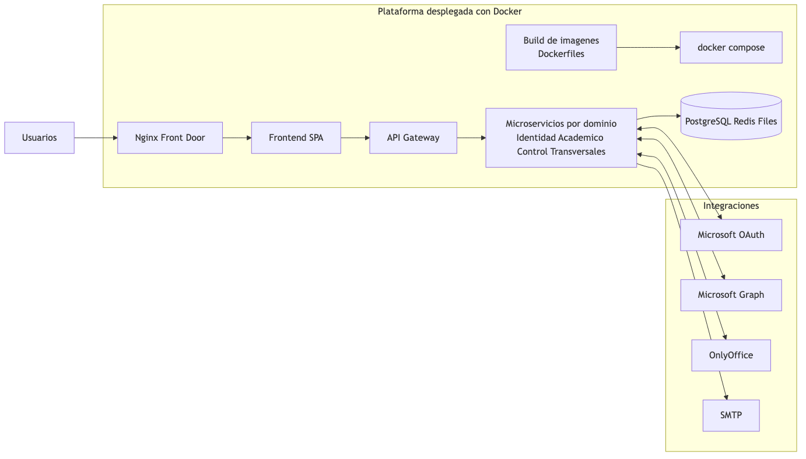

# Documento Ejecutivo - Arquitectura Plataforma Comunidad ESAP

Fecha: 30 de marzo de 2026

## 1. Objetivo

Presentar una vista ejecutiva de la arquitectura actual de la plataforma, enfocada en continuidad operativa, escalabilidad y gobierno tecnologico.

## 2. Diagrama ejecutivo

Archivo fuente del diagrama: `arquitectura_esap_ejecutiva.mmd`

## 3. Vista de arquitectura (resumen)

- Build y despliegue del aplicativo mediante `Dockerfiles` + `docker compose` por entorno.
- Canal unico de entrada por `Nginx` + `Frontend SPA`.
- `API Gateway` como punto central de seguridad y enrutamiento.
- Microservicios organizados por dominios:
  - Identidad y accesos.
  - Academico y certificaciones.
  - Control y cumplimiento.
  - Servicios transversales (notificaciones y auditoria).
- Persistencia centralizada en `PostgreSQL`, soporte en `Redis` y almacenamiento de archivos por servicio.
- Integraciones clave: Microsoft OAuth, Microsoft Graph, OnlyOffice y SMTP.

## 4. Beneficios para el negocio

- Modularidad para evolucionar dominios de negocio sin afectar todo el sistema.
- Trazabilidad de operaciones por servicio (auditoria central).
- Escalabilidad por componentes para periodos de alta demanda.
- Capacidad de integracion con plataformas institucionales y terceros.

## 5. Riesgos y atencion prioritaria

- Deuda tecnica en capa API frontend (clientes duplicados).
- Cobertura de pruebas automatizadas funcionales todavia limitada.
- Necesidad de estandarizar totalmente configuraciones sensibles por entorno.

## 6. Prioridades recomendadas (corto plazo)

1. Unificar cliente API frontend y contrato de endpoints.
2. Fortalecer pruebas de integracion de flujos criticos.
3. Formalizar estandares de despliegue/seguridad por entorno.

## 7. Entregables de arquitectura generados

- Diagrama tecnico detallado: `arquitectura_esap_cloud.png`
- Diagrama ejecutivo: `arquitectura_esap_ejecutiva.png`
- Documento tecnico completo: `DOCUMENTACION_TECNICA.md`
- Documento ejecutivo: `DOCUMENTACION_EJECUTIVA.md`
