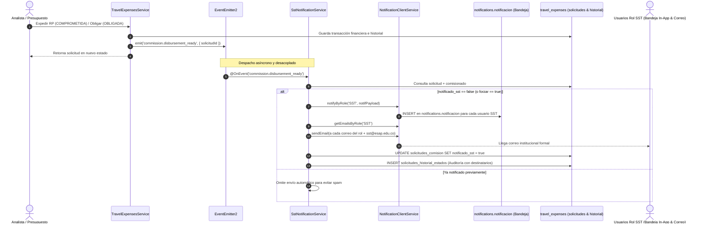

# Documento de Arquitectura Técnica: HU RF-PAG-002
## Notificación Automática a Seguridad y Salud en el Trabajo (SST) - Etapa 8

- **Módulo:** Viáticos y Comisiones de Servicio Oficiales (ESAP)
- **Código Requisito:** RF-PAG-002
- **Etapa:** 8 — Desembolso Financiero y Compromiso (`COMPROMETIDA`, `OBLIGADA`, `PAGADA`)
- **Actores:** Sistema Automático (Event-Driven), Grupo de Presupuesto, Tesorería, Analistas de Viáticos, Usuarios con Rol `SST`

---

## 1. Visión General y Propósito

El requerimiento **RF-PAG-002** asegura que cada vez que una comisión de servicios avance a la etapa de compromiso financiero o desembolso (`COMPROMETIDA`, `OBLIGADA` o `PAGADA`), el sistema despache de forma **100% automática, asíncrona y desacoplada**:
1. **Notificación In-App a la Bandeja de Notificaciones:** Se inserta directamente en la tabla central `notifications.notificacion` dirigida a todos los usuarios con rol institucional `SST` (`SEGURIDAD_SALUD_TRABAJO`), visualizable en la campanita global del Shell.
2. **Notificación por Correo Electrónico:** Despacho de correo institucional con los detalles del itinerario formalizado a todos los usuarios que posean el rol `SST`, más el buzón institucional configurado (`CORREO_DESTINO_SST = 'sst@esap.edu.co'`).
3. **Trazabilidad Inmutable en el Expediente:** Registro de auditoría en la línea de tiempo del expediente (`travel_expenses.solicitudes_historial_estados`) y marcado de la bandera `notificado_sst = true` en `travel_expenses.solicitudes_comision`.

> **Principio de Arquitectura Limpia:** No se crea una tabla redundante de logs locales en `travel_expenses`. Las notificaciones in-app se gestionan a través del esquema central de notificaciones (`notifications.notificacion`), y la trazabilidad legal del expediente reside en su historial inmutable de estados.

---

## 2. Arquitectura Event-Driven y Flujo de Comunicación



---

## 3. Modelo de Base de Datos y Migraciones

### 3.1. Migración: `436_tabla_notificaciones_sst_etapa8.sql`
Agrega la bandera booleana de estado de notificación en la comisión y elimina cualquier tabla redundante:

```sql
-- 1. Bandera de estado en solicitudes_comision
ALTER TABLE travel_expenses.solicitudes_comision
ADD COLUMN IF NOT EXISTS notificado_sst BOOLEAN DEFAULT FALSE NOT NULL;

-- 2. Esquema centralizado: Las notificaciones in-app residen en notifications.notificacion
DROP TABLE IF EXISTS travel_expenses.notificaciones_sst_log CASCADE;
```

### 3.2. Migración: `437_permisos_y_config_notificacion_sst.sql`
Siembra el rol institucional `SST`, permisos RBAC y parámetro global de buzón:

```sql
-- 1. Rol SST en auth.role
INSERT INTO auth.role (id, code, name, description, category, icon, color, is_active)
VALUES (
    gen_random_uuid(),
    'SST',
    'Seguridad y Salud en el Trabajo',
    'Área de Seguridad y Salud en el Trabajo (SST) receptora de desplazamientos en comisión',
    'administrativo',
    'HeartPulse',
    '#10B981',
    true
)
ON CONFLICT (code) DO NOTHING;

-- 2. Permisos de consulta y reintento
INSERT INTO travel_expenses.permisos (codigo, nombre, descripcion)
VALUES 
  ('travel_expenses:read_sst_logs', 'Ver Registros de Notificación SST', 'Permite consultar el estado y trazabilidad de notificaciones a SST'),
  ('travel_expenses:resend_sst_notification', 'Reenviar Notificación SST', 'Permite forzar el reintento manual de notificación a SST')
ON CONFLICT (codigo) DO NOTHING;

-- 3. Parámetro global institucional
INSERT INTO travel_expenses.configuraciones_globales (clave, valor, descripcion)
VALUES ('CORREO_DESTINO_SST', 'sst@esap.edu.co', 'Dirección de correo institucional del área de Seguridad y Salud en el Trabajo')
ON CONFLICT (clave) DO NOTHING;
```

---

## 4. Endpoints REST y Documentación Swagger

### 4.1. `GET /api/v1/notifications/sst/:solicitudId/status` (alias `/log`)
- **Descripción:** Consulta el estado del despacho formal de SST y las trazas de auditoría registradas en el expediente.
- **Permisos Requeridos:** `travel_expenses:read_sst_logs` o roles autorizados.

### 4.2. `POST /api/v1/notifications/sst/:solicitudId/resend`
- **Descripción:** Permite reenviar manualmente la notificación (bandeja in-app de usuarios SST y correo) ante requerimientos de contingencia o actualización de itinerario.
- **Permisos Requeridos:** `travel_expenses:resend_sst_notification`.

---

## 5. Pruebas Automatizadas

1. **Backend (Jest):** `sst-notification.service.spec.ts`
   - Despacho in-app a la bandeja de los usuarios del rol `SST`.
   - Envío de correos a los destinatarios del rol y al buzón institucional.
   - Prevención de duplicados (idempotencia).
   - Asiento de auditoría en `solicitudes_historial_estados`.
   - Reintento manual forzado vía endpoint `/resend`.
2. **Frontend (Vitest):** `SstNotificationTimeline.test.tsx`
   - Renderizado del hito verde con ícono `HeartPulse`.
   - Expansión de datos notificados (Comisionado, C.C., Destino, Fechas, Objeto).
   - Invocación de reenvío con feedback dinámico en UI.
