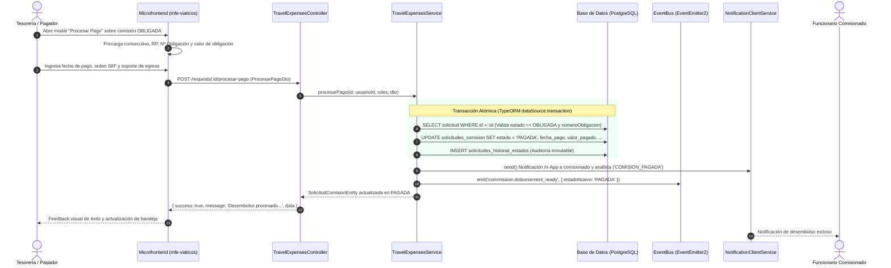

# Documento de Arquitectura Técnica: HU RF-PAG-003
## Procesamiento de Desembolso y Pago de Comisiones en SIIF Nación — Etapa 8

- **Módulo:** Viáticos y Comisiones de Servicio Oficiales (ESAP)
- **Código Requisito:** RF-PAG-003
- **Etapa:** 8 — Tesorería y Desembolso Financiero
- **Transición de Estado:** `OBLIGADA` ➔ `PAGADA`
- **Actores:** Tesorería, Pagador Institucional, Super Admin, Analista de Viáticos (Consulta)
- **Documento Fuente:** Requerimiento ESAP-TD-FO-019 (Módulo de Viáticos)

---

## 1. Visión General y Criterios de Aceptación

El requerimiento **RF-PAG-003** constituye el núcleo de la **Etapa 8**, donde el área de Tesorería ejecuta y formaliza el desembolso financiero al comisionado a través de SIIF Nación y las entidades bancarias vinculadas, transicionando el expediente al estado definitivo **PAGADA**.

### Criterios de Aceptación (Gherkin)

```gherkin
Característica: Procesamiento del desembolso y pago de comisión en Tesorería

  Criterio 1: Desembolso y transición a PAGADA
    Dado que existe una comisión de servicios con obligación registrada en SIIF Nación (estado OBLIGADA),
    Cuando el usuario con rol de Tesorería procesa el pago y registra los datos de egreso,
    Entonces la comisión transiciona exitosamente al estado final PAGADA.

  Criterio 2: Registro de trazabilidad, soporte y fecha
    Dado que el desembolso ha sido procesado por Tesorería,
    Cuando se registra en el sistema,
    Entonces queda registrado de forma inmutable en el historial de estados con:
      | Campo                   | Descripción                                       |
      | fecha_pago              | Fecha efectiva del desembolso / transferencia      |
      | valor_pagado            | Monto total pagado en COP                         |
      | numero_orden_pago       | Número oficial de la orden de pago / egreso SIIF  |
      | soporte_pago_path       | Ruta o enlace al comprobante de egreso            |
      | pagado_por_id           | Identificador del usuario que ejecutó el pago      |
      | fecha_registro_pago     | Marca de tiempo exacta del asiento                |

  Criterio 3: Respeto de la modalidad presupuestal
    Dado un expediente en etapa de desembolso,
    Cuando Tesorería efectúa el pago,
    Entonces se respeta la modalidad presupuestal confirmada en la obligación:
      - AVANCE: Desembolso previo al viaje para cubrir viáticos y gastos de desplazamiento.
      - RECONOCIMIENTO_POSTERIOR: Desembolso post-comisión sujeto a legalización de cumplido.

  Criterio 4: Validaciones de integridad
    Dado un intento de pago,
    Si la comisión no está en estado OBLIGADA, o no tiene número de obligación, o el valor es menor o igual a 0,
    Entonces el sistema rechaza la operación con una excepción HTTP 400 (BadRequestException).
```

---

## 2. Arquitectura de Transacción y Flujo de Comunicación



---

## 3. Modelo de Base de Datos y Migraciones Separadas

Conforme a los estándares de arquitectura empresarial del proyecto, las migraciones se separan estrictamente en dos artefactos independientes:

### 3.1. Migración de Modelo de Datos: `438_procesar_pago_desembolso_etapa8.sql`
- **Ubicación:** `backend/travel-expenses-service/bd/migrations/` (y sincronizada en `db/migrations/`).
- **Campos agregados a `travel_expenses.solicitudes_comision`:**
  - `fecha_pago DATE NULL`: Fecha en que Tesorería ejecutó la transferencia o egreso.
  - `valor_pagado NUMERIC(12, 2) NULL`: Monto formalmente desembolsado.
  - `soporte_pago_path VARCHAR(255) NULL`: Ruta o URL del comprobante de desembolso / egreso bancario.
  - `numero_orden_pago VARCHAR(100) NULL`: Identificador oficial de la Orden de Pago SIIF.
  - `observaciones_pago TEXT NULL`: Detalle, concepto o notas del desembolso.
  - `pagado_por_id UUID NULL`: Clave foránea al usuario pagador (compatible con `usuarios` o `auth.user`).
  - `fecha_registro_pago TIMESTAMP WITH TIME ZONE NULL`: Timestamp de registro en el sistema.
- **Índices de optimización:**
  - `idx_solicitudes_numero_orden_pago` sobre `numero_orden_pago`.
  - `idx_solicitudes_estado_pagada` sobre `estado_solicitud`.
  - `idx_solicitudes_fecha_pago` sobre `fecha_pago`.

### 3.2. Migración de Roles y Permisos RBAC: `439_roles_permisos_pago_tesoreria_etapa8.sql`
- **Ubicación:** `backend/travel-expenses-service/bd/migrations/` (y sincronizada en `db/migrations/`).
- **Rol creado / asegurado en `auth.role`:**
  - `TESORERIA`: "Grupo de Tesorería y Desembolso" (categoría `administrativo`, color `#059669`).
- **Permisos en `auth.permission` y `travel_expenses.permisos`:**
  - `travel_expenses:process_payment`: Procesar Pago y Desembolso de Comisión.
  - `travel_expenses:read_payments`: Consultar Pagos y Desembolsos Registrados.
  - `travel_expenses:register_payment`: Registrar Orden y Soporte de Pago SIIF.
- **Asignación de permisos:** Roles `TESORERIA`, `GRUPO_TESORERIA`, `SUPER_ADMIN`.

---

## 4. Endpoints del API REST

### `POST /api/v1/requests/:id/procesar-pago` (alias `/requests/:id/procesar-pago`, `/requests/:id/desembolso`)

- **Autenticación:** Requerida (`Bearer JWT`).
- **Permisos requeridos:** `travel_expenses:process_payment`, `travel_expenses:register_payment`, `travel_expenses:create_obligation`, `travel_expenses:verify_request`.
- **Payload (`ProcesarPagoDto`):**
  ```json
  {
    "fechaPago": "2026-10-26",
    "valorPagado": 850000,
    "numeroOrdenPago": "OP-SIIF-2026-98124",
    "soportePagoPath": "uploads/pagos/2026/comprobante-8920.pdf",
    "observacionesPago": "Transferencia interbancaria ejecutada conforme a orden de pago SIIF Nación.",
    "modalidadPago": "AVANCE"
  }
  ```
- **Respuesta (200 OK):**
  ```json
  {
    "success": true,
    "data": {
      "id": "sol-obli-001",
      "consecutivoUnico": "COM-2026-0089",
      "estadoSolicitud": "PAGADA",
      "fechaPago": "2026-10-26T00:00:00.000Z",
      "valorPagado": 850000,
      "numeroOrdenPago": "OP-SIIF-2026-98124",
      "soportePagoPath": "uploads/pagos/2026/comprobante-8920.pdf",
      "observacionesPago": "Transferencia interbancaria ejecutada...",
      "modalidadPago": "AVANCE",
      "pagadoPorId": "usr-tesorero-uuid",
      "fechaRegistroPago": "2026-10-26T14:32:00.000Z"
    },
    "message": "Desembolso procesado exitosamente por Tesorería. Comisión transicionada a estado PAGADA.",
    "timestamp": "2026-10-26T14:32:00.120Z"
  }
  ```

---

## 5. Componentes Frontend (Microfrontend mfe-viaticos)

1. **`ProcesarPagoModal.tsx`:**
   - Modal institucional con paleta esmeralda / teal acorde a la identidad institucional de la ESAP.
   - Resumen del expediente: comisionado, RP expedido, número de obligación SIIF, modalidad y valor.
   - Validación controlada con alertas accesibles (`role="alert"`).
   - Prellenado inteligente del valor a desembolsar.
2. **`AnalystInbox.tsx`:**
   - Visualización de comisiones en estado `OBLIGADA` con botón dinámico **"Procesar Pago"** para usuarios autorizados de Tesorería.
   - Distinctivo visual permanente para comisiones en estado **"Pagada · Desembolsada"**.
   - Mapeo de número de orden de pago y valor en la columna de detalles.
3. **`VerificacionSIIFModal.tsx`:**
   - Banner institucional para el estado `PAGADA` con visualización de la orden de pago y fecha.

---

## 6. Cobertura de Pruebas Automatizadas

| Suite de Pruebas | Archivo | Casos Verificados | Resultado |
| :--- | :--- | :--- | :--- |
| **Backend Unit Tests** | `travel-expenses-pago.spec.ts` | 9 pruebas: Criterio 1 (Avance y Posterior), Criterio 2 (Trazabilidad y Notificaciones), Validaciones (NotFound, Estado inválido, Sin obligación, Sin fecha, Valor <= 0), Controlador. | **100% PASS** (9/9) |
| **Frontend Unit Tests** | `ProcesarPagoModal.test.tsx` | 7 pruebas: Renderizado condicional, datos comparativos, validación de fecha, validación de valor > 0, envío exitoso, respeto de modalidad posterior, manejo de errores de API. | **100% PASS** (7/7) |
| **Bandeja de Gestión** | `AnalystInbox.test.tsx` | 13 pruebas: Renderizado, pestañas, apertura de modal Crear Obligación SIIF, apertura de modal Procesar Pago en solicitudes OBLIGADA. | **100% PASS** (13/13) |
