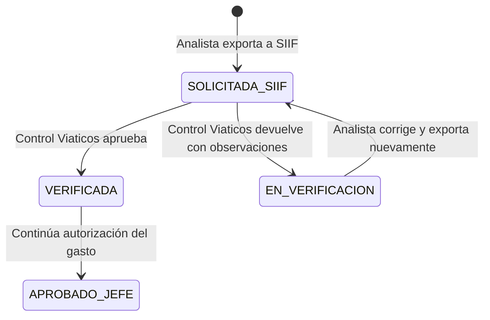

# RF-REV-002 — Segunda revisión de Control Viáticos

> **Módulo:** Viáticos y Gastos de Viaje · ESAP  
> **Responsabilidad:** Control cruzado obligatorio antes de la autorización del gasto  
> **Fecha:** 2026-09-09  
> **Estado esperado:** `SOLICITADA_SIIF` → `VERIFICADA` o `EN_VERIFICACION`

---

## 1. Resumen ejecutivo

RF-REV-002 agrega una segunda revisión independiente para las solicitudes que ya fueron verificadas por el analista y exportadas a SIIF. El rol técnico `CONTROL_VIATICOS` consulta una bandeja limitada al estado `SOLICITADA_SIIF`, revisa el expediente digital y puede:

1. Aprobar la solicitud y transicionarla a `VERIFICADA`.
2. Devolverla al analista asignado con observaciones obligatorias y transicionarla a `EN_VERIFICACION`.

La aprobación y la devolución son transaccionales. Cada acción actualiza la trazabilidad de la solicitud y agrega un registro append-only en `solicitudes_historial_estados`.

La regla de segregación de funciones (SoD) impide que el revisor de segundo nivel sea el comisionado, el creador original, el analista asignado o el usuario que exportó la solicitud a SIIF. El rol `SUPER_ADMIN` conserva un bypass explícito para contingencias operativas.

---

## 2. Flujo de estados



### Reglas de transición

| Acción | Estado de entrada | Estado de salida | Campos actualizados | Historial |
| --- | --- | --- | --- | --- |
| Aprobar segunda revisión | `SOLICITADA_SIIF` | `VERIFICADA` | `revisor_control_id`, `fecha_segunda_revision` | `SOLICITADA_SIIF` → `VERIFICADA` |
| Devolver a analista | `SOLICITADA_SIIF` | `EN_VERIFICACION` | `revisor_control_id`, `fecha_segunda_revision`, `observaciones_segunda_revision` | `SOLICITADA_SIIF` → `EN_VERIFICACION` |

Una devolución no borra la exportación SIIF ni los campos de primera revisión. Permite que el analista corrija el expediente y ejecute nuevamente el flujo de exportación según la lógica existente.

---

## 3. Migraciones SQL

Las migraciones están separadas por responsabilidad y deben ejecutarse en orden:

1. `backend/travel-expenses-service/db/migrations/429_rol_control_viaticos_y_permisos.sql`
2. `backend/travel-expenses-service/db/migrations/430_columnas_segunda_revision_etapa5.sql`

### 3.1. Migración 429 — Seguridad y RBAC

Registra el rol `CONTROL_VIATICOS` y crea o reutiliza estos permisos:

| Permiso | Rol | Uso |
| --- | --- | --- |
| `travel_expenses:read_siif_requested` | `CONTROL_VIATICOS` | Consultar la bandeja `SOLICITADA_SIIF`. |
| `travel_expenses:double_check_request` | `CONTROL_VIATICOS` | Aprobar la segunda revisión. |
| `travel_expenses:return_to_analyst` | `CONTROL_VIATICOS` | Devolver la solicitud con observaciones. |

La migración también conserva el comodín `travel_expenses:*` para los roles administrativos existentes. Es idempotente mediante consultas `IF NOT EXISTS` y `ON CONFLICT DO NOTHING`.

### 3.2. Migración 430 — Datos de negocio

Agrega a `travel_expenses.solicitudes_comision`:

| Columna | Tipo | Nula | Descripción |
| --- | --- | --- | --- |
| `revisor_control_id` | `UUID` | Sí | Usuario de Control Viáticos que ejecuta la acción. |
| `fecha_segunda_revision` | `TIMESTAMP` | Sí | Estampa de aprobación o devolución. |
| `observaciones_segunda_revision` | `TEXT` | Sí | Hallazgos obligatorios en caso de devolución. |

La implementación apunta la FK al esquema real de usuarios: `auth."user"(id_user)`, con `ON DELETE SET NULL`. El nombre físico se mantiene en la convención de columnas del servicio (`revisor_control_id`).

Se crean índices para `revisor_control_id` y `fecha_segunda_revision`.

---

## 4. Backend

### 4.1. Entidad y auditoría

`SolicitudComisionEntity` incluye:

- `revisorControlId` / `revisorControl`
- `fechaSegundaRevision`
- `observacionesSegundaRevision`

El enum `EstadoSolicitud` incluye explícitamente `VERIFICADA`.

Cada transición usa una transacción TypeORM con bloqueo pesimista de escritura sobre la solicitud. Primero se valida el estado y SoD; después se persisten la entidad y el historial. Si cualquiera de las escrituras falla, la transacción se revierte.

### 4.2. SoD

El guardia dedicado `SecondLevelSodGuard` compara el `userId` autenticado con:

- `comisionadoId`
- `creadoPorUsuarioId`
- `analistaAsignadoId`
- `usuarioExportadorId`

Si existe coincidencia, responde `403 Forbidden` con:

> Violacion de Segregacion de Funciones: El revisor de segundo nivel debe ser diferente del analista que verifico la solicitud

La validación equivalente permanece en el servicio como defensa en profundidad. Los roles `SUPER_ADMIN`, `ADMIN`, `ADMINISTRATIVO`, `SUPER_ADMINISTRADOR` y `SUPERUSER` pueden omitir la restricción.

### 4.3. Endpoints

El API Gateway expone las rutas bajo `/viaticos/api/v1`; el microservicio las implementa bajo `/api/v1` mediante el proxy.

| Método | Ruta | Permiso | Respuestas principales |
| --- | --- | --- | --- |
| `GET` | `/requests/siif-requested` | `travel_expenses:read_siif_requested` | `200`, `401`, `403` |
| `POST` | `/requests/:id/verify-second-level` | `travel_expenses:double_check_request` | `200`, `400`, `403`, `404` |
| `POST` | `/requests/:id/return-to-analyst` | `travel_expenses:return_to_analyst` | `200`, `400`, `403`, `404` |

#### `GET /requests/siif-requested`

Devuelve solicitudes en estado `SOLICITADA_SIIF`, con comisionado, analista asignado, dependencia, fechas, prioridad y datos de trazabilidad SIIF. Admite paginación básica mediante `page` y `limit`.

#### `POST /requests/:id/verify-second-level`

No requiere cuerpo. El usuario autenticado se registra como `revisor_control_id`. La solicitud debe estar en `SOLICITADA_SIIF`.

Respuesta de éxito:

```json
{
  "success": true,
  "data": {
    "id": "uuid",
    "estadoSolicitud": "VERIFICADA",
    "revisorControlId": "uuid",
    "fechaSegundaRevision": "2026-09-09T00:00:00.000Z"
  },
  "timestamp": "2026-09-09T00:00:00.000Z"
}
```

#### `POST /requests/:id/return-to-analyst`

Requiere:

```json
{
  "observaciones": "Inconsistencia detectada entre la fecha del CDP y el itinerario."
}
```

El texto se valida como string no vacío, con longitud mínima de 3 y máxima de 1000 caracteres. Un cuerpo vacío, solo espacios o un texto insuficiente produce `400 Bad Request`.

---

## 5. Frontend

### 5.1. Bandeja de Control Viáticos

`apps/mfe-viaticos/src/components/ControlViaticosInbox.tsx` muestra:

- Consecutivo.
- Comisionado.
- Analista verificador de primer nivel.
- Dependencia.
- Fechas de viaje.
- Prioridad.
- Botón **Realizar Control Cruzado**.

La bandeja consulta exclusivamente `SOLICITADA_SIIF` y se actualiza después de aprobar o devolver una solicitud.

### 5.2. Modal de segunda revisión

El modal presenta:

- Datos del Formato 023 y liquidación.
- Semáforo de presupuesto de tiquetes cuando hay datos disponibles.
- Soportes PDF.
- Trazabilidad de primer nivel con analista y fecha de exportación SIIF.
- Botón verde **Aprobar Segunda Revisión (VERIFICADA)**.
- Botón rojo **Devolver a Analista** con textarea obligatorio.

El modal usa el cliente `viaticosService`, maneja carga, éxito y error, y refresca la bandeja al terminar la acción.

### 5.3. Permisos y navegación

El menú de `ViaticosModulePremium` muestra la bandeja cuando el usuario tiene al menos uno de los permisos de Control Viáticos o es administrador. El rol `ANALISTA` continúa entrando a su bandeja existente; la nueva bandeja no reemplaza el flujo del analista.

---

## 6. Swagger y contratos

Los controladores y DTOs de esta HU usan:

- `@ApiTags('control-viaticos')`
- `@ApiBearerAuth()`
- `@ApiOperation`
- `@ApiResponse` para `200`, `400`, `403` y `404`
- `@ApiBody` para el DTO de observaciones

Los contratos de respuesta mantienen camelCase para integrarse con el frontend y el API Gateway.

---

## 7. Pruebas automatizadas

### Backend

Archivos base:

- `backend/travel-expenses-service/src/modules/travel-expenses/__tests__/travel-expenses.service.spec.ts`
- `backend/travel-expenses-service/src/modules/travel-expenses/__tests__/travel-expenses.controller.spec.ts`
- `backend/travel-expenses-service/src/common/__tests__/sod.guard.spec.ts`

Cobertura requerida:

| Escenario Gherkin | Validación |
| --- | --- |
| Aprobar exitosamente | Estado `VERIFICADA`, revisor, fecha e historial persistidos. |
| Auto-revisión | `ForbiddenException` 403 cuando el revisor participó antes. |
| Devolución por hallazgos | Estado `EN_VERIFICACION`, observaciones y fecha persistidas. |
| Bypass Super Admin | Aprobación exitosa aunque el usuario haya participado antes. |
| Observaciones vacías | `BadRequestException` 400 antes de escribir. |

Ejecución:

```bash
cd backend/travel-expenses-service
npm test -- --runInBand
npm run build
```

### Frontend

Archivos base:

- `apps/mfe-viaticos/src/components/ControlViaticosInbox.test.tsx`
- `apps/mfe-viaticos/src/components/ControlViaticosModal.test.tsx`
- `apps/mfe-viaticos/src/services/api/viaticosService.test.ts`

Cobertura requerida:

| Caso | Validación |
| --- | --- |
| Bandeja cargada | Filas `SOLICITADA_SIIF` y columnas requeridas. |
| Búsqueda | Filtrado por consecutivo, comisionado o dependencia. |
| Abrir modal | Carga del expediente completo. |
| Aprobar | Llamada a `verify-second-level`, éxito y refresco. |
| Devolver vacío | Envío inhabilitado y mensaje de observación obligatoria. |
| Devolver con texto | Llamada a `return-to-analyst`, éxito y refresco. |

Ejecución:

```bash
cd apps/mfe-viaticos
npm run test:run
npm run build
```

---

## 8. Pruebas manuales

1. Ejecutar las migraciones 429 y 430 en una base de pruebas.
2. Crear una solicitud y completarla hasta `SOLICITADA_SIIF` con un analista.
3. Ingresar como `CONTROL_VIATICOS` diferente al analista y al exportador.
4. Confirmar que la solicitud aparece en **Control Viáticos**.
5. Abrir **Realizar Control Cruzado** y validar el expediente, soportes y trazabilidad.
6. Devolver con observaciones vacías; confirmar `400` y que no cambia el estado.
7. Devolver con observaciones válidas; confirmar `EN_VERIFICACION` y el texto en BD/historial.
8. Exportar nuevamente hasta `SOLICITADA_SIIF`.
9. Aprobar como revisor independiente; confirmar `VERIFICADA`, fecha, revisor e historial.
10. Repetir aprobación con el analista/exportador; confirmar `403`.
11. Repetir como `SUPER_ADMIN`; confirmar que el bypass permite la operación.
12. Verificar Swagger en `/docs` y las respuestas documentadas.

---

## 9. Despliegue y operación

1. Ejecutar `429_rol_control_viaticos_y_permisos.sql`.
2. Ejecutar `430_columnas_segunda_revision_etapa5.sql`.
3. Desplegar `travel-expenses-service` y reiniciar el proceso.
4. Desplegar `api-gateway` si se requiere recargar configuración.
5. Asignar el rol `CONTROL_VIATICOS` a los usuarios operativos mediante la administración de autenticación.
6. Validar que el frontend reciba los permisos en el contexto de usuario.
7. Monitorear rechazos 403 de SoD y devoluciones con observaciones durante la puesta en producción.

## 10. Documentos relacionados

- `docs/viaticos/HU_RF-REC-002_TABLERO_CARGA.md`
- `docs/viaticos/HU_RF-REC-002_PRUEBAS.md`
- `docs/viaticos/PLAN_PRUEBAS_MODULO_VIATICOS.md`
- `docs/viaticos/DOCUMENTACION_MODULO_VIATICOS.md`
