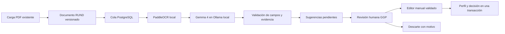

# REQ-RUND-F014 — Asistente documental experimental

Implementación del procesamiento local PaddleOCR → Gemma 4/Ollama para proponer datos del perfil RUND. El módulo requiere activación explícita y revisión humana; no es una dependencia de la carga documental, del perfil manual ni de los PTA. No implementa REQ-RUND-F016 (historial «En Firme»).

## Estado de entrega

Instalación local comprobada el 14 de septiembre de 2026: PaddleOCR y Ollama 0.34.0 ejecutados en contenedores, con Gemma 4 E2B QAT adaptado a entrada de texto. Las migraciones 656 y 657 están aplicadas a PostgreSQL local y la función habilitada en el backend PTA reiniciado. La verificación HTTP confirmó 401 sin sesión, 403 para docente y 200 con `enabled=true` para GGP. No se ha desplegado en producción.

La prueba completa utilizó un diploma ficticio, motores reales y PostgreSQL con tablas temporales y rollback. Extrajo «Administración Pública», mantuvo el perfil intacto mientras la sugerencia estaba pendiente y verificó la confirmación humana, el rollback conjunto, la no duplicación, el reemplazo documental, el descarte y los reintentos. Las tres lecturas OCR tardaron 16,0 / 9,2 / 7,3 segundos y las consultas Gemma 3,5 / 2,4 / 1,9 segundos, con los motores preparados. El primer arranque del modelo de texto tardó 107 segundos en este equipo (15,3 GB RAM, GPU NVIDIA de 8 GB); ese tiempo depende de la memoria disponible.

Los artefactos reproducibles están en `.local/rund-extraction-real/`. No se analizaron ni modificaron expedientes reales para esta prueba. La interfaz se verificó en navegador con componentes reales y API simulada. **Sigue pendiente la evaluación de precisión con un conjunto representativo de soportes institucionales**: un diploma sintético no acredita precisión general. El módulo conserva su carácter experimental y la validación humana obligatoria.

## Uso del operador

1. Cargar el PDF mediante la gestión documental RUND existente. Las nuevas versiones se detectan automáticamente después de habilitar la función.
2. Abrir el expediente con acceso GGP. Debajo de los documentos aparece **Asistente de captura · Experimental**; los estados se consultan cada 10 segundos sin bloquear el perfil.
3. Revisar el dato previo, la sugerencia, el fragmento OCR y su página. **Ver PDF de origen** abre la versión exacta. Una confianza baja queda marcada en naranja.
4. **Revisar y aplicar** abre el editor habitual en el paso del campo sugerido. Corregirlo si corresponde, adjuntar el soporte de edición y confirmar el guardado. Se conserva la exigencia existente de justificación y soporte; puede adjuntarse el PDF original como soporte de esta modificación. Abrir o cancelar el editor no confirma nada.
5. **Descartar** exige un motivo y conserva el resultado original para trazabilidad.

Mientras trabaja, el asistente muestra una barra por etapas reales: **Preparar PDF → Leer texto → Extraer datos → Verificar sugerencias**, con tiempo transcurrido y mensajes de cola/reintento. No se presenta un porcentaje ficticio de tiempo restante. El progreso se guarda en PostgreSQL; salir del módulo, cerrar la pestaña o cerrar sesión no cancela el trabajo. En instalación local, el equipo y los servicios deben permanecer encendidos; si se detienen, la cola se recupera cuando vuelven a funcionar.

Al completar, agotar los reintentos o detectar un documento obsoleto, un proceso independiente entrega un aviso persistente al usuario que solicitó el análisis o cargó el soporte. La campanita lo muestra desde cualquier módulo, normalmente en su siguiente consulta de 30 segundos. **Ver resultado** abre el expediente por id, sin depender de filtros, página o periodo del listado. El aviso no incluye datos extraídos ni envía correo. Si notificaciones está fuera de servicio, se reintenta sin repetir el OCR; una clave estable impide duplicar el aviso o reiniciar su marca de lectura. Si no puede resolverse el usuario destinatario activo, no se difunde a otros usuarios y se vuelve a comprobar al día siguiente.

La aprobación de una sugerencia confirma el dato editado, pero **no aprueba automáticamente los soportes ni los bloques documentales**: siguen las validaciones del flujo RUND. Un PDF reemplazado/eliminado no puede respaldar una nueva aplicación. Si alguien modificó el mismo campo después de extraerlo, se rechaza el guardado asistido: hay que descartar la sugerencia y solicitar un nuevo análisis.

Los documentos anteriores a la primera activación se procesan solo mediante **Extraer sugerencias**. El reanálisis conserva los trabajos anteriores y requiere revisar o descartar sus sugerencias pendientes. Los errores permiten reintentar explícitamente.

## Arquitectura y persistencia



Migración `db/migrations/656_rund_extraccion_experimental.sql`, posterior a las tablas documentales RUND:

- `RundExtraccionInicio`: marca persistente de primera activación; no se pierde al reiniciar el backend.
- `RundExtraccionTrabajo`: versión documental, docente, solicitante, estado, intentos, plazo de procesamiento, perfil al extraer, checksum y versiones de motores/contrato.
- `RundExtraccionSugerencia`: campo, original, propuesta, evidencia, página, confianza orientativa, decisión, valor confirmado, operador, motivo y fecha.

El worker del servicio PTA consulta cada 5 segundos. Usa una reserva de 90 segundos renovada cada 20 segundos mientras trabaja y `FOR UPDATE SKIP LOCKED`; un índice parcial impide dos trabajos activos para la misma versión. Si cae el proceso, la reserva expira y se recupera sin esperar el timeout completo del modelo. Los fallos tienen hasta tres intentos, con espera de un minuto entre intentos normales. Los resultados tardíos de una reserva vencida se ignoran. No se duplica automáticamente un documento ya analizado; un reanálisis explícito crea otro trabajo.

La migración `657_rund_extraccion_progreso.sql` agrega etapas, tiempos y estado de entrega del aviso. La reserva del trabajo y el descarte usan `WITH … UPDATE … RETURNING … SELECT`: conserva el contrato de filas al ejecutar con TypeORM. Su driver PostgreSQL devuelve `[filas, cantidad]` para un `UPDATE` directo, diferencia que causaba el estado «Procesando» sin iniciar OCR. La prueba de integración ahora usa **PostgresQueryRunner real**, no un adaptador que devuelva únicamente las filas.

La extracción solo inserta sugerencias. Al editar con `rundSuggestionIds`, el backend bloquea la sugerencia, el documento y el perfil, comprueba vigencia y dato previo, ejecuta las validaciones manuales existentes y guarda perfil + decisión en **la misma transacción**. Las ediciones sin sugerencias conservan su ruta habitual.

## Campos y confianza

La lista cerrada está en `rund-extraccion-fields.ts`; el modelo nunca determina columnas SQL. Se limita por tipo de soporte; un PDF general sin tipo se limita por categoría documental.

| Soporte | Campos candidatos |
| --- | --- |
| Identidad | Nombre completo y fecha de nacimiento |
| Diplomas y actas de grado | Pregrado, especialización, maestría, doctorado, posdoctorado |
| Hoja de vida | Perfil académico |
| Contrato / acto de vinculación | Acto y fechas de vinculación |
| Resoluciones específicas | Origen, situación administrativa, escalafón y núcleo temático |
| Certificaciones y evaluación | Investigación y última evaluación |

No se extraen identificadores editables, contraseñas, permisos, estados, horas calculadas, puntaje salarial, género ni otros atributos sensibles inferidos. La cédula permanece protegida por las reglas existentes. La fecha de nacimiento solo puede proponerse desde soporte de identidad; nunca se infiere edad para completar una fecha.

Se descartan campos desconocidos, repetidos, valores vacíos, páginas inexistentes y citas no presentes en el OCR. Los valores deben estar contenidos en la cita, salvo fechas normalizadas a `AAAA-MM-DD`, que siempre requieren una fecha válida y se marcan con confianza baja si no aparecen literalmente. Cada cita tiene como máximo 600 caracteres y cada valor 1000; las restricciones más precisas del formulario se aplican durante la revisión/guardado.

La puntuación es **orientativa, no una probabilidad calibrada**: mínimo de la confianza declarada por el modelo y el percentil 10 de confianza OCR de la página. Menos de `0,85` se marca como baja; fechas normalizadas sin coincidencia literal se limitan a `0,5`. **Ni siquiera confianza 1 elimina la revisión humana.** El texto del PDF se trata como contenido no confiable y no habilita herramientas ni acciones para el modelo.

## Contrato API

Base externa del gateway: `/pta/api/v1/pta/banco-docentes/:docenteId/extracciones`.

| Método / ruta relativa | Operación |
| --- | --- |
| `GET /` | `{success:true,data:{enabled,jobs,documents}}`; cada trabajo incluye sus sugerencias y la vigencia documental. Sin caché. |
| `POST /documentos/:documentId` | Solicitud/reintento explícito, cuerpo `{}`; HTTP 202 y `{success:true,data:{queued:true}}`. |
| `POST /sugerencias/:suggestionId/descartar` | Cuerpo `{motivo:"..."}` de 3 a 1000 caracteres; responde `discarded:true`. |

No existe un endpoint de aprobación automática. El endpoint existente de edición del docente recibe adicionalmente `rundSuggestionIds:["uuid"]`, junto con el valor revisado, `soporteEdicionId`, `justificacionEdicion` y el resto del formulario validado. Los IDs deben pertenecer a este docente y a campos distintos. El servidor obtiene el operador y su acceso de la sesión autenticada; no confía en un rol enviado por el navegador.

Se conservan los guards JWT y permisos RUND existentes. Además de editar/gestionar RUND, el operador debe tener acceso completo al documento original (GGP/SUPER_ADMIN); tener únicamente un permiso de edición con datos restringidos no permite consultar texto OCR. Consultas, solicitudes y descartes registran auditoría de acceso; la edición guarda su auditoría existente y los IDs de las sugerencias utilizadas.

Contrato privado OCR: `POST /extract`, `Authorization: Bearer <RUND_OCR_TOKEN>`, multipart `file` PDF. Respuesta `{motor,paginas:[{pagina,texto,confianza}]}`. `GET /health` no muestra documentos ni secretos. Ollama se consume con `POST /api/chat`, `stream:false`, esquema JSON cerrado y temperatura cero.

## Instalación local

Requisitos: Docker con contenedores Linux, espacio para imágenes/modelos y memoria suficiente para el sistema y ambos motores. El instalador detecta NVIDIA con al menos 6 GB de VRAM y aplica `docker-compose.rund-ocr.gpu.yml`; se puede elegir `-CpuOnly` explícitamente. La RAM y el espacio de disco son recursos distintos; disponer de GPU reduce la carga de RAM del modelo pero no la elimina. Los límites son 4 GB para OCR, 12 GB para Ollama en CPU y 6 GB de RAM más la GPU con el complemento NVIDIA. Para uso compartido, dimensionar un servidor dedicado tras medir los tiempos con el corpus acordado.

Desde la raíz del repositorio, PowerShell:

```powershell
# Prepara únicamente el archivo local y un token aleatorio; no inicia servicios.
.\scripts\setup-rund-ocr.ps1

# Con Docker iniciado y suficiente memoria: construye OCR y descarga los modelos locales.
.\scripts\setup-rund-ocr.ps1 -Start
```

El archivo generado `.env.rund-ocr.local` está ignorado por Git. No sobreescribe la configuración de la aplicación ni cambia una instalación existente de Ollama. El compose independiente usa OCR en `127.0.0.1:8091` y Ollama en `127.0.0.1:11435` para evitar colisión con un Ollama ya instalado en 11434. Las descargas iniciales de paquetes/modelos requieren Internet; los PDF se procesan localmente y no se envían a la nube. Los modelos se conservan en volúmenes Docker.

Versiones fijadas: PaddleOCR 3.7.0, PaddlePaddle 3.3.1, Ollama 0.34.0 y modelo `gemma4:e2b-it-qat`. Se seleccionan explícitamente `PP-OCRv5_mobile_det` y `latin_PP-OCRv5_mobile_rec`, con MKLDNN desactivado y dos hilos CPU. Esto evita heredar un modelo OCR distinto cuando cambian los valores predeterminados del paquete. La instalación prepara el OCR mediante `/warmup` autenticado en el servidor activo y después inicializa el contexto de Gemma; no carga un segundo motor OCR en otro proceso.

Para el flujo OCR → texto, `prepare-rund-text-model.cjs` crea `gemma4:rund-e2b-text` a partir de los pesos oficiales del modelo anterior, conservando su renderer, parser y licencia y excluyendo el proyector de imagen/audio. El instalador lo configura automáticamente después de descargar la base. Esto reduce el consumo del procesamiento textual. La preparación puede tardar varios minutos al verificar el archivo GGUF; no cambia la precisión de sus pesos. El script valida la estructura esperada y falla si el formato base cambió. Véase [Modelfile de Ollama](https://docs.ollama.com/modelfile).

Después de preparar los motores:

1. Aplicar las migraciones 656 y 657, en ese orden, mediante el procedimiento de migraciones del ambiente, con el módulo aún deshabilitado. Agregan tablas, columnas e índices; no modifican perfiles existentes. Actualizar también `notifications-service`, cuyo `POST /notifications` acepta la clave UUID opcional `clave_idempotencia` (las llamadas existentes sin clave conservan su comportamiento).
2. Cargar las siguientes variables en **academic-work-plan-service**, usando el token del archivo local mediante el mecanismo de secretos del ambiente. Nest no carga automáticamente `.env.rund-ocr.local`.

```dotenv
RUND_OCR_ENABLED=true
RUND_OCR_URL=http://localhost:8091
RUND_OCR_TOKEN=<token generado, mínimo 32 caracteres>
RUND_OLLAMA_URL=http://localhost:11435
RUND_OLLAMA_MODEL=gemma4:rund-e2b-text
```

3. Reiniciar el backend PTA. Si corre en otro contenedor, conectar ambos servicios a su red privada y usar `http://rund-ocr:8091` / `http://rund-ollama:11434`; `localhost` dentro del contenedor no es el host. No publicar Ollama ni el OCR en Internet. El servicio solo admite destinos locales/privados configurados; rechaza redirects, credenciales en URL y etiquetas de modelos cloud.
4. Probar un expediente de prueba con un PDF sintético y revisar la cola, el asistente y la aprobación/corrección/descarte. Validar aparte carga de PDF, edición manual y devolución/aprobación documental con la función habilitada y deshabilitada.

Para una instalación completamente local, el siguiente activador comprueba los motores, aplica la migración solo a PostgreSQL en localhost y copia exclusivamente las variables OCR al `.env` de PTA. No modifica las credenciales de BD ni perfiles. Debe reiniciarse el proceso PTA después:

```powershell
node scripts/activate-rund-ocr-local.cjs
node scripts/verify-rund-ocr-active.cjs
```

La verificación HTTP usa identidades sintéticas con JWT de un minuto: exige 401 sin sesión, 403 para docente y 200 con la función activa para GGP. Solo consulta un UUID inexistente y deja su registro de acceso en la auditoría local.

Para apagar el experimento: `RUND_OCR_ENABLED=false` y reiniciar PTA. Se oculta el asistente y no se ejecuta el worker; se conservan sugerencias y trazabilidad. No borrar las tablas ni los documentos para desactivarlo. Para detener únicamente los motores locales:

```powershell
docker compose --env-file .env.rund-ocr.local -f docker-compose.rund-ocr.yml stop
```

## Límites y operación

- Solo PDFs; hasta 25 MB, 25 páginas y 50 000 caracteres OCR por documento. Las restricciones menores de la carga existente siguen vigentes. Imágenes adjuntas mantienen su flujo habitual, sin este análisis.
- OCR tiene un timeout de 180 segundos y Ollama de 600 segundos, incluido su arranque. El transporte HTTP del modelo espera esas cabeceras tardías, limita la respuesta a 2 MB y no sigue redirecciones. El heartbeat mantiene la reserva mientras cualquiera de las etapas continúa. El rendimiento depende del documento y hardware; un timeout deja el trabajo pendiente de reintento, no rechaza la carga del archivo.
- El OCR ejecuta una solicitud a la vez y devuelve 503 cuando está ocupado. No tiene acceso a perfiles ni a la base de datos. La renderización limita cada página a 12 millones de píxeles y cierra sus recursos.
- PDFs dañados, protegidos o sin texto legible pueden no producir sugerencias. Un documento con campos no compatibles informa que debe completarse manualmente.
- El SHA-256 se contrasta con el documento guardado. No se registran texto OCR, PDF, token ni respuestas del modelo en logs. Solo se persisten las citas necesarias bajo los permisos del expediente.
- El panel consulta los últimos 100 trabajos del expediente; los anteriores permanecen en la base para auditoría. La retención de documentos, citas y auditorías debe seguir la política documental del ambiente.

## Pruebas reproducibles

Resultado automatizado: **108 pruebas del backend PTA, 3 de notificaciones, 37 de interfaz PTA, 8 de la campanita y 7 Python aprobadas**, más las comprobaciones PostgreSQL TEMP y navegador descritas abajo. Se verificaron la compilación y los tipos de los componentes modificados; `docker compose config --quiet` validó la configuración. Las pruebas unitarias simulan los motores; la opción `--real` usa PaddleOCR y Gemma instalados, conservando las tablas temporales para proteger expedientes reales.

Desde la raíz:

```powershell
node scripts/verify-rund-extraction.cjs
node scripts/verify-rund-extraction.cjs --real
node scripts/verify-rund-notifications.cjs
node scripts/verify-rund-extraction-browser.mjs
node node_modules/vitest/vitest.mjs run --config apps/mfe-pta/vitest.config.ts src/components/pta/banco-docentes/RundExtractionPanel.test.tsx src/components/pta/banco-docentes/RundExtractionNotificationDetail.test.tsx src/components/pta/banco-docentes/BancoDocenteEditModal.extraction.test.tsx src/components/pta/banco-docentes/RundValidationPanel.workflow.test.tsx src/components/pta/banco-docentes/RundDocumentManager.test.tsx --threads false
```

La prueba PostgreSQL usa la configuración de desarrollo del repositorio, TypeORM real, tablas TEMP y rollback; no escribe expedientes reales. Comprueba idempotencia, nuevas cargas después de reiniciar, reintentos acotados, obsolescencia, confirmación humana y rollback conjunto. La prueba de notificaciones usa el repositorio real sobre una tabla TEMP: confirma que repetir un aviso conserva su id, destinatario y lectura, sin enviar avisos a personas reales. La prueba de navegador monta componentes reales con respuestas simuladas, verifica la barra de progreso en escritorio/móvil, bloquea solicitudes externas y genera capturas con datos ficticios en `.local/rund-extraction-preview/`.

`--real` genera un diploma ficticio y guarda en `.local/rund-extraction-real/` el PDF, las respuestas reales de los motores, los tiempos, las sugerencias pendientes y la decisión humana de prueba. Los fallos de disponibilidad al final de esa prueba se simulan deliberadamente para comprobar los reintentos sin detener la infraestructura.

Desde `backend/academic-work-plan-service`:

```powershell
node node_modules/jest/bin/jest.js --runInBand --runTestsByPath src/pta/banco-docentes/rund-local-http.spec.ts src/pta/banco-docentes/rund-extraccion.spec.ts src/pta/banco-docentes/rund-extraccion-notifications.service.spec.ts src/pta/banco-docentes/banco-docentes.manual-validation.spec.ts src/pta/banco-docentes/rund-documentos.service.spec.ts src/pta/banco-docentes/rund-documentos-crud.spec.ts src/pta/banco-docentes/rund-evidence-review.controller.spec.ts src/pta/banco-docentes/banco-docentes-channel-security.spec.ts src/pta/banco-docentes/banco-docentes-sensitive-access.spec.ts
npm run build
```

Prueba ligera del contrato Python, desde la raíz, sin descargar Paddle/Gemma:

```powershell
python -m venv .rund-ocr-testenv
.\.rund-ocr-testenv\Scripts\python.exe -m pip install -r backend/rund-ocr-service/requirements-test.txt
.\.rund-ocr-testenv\Scripts\python.exe -m unittest discover -s backend/rund-ocr-service -v
npm run build -w @esap-mfe/pta
```

## Correspondencia con subtareas

| Subtarea | Entrega |
| --- | --- |
| EFDS-1988 Arquitectura | Cola persistente independiente, worker, OCR separado y transacción de revisión |
| EFDS-1990 Ollama/Gemma local | Compose, instalador y motores locales instalados; ejecución real comprobada con GPU |
| EFDS-1986 Extracción asíncrona | Descubrimiento de nuevas versiones, OCR, modelo, reintentos y recuperación |
| EFDS-1987 Mapeo | Lista cerrada por soporte/categoría y validación de citas |
| EFDS-1989 Revisión humana | Asistente, PDF de origen, editor prellenado, corrección y descarte |
| EFDS-1985 Persistencia/trazabilidad | Migración, perfil previo, checksum, motores, operador y decisión transaccional |
| EFDS-1991 Baja confianza | Etiquetas explícitas y puntuación conservadora; sin aprobación automática |
| EFDS-1992 Pruebas | Unitarias, PostgreSQL TEMP, navegador y PDF sintético con motores reales; evaluación de precisión institucional pendiente |
| EFDS-1993 Documentación | Este documento y comandos reproducibles |

Referencias primarias: [PaddleOCR, pipeline OCR](https://www.paddleocr.ai/main/en/version3.x/pipeline_usage/OCR.html), [Gemma 4 en Ollama](https://ollama.com/library/gemma4), [API chat de Ollama](https://docs.ollama.com/api/chat).
