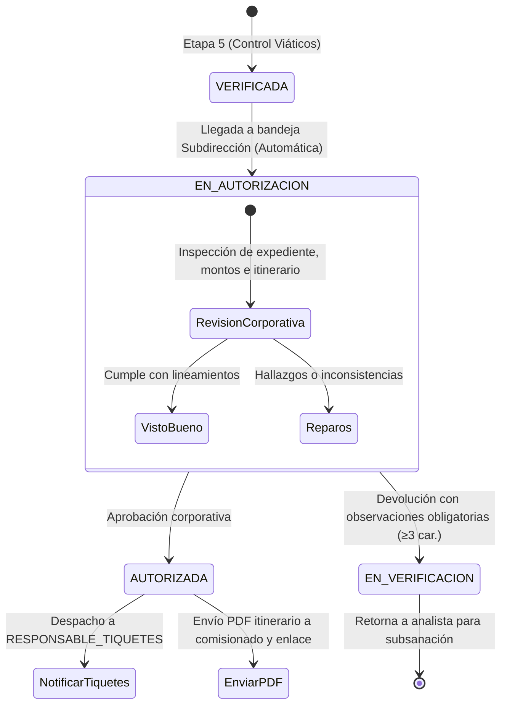

# HU RF-AUT-001 — [Etapa 6] Autorizar Gasto e Itinerario (AUTORIZADA) y Enviar Tiquete

> **Módulo:** Viáticos y Gastos de Viaje · ESAP  
> **Requerimiento Funcional:** `RF-AUT-001`  
> **Documento Fuente:** ESAP-TD-FO-019 (Módulo de Viáticos)  
> **Actor:** Subdirección de Gestión Corporativa (`SUBDIRECCION_GESTION_CORPORATIVA`)  
> **Estado del Ciclo de Vida:** `VERIFICADA` ➔ `EN_AUTORIZACION` ➔ `AUTORIZADA` (o `EN_VERIFICACION`)  

---

## 1. Contexto y Justificación del Negocio

En el marco del proceso de comisiones de servicio de la **Escuela Superior de Administración Pública (ESAP)**, la **Etapa 6: Autorización Corporativa** constituye el hito formal y vinculante donde la **Subdirección de Gestión Corporativa** otorga el visto bueno final al presupuesto y al itinerario de viaje aprobado técnicamente por las áreas de revisión y control.

### 1.1 Objetivos Clave
1. **Validación Presupuestal y Corporativa:** Ratificar la coherencia del gasto total proyectado (viáticos y gastos de viaje) frente al objeto de la comisión y los rubros de la entidad.
2. **Confirmación del Itinerario de Viaje:** Revisar fechas de inicio/fin, ciudades de origen y destino, tipo de transporte y requerimientos de tiquetes aéreos o terrestres.
3. **Despacho Automático e Integración con Tiquetes:** Al confirmarse la autorización, el sistema notifica de forma inmediata al responsable de tiquetes para su emisión y remite al pasajero y al enlace el PDF oficial de itinerario y tiquete.
4. **Segregación Estricta de Funciones (SoD):** Blindar el proceso administrativo impidiendo que un comisionado o creador autorice su propio gasto o viaje.

---

## 2. Diagrama de Estados y Flujo Operativo



---

## 3. Modelo de Seguridad y RBAC

### 3.1 Roles y Permisos (Migración 032)
Ubicación: `backend/travel-expenses-service/db/migrations/032_rol_subdireccion_gestion_corporativa_y_permisos.sql`

1. **Nuevo Rol `SUBDIRECCION_GESTION_CORPORATIVA`**:
   - Asignado a directivos y delegados de la Subdirección de Gestión Corporativa.
   - Permisos asignados:
     - `travel_expenses:read_authorizations`: Acceso a bandeja de autorizaciones corporativas.
     - `travel_expenses:authorize_expense`: Facultad para autorizar el gasto y el itinerario.
     - `travel_expenses:return_authorization`: Facultad para devolver la comisión con observaciones.
     - `travel_expenses:read_all`: Lectura de expedientes y soportes.

2. **Rol Operativo `RESPONSABLE_TIQUETES`**:
   - Receptor de las notificaciones de comisiones autorizadas que requieren compra/emisión de tiquetes.
   - Permiso `travel_expenses:read_authorizations` para consulta de itinerarios autorizados.

3. **Herencia Administrativa**:
   - Roles `SUPER_ADMIN` y `ADMIN_SISTEMA` reciben comodín `travel_expenses:*`.

### 3.2 Segregación de Funciones (SoD)
Implementado en `AuthorizationSodGuard` (`backend/travel-expenses-service/src/common/authorization-sod.guard.ts`):
- **Regla:** El usuario que autoriza **NO PUEDE** ser:
  - El comisionado (`solicitud.comisionadoId === usuarioId`).
  - El creador de la solicitud (`solicitud.creadoPorUsuarioId === usuarioId`).
- **Excepción / Bypass:** Usuarios con rol `SUPER_ADMIN` o `ADMIN_SISTEMA` pueden realizar pruebas o autorizaciones de emergencia garantizando trazabilidad completa.

---

## 4. Estructura de Datos (Migración 033)

Ubicación: `backend/travel-expenses-service/db/migrations/033_columnas_autorizacion_etapa6.sql`

```sql
ALTER TABLE travel_expenses.solicitudes_comision
ADD COLUMN IF NOT EXISTS autorizador_id VARCHAR(100) REFERENCES auth."user"(id) ON DELETE SET NULL,
ADD COLUMN IF NOT EXISTS fecha_autorizacion TIMESTAMP WITH TIME ZONE NULL,
ADD COLUMN IF NOT EXISTS observaciones_autorizacion TEXT NULL;

CREATE INDEX IF NOT EXISTS idx_solicitudes_autorizador_id ON travel_expenses.solicitudes_comision(autorizador_id);
CREATE INDEX IF NOT EXISTS idx_solicitudes_fecha_autorizacion ON travel_expenses.solicitudes_comision(fecha_autorizacion);
```

---

## 5. Especificación de Endpoints y Contratos OpenAPI / Swagger

### 5.1 `GET /viaticos/api/v1/requests/authorization/inbox`
- **Descripción:** Consulta la bandeja de la Subdirección. Transiciona atómicamente comisiones `VERIFICADA` a `EN_AUTORIZACION`.
- **Seguridad:** `Bearer JWT`, permiso `travel_expenses:read_authorizations`.
- **Query Params:**
  - `page` (número, default 1).
  - `limit` (número, default 20).
  - `search` (string opcional: consecutivo, comisionado, cédula, destino).
  - `estado` (string opcional: `EN_AUTORIZACION`, `AUTORIZADA`).
- **Respuesta:**
```json
{
  "success": true,
  "data": [
    {
      "id": "uuid",
      "consecutivoUnico": "COM-2026-0099",
      "estadoSolicitud": "EN_AUTORIZACION",
      "objetoComision": "Taller nacional",
      "destinoCiudad": "Cali",
      "destinoDepartamento": "Valle del Cauca",
      "fechaInicio": "2026-11-01T08:00:00.000Z",
      "fechaFin": "2026-11-04T18:00:00.000Z",
      "montoViaticos": 850000,
      "montoGastosViaje": 150000,
      "totalComision": 1000000,
      "requiereTiquetes": true,
      "tipoTransporte": "AEREO",
      "comisionado": {
        "id": "uuid",
        "numeroDocumento": "987654321",
        "nombreCompleto": "Carlos Mendoza",
        "email": "carlos.mendoza@esap.edu.co"
      }
    }
  ],
  "total": 1,
  "page": 1,
  "limit": 20,
  "timestamp": "2026-09-11T16:00:00.000Z"
}
```

### 5.2 `POST /viaticos/api/v1/requests/:id/authorize`
- **Descripción:** Autoriza la comisión, registra autorizador, fecha, y dispara notificaciones multicanal.
- **Seguridad:** `Bearer JWT`, permiso `travel_expenses:authorize_expense`, validación SoD activa.
- **Request Body:**
```json
{
  "observaciones": "Aprobado por Subdirección de Gestión Corporativa sin objeción presupuestal."
}
```
- **Respuesta (200 OK):**
```json
{
  "success": true,
  "data": {
    "id": "uuid",
    "estadoSolicitud": "AUTORIZADA",
    "autorizadorId": "user-subdirector",
    "fechaAutorizacion": "2026-09-11T16:30:00.000Z",
    "observacionesAutorizacion": "Aprobado por Subdirección de Gestión Corporativa sin objeción presupuestal."
  },
  "message": "Comisión autorizada exitosamente. Trámite de tiquetes habilitado.",
  "timestamp": "2026-09-11T16:30:00.000Z"
}
```

### 5.3 `POST /viaticos/api/v1/requests/:id/return-authorization`
- **Descripción:** Devuelve la comisión a `EN_VERIFICACION` con observaciones obligatorias (mínimo 3 caracteres).
- **Seguridad:** `Bearer JWT`, permiso `travel_expenses:return_authorization`, validación SoD activa.
- **Request Body:**
```json
{
  "observaciones": "El itinerario propuesto coincide con día festivo sin justificación operativa expresa."
}
```

### 5.4 `GET /viaticos/api/v1/requests/:id/ticket-itinerary/pdf`
- **Descripción:** Genera al vuelo con PDFKit el documento oficial institucional de Autorización de Gasto e Itinerario con membrete ESAP, desglose financiero, datos del comisionado y firmas digitales de visto bueno.

---

## 6. Frontend y Experiencia de Usuario (MFE Viáticos)

1. **Bandeja de Autorización (`AutorizacionInbox.tsx`)**:
   - Vista exclusiva para la Subdirección y Administradores.
   - Pestañas rápidas: Todas, En Autorización, Autorizadas.
   - Filtros por texto libre (consecutivo, ciudad, nombre, documento).
   - Acciones: Botón "Revisar y Autorizar" y botón para descarga directa del PDF.

2. **Modal de Autorización Corporativa (`AutorizacionGastoModal.tsx`)**:
   - Tarjetas de resumen financiero con gradientes de diseño premium:
     - Viáticos (`montoViaticos`).
     - Gastos de Viaje (`montoGastosViaje`).
     - Inversión Total (`totalComision`).
   - Bloque de Itinerario: Origen, Destino, Fechas, Tipo de Transporte y Badge de Tiquetes (Prioritario / No requiere).
   - Visor y descarga de soportes documentales (CDP, justificaciones).
   - Botón primario verde: `Autorizar Gasto e Itinerario`.
   - Botón secundario rojo: `Devolver con Observaciones` con panel desplegable de observaciones obligatorias.

3. **Integración en Navegación Principal (`ViaticosModulePremium.tsx`)**:
   - Nueva opción en menú lateral: **Autorización Corporativa** (ícono `Award`).
   - Visible dinámicamente según permisos RBAC (`puedeVerAutorizaciones`).
