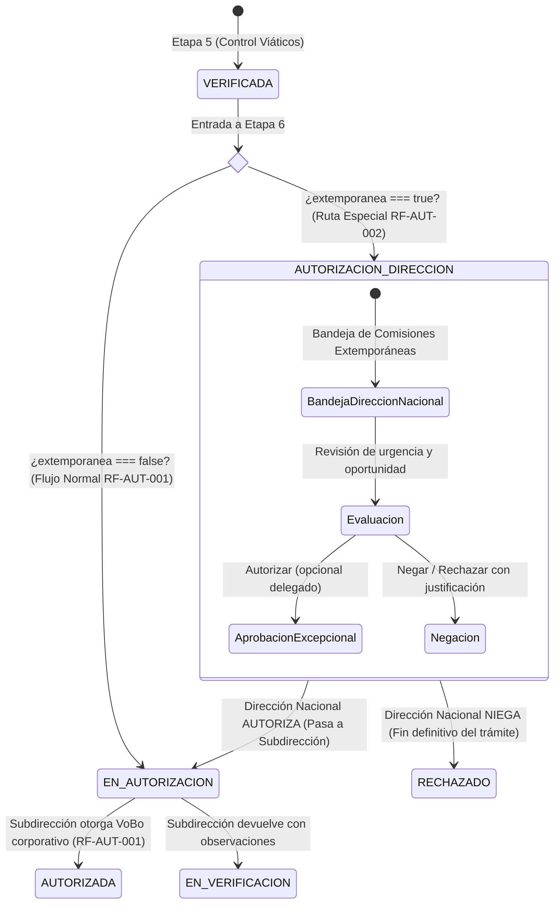

# HU RF-AUT-002 — [Etapa 6] Autorizar Comisiones Extemporáneas (Dirección Nacional)

> **Módulo:** Viáticos y Gastos de Viaje · ESAP  
> **Requerimiento Funcional:** `RF-AUT-002` (Derivado de `RF-VAL-002`)  
> **Documento Fuente:** Requerimiento ESAP-TD-FO-019 (Módulo de Viáticos)  
> **Actor:** Dirección Nacional o su Delegado (`DIRECCION_NACIONAL`)  
> **Estado del Ciclo de Vida:** `VERIFICADA` (con `extemporanea: true`) ➔ `AUTORIZACION_DIRECCION` ➔ `EN_AUTORIZACION` (o `RECHAZADO`)  

---

## 1. Historia de Usuario y Criterios de Aceptación (Gherkin)

### 1.1 Historia de Usuario
> **Como** Dirección Nacional (o su delegado),  
> **Quiero** autorizar las comisiones extemporáneas,  
> **Para** permitir excepcionalmente comisiones que no cumplieron los 14 días hábiles de anticipación reglamentarios.

### 1.2 Criterios de Aceptación (Gherkin)

```gherkin
Característica: Autorización especial de comisiones extemporáneas por Dirección Nacional

  Criterio 1: Enrutamiento especial por extemporaneidad
    Dada una comisión con marca EXTEMPORÁNEA (RF-VAL-002),
    Cuando llega a la fase de autorización (Etapa 6),
    Entonces el sistema la enruta a la bandeja de la Dirección Nacional (estado AUTORIZACION_DIRECCION) y no directamente a la Subdirección.

  Criterio 2: Autorización excepcional por Dirección Nacional
    Dada una comisión extemporánea en bandeja de Dirección Nacional,
    Cuando la Dirección Nacional (o su delegado) la autoriza,
    Entonces la comisión transiciona a EN_AUTORIZACION y continúa el flujo normal de autorización corporativa en la Subdirección de Gestión Corporativa.

  Criterio 3: Negación de comisión extemporánea
    Dada una comisión extemporánea en bandeja de Dirección Nacional,
    Cuando la Dirección Nacional (o su delegado) la niega / rechaza,
    Entonces la comisión transiciona de forma definitiva a RECHAZADO registrando obligatoriamente la justificación trazable (mínimo 5 caracteres).
```

---

## 2. Diagrama de Flujo y Máquina de Estados



---

## 3. Modelo de Seguridad y RBAC

### 3.1 Roles y Permisos (Migración 034)
Archivo de migración: `backend/travel-expenses-service/db/migrations/034_autorizacion_extemporanea_direccion_nacional.sql`

1. **Nuevo Rol `DIRECCION_NACIONAL`**:
   - Asignado a directivos y delegados oficiales de la Dirección Nacional de la ESAP.
   - Permisos RBAC vinculados:
     - `travel_expenses:read_extemporaneous_authorizations`: Lectura de bandeja ejecutiva de comisiones extemporáneas.
     - `travel_expenses:authorize_extemporaneous`: Facultad decisoria para autorizar excepcionalmente la comisión extemporánea.
     - `travel_expenses:reject_extemporaneous`: Facultad para negar/rechazar definitivamente la comisión con justificación.
     - `travel_expenses:read_all`: Lectura integral de expedientes y soportes documentales.

2. **Permisos y comodines administrativos**:
   - `SUPER_ADMIN` y `ADMIN_SISTEMA` reciben los 3 permisos vía comodín o asignación explícita.

### 3.2 Segregación Estricta de Funciones (SoD)
Blindaje asegurado mediante `@AuthorizationSodProtected('id')` y `AuthorizationSodGuard`:
- **Regla:** El usuario directivo que emite la autorización o rechazo extemporáneo **NO PUEDE** ser:
  1. El comisionado/pasajero (`comisionadoId === usuarioId`).
  2. El enlace que creó o radicó la solicitud (`creadoPorUsuarioId === usuarioId`).
- `SUPER_ADMIN` retiene facultad de bypass para contingencias operativas.

---

## 4. Endpoints y Contratos API

### 4.1 `GET /travel-expenses/requests/extemporaneous-authorization/inbox`
Consulta la bandeja ejecutiva de comisiones extemporáneas.
- **Parámetros Query:** `page` (def. 1), `limit` (def. 20), `search`, `estado`.
- **Lógica:** Filtra solicitudes con `extemporanea = true`, auto-enruta cualquier registro en `VERIFICADA` a `AUTORIZACION_DIRECCION`.
- **Guardias:** `JwtAuthGuard`, `PermissionsGuard('travel_expenses:read_extemporaneous_authorizations')`.

### 4.2 `POST /travel-expenses/requests/:id/authorize-extemporaneous`
Emite la autorización excepcional de la Dirección Nacional o de su delegado formal.
- **Body (`AutorizacionExtemporaneaDto`):**
  ```json
  {
    "justificacion": "Comisión de urgencia regional requerida por calamidad pública.",
    "esDelegado": true
  }
  ```
- **Transición:** `AUTORIZACION_DIRECCION` ➔ `EN_AUTORIZACION`.
- **Efectos colaterales:**
  - Registra `autorizador_direccion_id`, `fecha_autorizacion_direccion = NOW()`, `decision_direccion = 'AUTORIZADA'`, `es_delegado_direccion = true|false`, `justificacion_direccion`.
  - Notifica al comisionado, enlace creador y a la Subdirección de Gestión Corporativa informando el aval y el paso a la siguiente etapa.

### 4.3 `POST /travel-expenses/requests/:id/reject-extemporaneous`
Niega y rechaza definitivamente la comisión extemporánea.
- **Body (`RechazoExtemporaneaDto`):**
  ```json
  {
    "justificacion": "No se evidencia justificación de fuerza mayor ni pertinencia para omitir los 14 días hábiles.",
    "esDelegado": false
  }
  ```
- **Validación:** `justificacion` es obligatoria con mínimo 5 caracteres (`@MinLength(5)`).
- **Transición:** `AUTORIZACION_DIRECCION` ➔ `RECHAZADO`.
- **Efectos colaterales:**
  - Registra `decision_direccion = 'RECHAZADA'`, `justificacion_direccion`.
  - Notifica al comisionado y enlace con la causal registrada.

---

## 5. Interfaz de Usuario y Experiencia (Frontend)

1. **Bandeja Ejecutiva (`AutorizacionDireccionInbox.tsx`)**:
   - Tarjetas KPI con conteo de: *Pendientes Dirección*, *Autorizadas / En Trámite*, *Rechazadas Definitivas*, *Total Extemporáneas*.
   - Filtro reactivo por estado (`AUTORIZACION_DIRECCION`, `EN_AUTORIZACION`, `AUTORIZADA`, `RECHAZADO`).
   - Diseño corporativo de alto contraste con gradiente institucional púrpura/dorado, adaptable a pantallas móviles y desktop.

2. **Modal de Decisión (`AutorizacionDireccionModal.tsx`)**:
   - Banner superior de alerta extemporánea con detalle de antelación faltante.
   - Casilla de verificación para actuación formal como Delegado de la Dirección Nacional (`es_delegado_direccion`).
   - Campo de justificación con contador de caracteres y validación en tiempo real.
   - Restricción visual inmediata por Segregación de Funciones (SoD) si el usuario activo es el comisionado.
   - Cuadro de confirmación preventiva antes de ejecutar el rechazo permanente.

3. **Trazabilidad en Subdirección (`AutorizacionInbox.tsx` y `AutorizacionGastoModal.tsx`)**:
   - En la bandeja corporativa de la Subdirección, las solicitudes extemporáneas exhiben una insignia púrpura distintiva: `"Extemporánea · Aval Dirección Nal."`.
   - En el modal de autorización de gasto de la Subdirección se despliega un banner informativo certificando el aval otorgado previamente por la Dirección Nacional (o su delegado) con su justificación respectiva.

---

## 6. Cobertura de Pruebas Automatizadas

| Suite de Pruebas | Archivo | Casos | Estado |
| :--- | :--- | :---: | :---: |
| **Backend Unit Tests** | `travel-expenses-extemporanea.spec.ts` | 11 | ✅ PASS |
| **Backend Controller Tests** | `travel-expenses.controller.spec.ts` | 30 | ✅ PASS |
| **Frontend Tray Tests** | `AutorizacionDireccionInbox.test.tsx` | 3 | ✅ PASS |
| **Frontend Modal Tests** | `AutorizacionDireccionModal.test.tsx` | 4 | ✅ PASS |
| **Frontend Subdirección Tests**| `AutorizacionInbox.test.tsx` / `AutorizacionGastoModal.test.tsx` | 13 | ✅ PASS |
| **Total Cobertura** | | **61 pruebas** | **100% Exitoso** |
