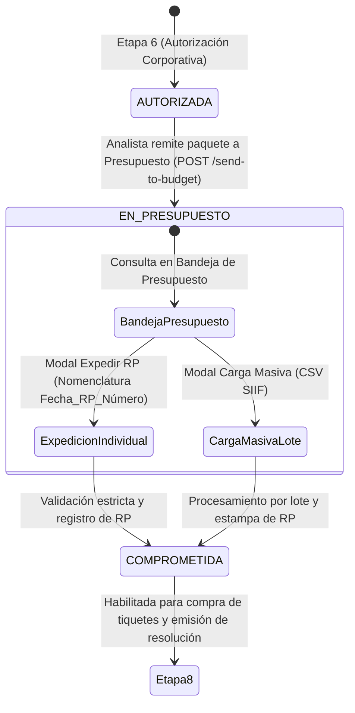

# HU RF-PRE-001 — [Etapa 7] Expedir RP en SIIF Nación (COMPROMETIDA)

> **Módulo:** Viáticos y Gastos de Viaje · ESAP  
> **Requerimiento Funcional:** `RF-PRE-001`  
> **Documento Fuente:** ESAP-TD-FO-019 (Módulo de Viáticos)  
> **Actor:** Grupo de Presupuesto (`PRESUPUESTO` / `GRUPO_PRESUPUESTO`) y Analista de Viáticos  
> **Estado del Ciclo de Vida:** `AUTORIZADA` ➔ `EN_PRESUPUESTO` ➔ `COMPROMETIDA`  

---

## 1. Contexto y Justificación del Negocio

En el ciclo de comisiones de servicio de la **Escuela Superior de Administración Pública (ESAP)**, la **Etapa 7: Presupuesto y RP** representa la formalización presupuestal del compromiso de gasto ante el sistema oficial del Estado colombiano: **SIIF Nación (Sistema Integrado de Información Financiera)**.

Una vez la comisión cuenta con visto bueno corporativo (`AUTORIZADA`), el paquete es remitido al **Grupo de Presupuesto**. El profesional de presupuesto expide el **Registro Presupuestal (RP)** en SIIF Nación y lo registra en el sistema de viáticos respetando la nomenclatura estándar **`Fecha_RP_Número`**, comprometiendo los recursos de la comisión y permitiendo la posterior emisión de pasajes, resolución y liquidación (Etapa 8).

---

## 2. Criterios de Aceptación (Gherkin)

### Criterio 1: Envío de paquete de comisión autorizada a Presupuesto
```gherkin
Dada una comisión AUTORIZADA,
Cuando el analista envía el paquete a Presupuesto,
Entonces pasa a estado EN_PRESUPUESTO (con enviadoPresupuesto: true)
Y aparece en la bandeja del Grupo de Presupuesto.
```

### Criterio 2: Expedición individual de RP y paso a COMPROMETIDA
```gherkin
Dada una comisión en Presupuesto (EN_PRESUPUESTO),
Cuando se expide el RP en SIIF Nación con número, fecha, rubro y valor comprometido,
Entonces la comisión pasa a estado COMPROMETIDA
Y se registra trazabilidad histórica con el usuario de presupuesto responsable.
```

### Criterio 3: Nomenclatura Fecha_RP_Número y Carga Masiva
```gherkin
Dado el registro del RP (individual o por lote),
Cuando se carga,
Entonces respeta la nomenclatura Fecha_RP_Número (formato YYYY-MM-DD_RP_NUMERO o YYYYMMDD_RP_NUMERO)
Y admite carga masiva vía CSV con reporte detallado de procesados e inconsistencias.
```

---

## 3. Diagrama de Estados y Flujo Operativo



---

## 4. Modelo de Seguridad y RBAC

### 4.1 Rol y Permisos (Migración 037)
Archivo: `backend/travel-expenses-service/db/migrations/037_etapa7_presupuesto_rp_roles_columnas.sql`

- **Rol `PRESUPUESTO`**:
  - `travel_expenses:read_budget`: Visualización de la bandeja exclusiva de presupuesto.
  - `travel_expenses:register_rp`: Facultad para expedir RP y procesar cargas masivas.
  - `travel_expenses:read_all`: Consulta de expedientes y soportes financieros.
- **Permiso `travel_expenses:send_to_budget`**:
  - Asignado a analistas y administradores para radicar paquetes autorizados en presupuesto.

---

## 5. Endpoints de la API Backend

| Método | Ruta | Rol / Permiso | Descripción |
|---|---|---|---|
| `POST` | `/viaticos/api/v1/requests/:id/send-to-budget` | Analista / Admin (`send_to_budget`) | Envía comisión `AUTORIZADA` a `EN_PRESUPUESTO`. |
| `GET` | `/viaticos/api/v1/requests/budget/inbox` | `PRESUPUESTO` (`read_budget`) | Consulta comisiones en bandeja de presupuesto con KPIs y filtros. |
| `POST` | `/viaticos/api/v1/requests/:id/register-rp` | `PRESUPUESTO` (`register_rp`) | Expide el RP individual validando la nomenclatura `Fecha_RP_Número`. |
| `POST` | `/viaticos/api/v1/requests/budget/batch-rp` | `PRESUPUESTO` (`register_rp`) | Carga masiva de RPs vía lote/CSV con reporte de resultados. |

---

## 6. Validación de Nomenclatura del RP

La nomenclatura estándar `Fecha_RP_Número` es validada en frontend y backend mediante expresión regular:
```regex
/^\d{4}-?\d{2}-?\d{2}_RP_[A-Za-z0-9\-_]+$/i
```
- **Ejemplos válidos:**
  - `2026-10-25_RP_48920`
  - `20261025_RP_48920`
  - `2026-11-01_RP_RP-0012`
- **Campos almacenados:**
  - `codigoRp`: Nomenclatura completa formal (`Fecha_RP_Número`).
  - `numeroRp`: Número consecutivo expedido en SIIF.
  - `fechaRp`: Fecha de expedición formal.
  - `valorComprometido`: Monto amparado en el RP ($ COP).
  - `rubroRp`: Rubro presupuestal institucional.
  - `expedidoRpPorId`: ID del funcionario de presupuesto responsable.
  - `fechaExpedicionRp`: Estampa temporal del registro.

---

## 7. Componentes Frontend Desarrollados

1. **`PresupuestoInbox.tsx`:** Bandeja completa de presupuesto con KPIs dinámicos, pestañas (`Pendientes RP`, `Comprometidas`, `Todas`), buscador en tiempo real, tabla con radicado, fechas, montos y rubro.
2. **`ExpedirRpModal.tsx`:** Modal de expedición individual con previsualización en vivo del código `Fecha_RP_Número`, validación de campos obligatorios y modo personalizado.
3. **`CargaMasivaRpModal.tsx`:** Modal de importación masiva por archivo CSV con descarga de plantilla oficial, validación preliminar fila por fila y reporte de exitosos vs inconsistencias.
4. **`AnalystInbox.tsx`:** Integración de pestaña `Autorizadas / A Presupuesto` y botón de fila `A Presupuesto` para comisiones autorizadas.
5. **`ViaticosModulePremium.tsx`:** Integración en menú lateral de `Presupuesto y RP (Etapa 7)`, ordenamiento prioritario por rol y tarjetas informativas en modal de detalle.

---

## 8. Cobertura de Pruebas Automatizadas

- **Backend (Jest):**
  - `travel-expenses-presupuesto.spec.ts`: 13 pruebas unitarias completas cubriendo envío de paquete, consultas de bandeja, validaciones de nomenclatura, transiciones de estado a `COMPROMETIDA` y carga masiva por lote.
  - `travel-expenses-cancelar.spec.ts`: 10 pruebas de regresión verificando compatibilidad con el flujo de cancelación.
- **Frontend (Vitest):**
  - `PresupuestoInbox.test.tsx`: 4 pruebas de integración para KPIs, filtrado de estados, apertura de modal individual y apertura de carga masiva.
  - `ExpedirRpModal.test.tsx`: 3 pruebas validando cálculo dinámico de nomenclatura, campos requeridos y expedición exitosa.
  - `AnalystInbox.test.tsx`: 11 pruebas verificando visualización y acción `A Presupuesto` para comisiones autorizadas.
