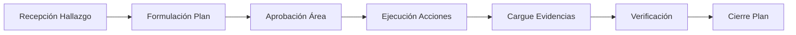

# 📋 Rediseño del Módulo de Planes de Mejoramiento

## 🎯 Resumen de Cambios

Se ha rediseñado completamente el módulo **MOD-10: Planes de Mejoramiento** para mejorar la usabilidad, coherencia con el modelo de negocio real y la integración con otros módulos del sistema.

---

## ❌ Problemas Identificados en la Versión Anterior

### 1. **Vista Kanban Inadecuada**
- **Problema**: Los planes de mejoramiento NO fluyen linealmente entre estados
- **Razón**: Kanban es apropiado para workflows de tareas, no para seguimiento de cumplimiento de hallazgos
- **Consecuencia**: Confusión en el usuario y modelo de datos forzado

### 2. **Estados Poco Realistas**
- Estados anteriores: `FORMULACION`, `APROBADO`, `EN_EJECUCION`, `CON_RETRASO`, `COMPLETADO`, `SUSPENDIDO`
- **Problema**: Demasiados estados intermedios que no reflejan la realidad
- **Ejemplo**: `APROBADO` y `CON_RETRASO` son más bien "sub-estados" que estados principales

### 3. **Falta de Integración**
- No estaba claro cómo se relaciona con:
  - Órganos de Control (origen de hallazgos externos)
  - Auditorías Internas/OCI (origen de hallazgos internos)
  - Gestión Documental (evidencias)

### 4. **Estructura de Datos Simplificada**
- No se diferenciaba entre:
  - **Hallazgos** (lo que se encontró mal)
  - **Acciones de Mejora** (lo que se va a hacer para corregir)
- No se incluía información del **Ente de Control** (Contraloría, Procuraduría, OCI)

---

## ✅ Solución Implementada

### 1. **Eliminación de Vista Kanban**
Se eliminó la vista Kanban y se reemplazó por **3 vistas más apropiadas**:

#### 📊 **Vista Dashboard** (Por Defecto)
- **Planes por Ente de Control**: Gráfico con avance promedio
- **Hallazgos por Severidad**: Clasificación 🔴 Críticos / 🟠 Altos / 🟡 Medios / 🟢 Bajos
- **Planes Próximos a Vencer**: Alertas de vencimientos en 60 días

#### 📋 **Vista Lista**
- Tabla detallada expandible
- Agrupación por plan → hallazgos → acciones
- Indicadores de severidad y estado
- Barras de progreso por acción

#### 📅 **Vista Timeline**
- Línea de tiempo de vencimientos
- Agrupación por trimestre
- Semáforos visuales (verde/amarillo/rojo)
- Ideal para seguimiento ejecutivo

### 2. **Estados Simplificados y Realistas**
```typescript
type EstadoPlan = 
  | 'FORMULACION'      // En proceso de creación inicial
  | 'EN_EJECUCION'     // Ejecutando las acciones de mejora
  | 'COMPLETADO'       // Todas las acciones cumplidas y cerradas
  | 'SUSPENDIDO'       // Plan pausado por decisión administrativa
```

**Beneficios**:
- Ciclo de vida claro y simple
- Fácil de entender para usuarios
- Alineado con la práctica real de gestión pública

### 3. **Estructura de Datos Mejorada**

#### **Jerarquía de 3 Niveles**:
```
Plan de Mejoramiento
  ├─ Hallazgo 1 (Crítico)
  │   ├─ Acción 1 (65% - En Proceso)
  │   └─ Acción 2 (100% - Completada)
  ├─ Hallazgo 2 (Alto)
  │   └─ Acción 3 (40% - En Proceso)
  └─ ...
```

#### **Atributos Clave del Plan**:
- **Ente de Control**: Contraloría / Procuraduría / OCI / Auditoría Externa
- **Documento Origen**: Informe de auditoría, auto, resolución
- **Fechas**: Recepción, Respuesta, Inicio, Fin
- **Alertas**: Acciones vencidas
- **Avance General**: % calculado automáticamente

#### **Atributos de Hallazgos**:
- **Código**: HAL-001, HAL-002, etc.
- **Severidad**: Crítica / Alta / Media / Baja
- **Descripción**: Qué se encontró mal
- **Acciones**: Lista de acciones correctivas

#### **Atributos de Acciones**:
- **Estado**: Pendiente / En Proceso / Completada / Vencida
- **Responsable**: Persona a cargo
- **Evidencias**: Cantidad de documentos probatorios
- **Avance**: Porcentaje 0-100%

### 4. **Integración con Otros Módulos**

#### 🏛️ **Órganos de Control** → Planes de Mejoramiento
- Los requerimientos de Contraloría/Procuraduría generan hallazgos
- El plan se crea como respuesta al documento de control

#### 🔍 **Auditorías Internas (OCI)** → Planes de Mejoramiento
- Las auditorías internas detectan hallazgos
- El jefe de área formulan el plan de mejoramiento

#### 📁 **Gestión Documental** → Planes de Mejoramiento
- Las evidencias de cumplimiento se almacenan en el ORFEO/GD
- Cada acción debe tener documentos probatorios

---

## 🎨 Diseño Corporativo ESAP 2025

### **Colores por Ente de Control**:
- 🏛️ **Contraloría**: Rojo (#DC2626)
- ⚖️ **Procuraduría**: Verde (#059669)
- 🔍 **OCI**: Azul (#2962FF)
- 📊 **Auditoría Externa**: Morado (#9C27B0)

### **Colores por Estado**:
- 📝 **Formulación**: Amarillo (#F59E0B)
- ⚡ **En Ejecución**: Azul (#2962FF)
- ✅ **Completado**: Verde (#10B981)
- ⏸️ **Suspendido**: Gris (#6B7280)

### **Semáforos de Severidad**:
- 🔴 **Crítica**: #DC2626
- 🟠 **Alta**: #F97316
- 🟡 **Media**: #F59E0B
- 🟢 **Baja**: #10B981

---

## 📊 Datos de Ejemplo Incluidos

Se incluyeron **4 planes de ejemplo** que representan casos reales:

1. **PM-CGR-2025-001**: Contraloría - Auditoría Regular (En Ejecución, 68%)
2. **PM-PGN-2025-002**: Procuraduría - Función de Advertencia (En Ejecución, 78%)
3. **PM-OCI-2025-003**: OCI - Gestión Documental (En Ejecución, 38%, con alertas)
4. **PM-CGR-2024-015**: Contraloría - Auditoría TIC (Completado, 100%)

---

## 🔄 Flujo de Trabajo Estándar



### **Etapas Detalladas**:

1. **Recepción de Hallazgo**
   - Llega documento de Contraloría, Procuraduría u OCI
   - Se registra en el sistema con fecha de recepción

2. **Formulación del Plan**
   - El área responsable crea el plan
   - Se desglosan hallazgos en acciones específicas
   - Se asignan responsables y fechas

3. **Ejecución de Acciones**
   - Cada responsable ejecuta su acción
   - Se actualiza el % de avance
   - Se cargan evidencias de cumplimiento

4. **Verificación y Cierre**
   - El ente de control verifica el cumplimiento
   - Si es satisfactorio, se cierra el plan
   - Si no, se generan nuevas acciones

---

## 🎓 Tooltip Informativo del Módulo

Se incluyó un tooltip educativo que explica:

### 🎯 **Propósito del Módulo**
"Gestión integral de hallazgos y acciones de mejora derivados de auditorías de Órganos de Control (Contraloría, Procuraduría), Oficina de Control Interno y Auditorías Externas."

### 📊 **3 Vistas Disponibles**
- **Dashboard**: Métricas ejecutivas y semáforos
- **Lista**: Tabla detallada agrupada por ente de control
- **Timeline**: Línea de tiempo de vencimientos y seguimiento trimestral

### 🔄 **Flujo de Trabajo**
1. Recepción de Hallazgo
2. Formulación del Plan
3. Ejecución de Acciones
4. Cargue de Evidencias
5. Verificación y Cierre

### ⚠️ **Alertas Automáticas**
- Acciones próximas a vencer (15 días antes)
- Acciones vencidas
- Planes sin actualización en 30 días

### 🔗 **Integración con Otros Módulos**
- **Órganos de Control**: Origen de hallazgos externos
- **Auditorías Internas (OCI)**: Origen de hallazgos internos
- **Gestión Documental**: Almacenamiento de evidencias

---

## 📈 Métricas del Dashboard

### **KPIs Principales**:
1. **Total Planes**: Cantidad total en el sistema
2. **Avance Promedio**: % de cumplimiento general
3. **En Ejecución**: Planes activos actualmente
4. **Completados**: Planes cerrados exitosamente
5. **Alertas Activas**: Acciones vencidas o en riesgo

### **Gráficos**:
- Planes por Ente de Control (con avance promedio)
- Hallazgos por Severidad (críticos, altos, medios, bajos)
- Planes próximos a vencer (próximos 60 días)

---

## 🚀 Beneficios de la Nueva Implementación

### **Para el Usuario Final**:
✅ Interfaz más intuitiva y clara
✅ Navegación simplificada (sin Kanban confuso)
✅ Mejor visualización de prioridades (semáforos)
✅ Alertas proactivas de vencimientos

### **Para la Gestión**:
✅ Métricas ejecutivas en Dashboard
✅ Seguimiento por ente de control
✅ Timeline de vencimientos trimestral
✅ Trazabilidad completa (hallazgo → acción → evidencia)

### **Para la Integración**:
✅ Conexión clara con Órganos de Control
✅ Vinculación con Auditorías Internas
✅ Referencia a Gestión Documental
✅ Escalabilidad para futuras funcionalidades

---

## 📝 Archivos Modificados

### **Creados**:
- `/components/esap/gestion-legal/modulos/PlanesMejoramientoV4.tsx` (NUEVO)

### **Actualizados**:
- `/components/esap/gestion-legal/core/GestionLegalFull.tsx` (import actualizado)

### **Eliminados**:
- `/components/esap/gestion-legal/modulos/PlanesMejoramiento.tsx` (versión anterior)

---

## 🎯 Próximos Pasos Sugeridos

### **Funcionalidades Futuras**:
1. **Modal de Creación de Plan**
   - Formulario completo para nuevo plan
   - Asistente paso a paso
   - Validaciones automáticas

2. **Modal de Detalle de Plan**
   - Vista completa de hallazgos y acciones
   - Historial de actualizaciones
   - Cargue de evidencias

3. **Integración API Real**
   - Conexión con base de datos Supabase
   - Sincronización con ORFEO/Gestión Documental
   - Notificaciones automáticas

4. **Reportes y Exportación**
   - Generar informe trimestral PDF
   - Exportar a Excel para revisión
   - Dashboard ejecutivo imprimible

5. **Alertas Automáticas**
   - Email a responsables 15 días antes de vencimiento
   - Notificación push en la app
   - Escalamiento a jefe inmediato

---

## ✅ Conclusión

El rediseño del módulo de Planes de Mejoramiento **elimina la vista Kanban inadecuada** y reemplaza con vistas más apropiadas (Dashboard, Lista, Timeline), mejora la estructura de datos para reflejar la realidad del negocio (hallazgos → acciones → evidencias), y establece una integración clara con otros módulos del ecosistema ESAP.

**Resultado**: Un módulo más profesional, usable y alineado con las mejores prácticas de gestión pública. ✨
