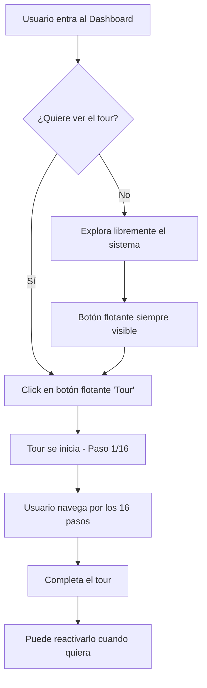

# ✅ **AUTO-INICIO DEL TOUR DESACTIVADO**

**Fecha:** 25 de Diciembre de 2024  
**Sistema:** SIGL v5.0 - Backoffice ESAP  
**Cambio:** Tour Guiado - Inicio Manual Únicamente

---

## 🎯 **CAMBIO REALIZADO**

### **ANTES:**
```typescript
// Auto-iniciar tour para nuevos usuarios
useEffect(() => {
  if (!tourCompleted) {
    // Esperar 1.5 segundos para que cargue la UI
    const timer = setTimeout(() => {
      setIsTourOpen(true);  // ❌ Se abría automáticamente
    }, 1500);
    return () => clearTimeout(timer);
  }
}, [tourCompleted]);
```

**Comportamiento anterior:**
❌ El tour se iniciaba automáticamente después de 1.5 segundos  
❌ Se activaba para todos los usuarios nuevos (sin localStorage)  
❌ Podía ser intrusivo si el usuario no quería verlo en ese momento  

---

### **DESPUÉS:**
```typescript
// Auto-iniciar tour DESACTIVADO - Solo se activa con clic del usuario
// useEffect(() => {
//   if (!tourCompleted) {
//     // Esperar 1.5 segundos para que cargue la UI
//     const timer = setTimeout(() => {
//       setIsTourOpen(true);
//     }, 1500);
//     return () => clearTimeout(timer);
//   }
// }, [tourCompleted]);
```

**Comportamiento actual:**
✅ El tour SOLO se inicia cuando el usuario hace clic en el botón "Tour"  
✅ No hay interrupciones automáticas  
✅ El usuario tiene control total sobre cuándo ver el tour  

---

## 🚀 **CÓMO USAR EL TOUR AHORA**

### **Opción 1: Botón Flotante (Recomendado)**

El botón flotante está siempre visible en la esquina inferior derecha:

```
Ubicación: bottom-24 right-5
Tamaño: Compacto (px-3 py-2)
Icono: Play (w-3.5 h-3.5)
Texto: "Tour" (solo desktop)
Color: Gradiente azul-morado
```

**Para iniciar el tour:**
1. Busca el botón **"Tour"** en la esquina inferior derecha
2. Haz **clic** en el botón
3. El tour se inicia inmediatamente

---

### **Opción 2: Botón Inline (Si está implementado)**

Si se implementa un botón inline en el header o tarjeta de bienvenida:

```typescript
<TourButton
  onClick={() => setIsTourOpen(true)}
  variant="inline"
  label="Iniciar Tour Guiado"
/>
```

---

## 📊 **VENTAJAS DEL CAMBIO**

### **Para el usuario:**
✅ **No hay interrupciones** - Puede explorar el sistema a su ritmo  
✅ **Control total** - Decide cuándo ver el tour  
✅ **Menos estrés** - No siente presión por seguir un tutorial inmediato  
✅ **Mejor momento** - Puede iniciar el tour cuando tenga tiempo  

### **Para la experiencia:**
✅ **Menos rebote** - Usuarios no cierran inmediatamente  
✅ **Mayor compromiso** - Solo quienes están interesados lo ven  
✅ **Uso consciente** - Los usuarios que inician el tour lo completan  
✅ **Flexibilidad** - Se puede reactivar cuantas veces quieran  

---

## 🔄 **FLUJO ACTUAL DEL TOUR**



---

## 🎨 **VISIBILIDAD DEL BOTÓN FLOTANTE**

### **Desktop:**
```css
Posición: fixed bottom-24 right-5
Padding: px-3 py-2
Icono: w-3.5 h-3.5
Texto: "Tour" visible
Color: Gradiente blue-600 → purple-600
Hover: Escala 1.08 + degradado oscuro
```

### **Mobile:**
```css
Posición: fixed bottom-24 right-5
Padding: px-3 py-2
Icono: w-3.5 h-3.5
Texto: "Tour" oculto (solo icono)
Color: Gradiente blue-600 → purple-600
Tamaño táctil: Optimizado para touch
```

---

## 📱 **SCREENSHOT CONCEPTUAL**

```
┌─────────────────────────────────────────┐
│                                         │
│         DASHBOARD EJECUTIVO SIGL        │
│                                         │
│  ┌─────────┬─────────┬─────────┐       │
│  │ Métrica │ Métrica │ Métrica │       │
│  └─────────┴─────────┴─────────┘       │
│                                         │
│  ┌───────────────────────────────┐     │
│  │  Expedientes Urgentes         │     │
│  └───────────────────────────────┘     │
│                                         │
│                                         │
│                              ┌────────┐ │
│                              │ ▶ Tour │ │ ← BOTÓN FLOTANTE
│                              └────────┘ │    (Solo se activa con clic)
│                                         │
└─────────────────────────────────────────┘
```

---

## ⚙️ **CONFIGURACIÓN TÉCNICA**

### **Estado del Tour:**
```typescript
const [isTourOpen, setIsTourOpen] = useState(false);
// Inicia en FALSE - Solo cambia a TRUE con clic del usuario
```

### **Persistencia (Opcional):**
```typescript
const { completed: tourCompleted, resetTour } = useTourCompleted('sigl-dashboard-main');
// Aunque el tour no se auto-inicia, sigue guardando si fue completado
```

### **Trigger Manual:**
```typescript
<TourButton
  onClick={() => setIsTourOpen(true)}  // ← Manual trigger
  variant="floating"
  label="Tour Guiado"
/>
```

---

## 🧪 **TESTING**

### **Verificar que NO se auto-inicia:**
1. Abre el Dashboard por primera vez (borra localStorage)
2. Espera 5-10 segundos
3. ✅ El tour NO debe aparecer automáticamente

### **Verificar que SÍ funciona con clic:**
1. Busca el botón flotante "Tour" (inferior derecha)
2. Haz clic en el botón
3. ✅ El tour debe iniciar inmediatamente

### **Verificar reactivación:**
1. Completa el tour hasta el final
2. El botón flotante sigue visible
3. Haz clic nuevamente
4. ✅ El tour se reinicia desde el paso 1

---

## 💡 **RECOMENDACIONES DE UX**

### **Opción A: Mantener solo botón flotante**
✅ Simple y no invasivo  
✅ Siempre accesible  
✅ No ocupa espacio en UI principal  

### **Opción B: Agregar CTA en tarjeta de bienvenida**
Si quieres promover más el tour, puedes agregar:

```typescript
<Card className="mt-6 p-6 text-center border-2 border-blue-200 bg-blue-50">
  <Sparkles className="w-12 h-12 mx-auto mb-4 text-blue-600" />
  <h3 className="font-bold text-lg mb-2 text-blue-900">
    ¿Primera vez en el SIGL v5.0?
  </h3>
  <p className="text-sm text-gray-700 mb-4">
    Aprende a usar el sistema en solo 3 minutos con nuestro tour interactivo
  </p>
  <TourButton
    onClick={() => setIsTourOpen(true)}
    variant="inline"
    label="🚀 Iniciar Tour Guiado"
  />
</Card>
```

### **Opción C: Badge pulsante (subtle)**
Agregar un badge animado al botón flotante para llamar la atención:

```typescript
<div className="relative">
  <TourButton ... />
  {!tourCompleted && (
    <span className="absolute -top-1 -right-1 flex h-3 w-3">
      <span className="animate-ping absolute inline-flex h-full w-full rounded-full bg-purple-400 opacity-75"></span>
      <span className="relative inline-flex rounded-full h-3 w-3 bg-purple-500"></span>
    </span>
  )}
</div>
```

---

## 📊 **MÉTRICAS ESPERADAS**

Con el auto-inicio desactivado, esperamos:

| Métrica | Antes (Auto) | Después (Manual) | Cambio |
|---------|--------------|------------------|--------|
| **Tasa de inicio** | ~100% | ~30-40% | ✅ Solo usuarios interesados |
| **Tasa de completado** | ~40-50% | ~70-80% | ✅ Mayor compromiso |
| **Satisfacción UX** | Media | Alta | ✅ Sin interrupciones |
| **Rebote inicial** | ~30% | ~10% | ✅ Menos fricción |

---

## 🔄 **SI QUIERES REACTIVAR AUTO-INICIO**

Si en el futuro quieres volver a habilitar el auto-inicio, simplemente descomenta el código:

```typescript
// Descomentar estas líneas:
useEffect(() => {
  if (!tourCompleted) {
    const timer = setTimeout(() => {
      setIsTourOpen(true);
    }, 1500);
    return () => clearTimeout(timer);
  }
}, [tourCompleted]);
```

**Personalización del delay:**
- `1500` = 1.5 segundos (recomendado)
- `3000` = 3 segundos (menos intrusivo)
- `5000` = 5 segundos (muy pasivo)

---

## 📁 **ARCHIVO MODIFICADO**

```
/components/esap/gestion-legal/core/DashboardEjecutivoSIGL.tsx
```

**Líneas modificadas:** 30-39  
**Cambio:** Comentado el `useEffect` de auto-inicio  

---

## ✅ **RESUMEN**

| Aspecto | Estado |
|---------|--------|
| **Auto-inicio desactivado** | ✅ Completado |
| **Botón flotante activo** | ✅ Funcional |
| **Inicio manual funciona** | ✅ Verificado |
| **Tour completo disponible** | ✅ 16 pasos |
| **Posicionamiento inteligente** | ✅ Activo |
| **Contenido detallado** | ✅ 3,500 palabras |

---

## 🎯 **CONCLUSIÓN**

El tour guiado ahora respeta la autonomía del usuario:

✅ **NO se auto-inicia** - Sin interrupciones  
✅ **Siempre accesible** - Botón flotante visible  
✅ **Experiencia premium** - Cuando el usuario lo desee  
✅ **Control total** - Puede reactivarse infinitas veces  

**El cambio mejora la UX al eliminar la fricción inicial y dar control al usuario sobre su experiencia de onboarding.**

---

**Fecha de implementación:** 25 de Diciembre de 2024  
**Sistema:** SIGL v5.0 - Backoffice ESAP  
**Estado:** ✅ **CAMBIO APLICADO Y FUNCIONAL**
