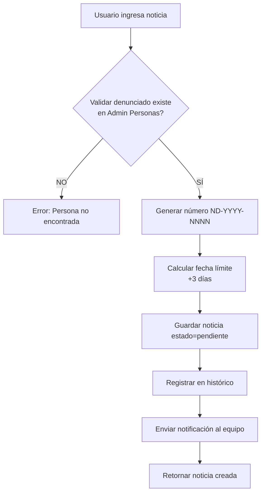
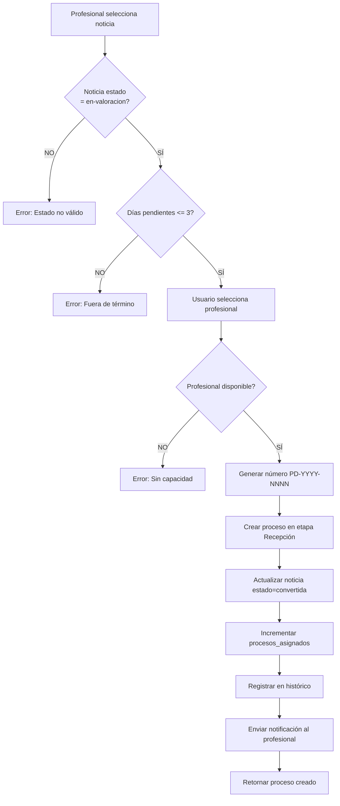
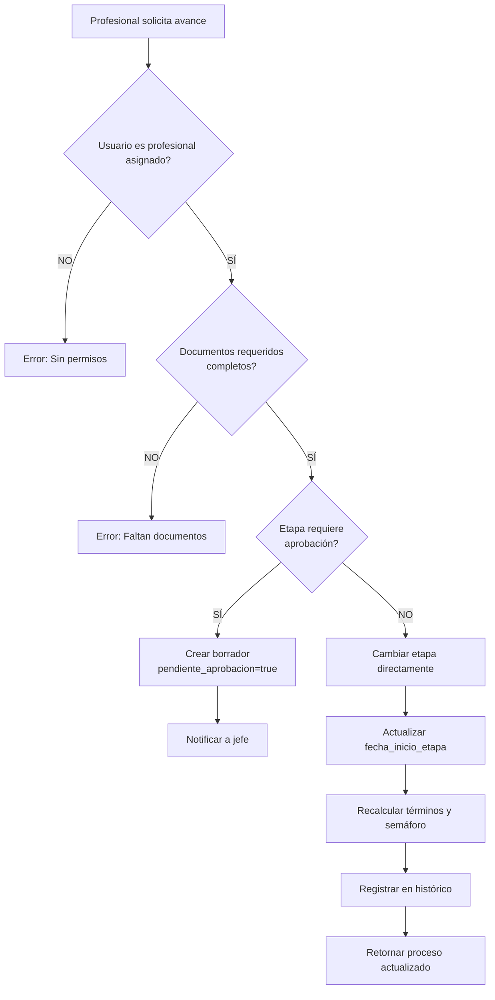
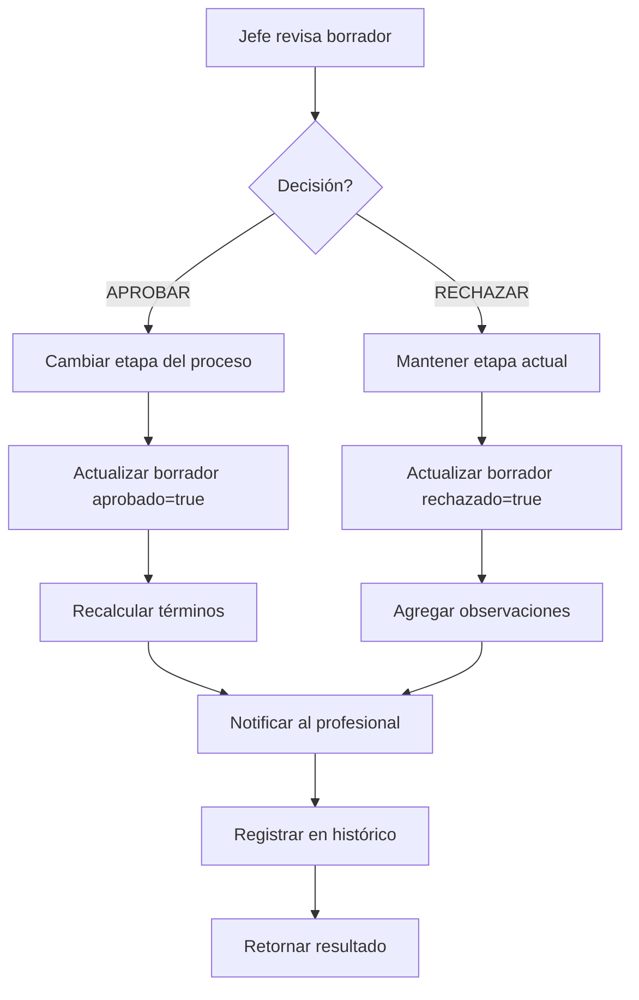
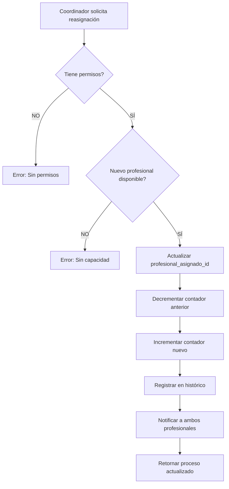
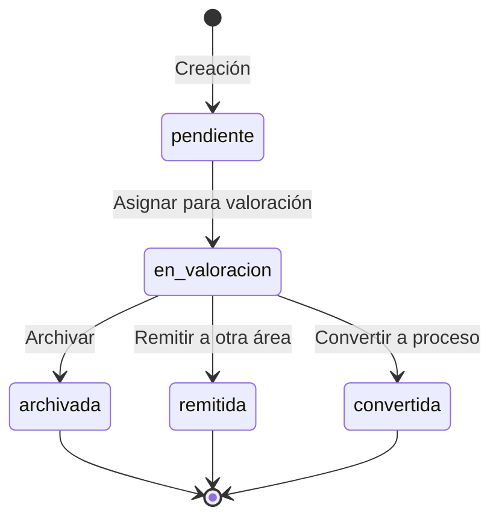
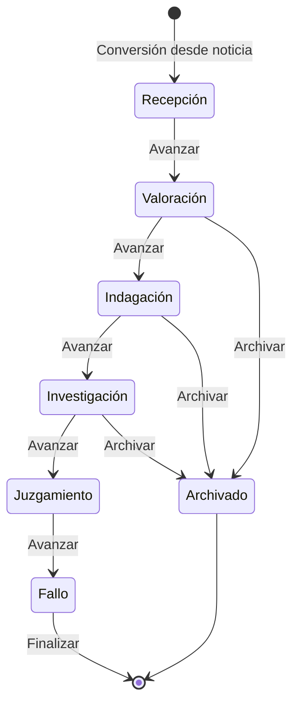

# 📘 GUÍA TÉCNICA BACKEND - MÓDULO CONTROL INTERNO DISCIPLINARIO
## ESCUELA SUPERIOR DE ADMINISTRACIÓN PÚBLICA (ESAP)

---

## 📋 TABLA DE CONTENIDOS

1. [Visión General del Módulo](#1-visión-general-del-módulo)
2. [Arquitectura del Sistema](#2-arquitectura-del-sistema)
3. [Modelos de Datos y Entidades](#3-modelos-de-datos-y-entidades)
4. [Flujos de Trabajo Completos](#4-flujos-de-trabajo-completos)
5. [Endpoints API Requeridos](#5-endpoints-api-requeridos)
6. [Reglas de Negocio](#6-reglas-de-negocio)
7. [Sistema de Estados y Transiciones](#7-sistema-de-estados-y-transiciones)
8. [Validaciones y Seguridad](#8-validaciones-y-seguridad)
9. [Integraciones con Otros Módulos](#9-integraciones-con-otros-módulos)
10. [Sistema de Semáforo y Alertas](#10-sistema-de-semáforo-y-alertas)
11. [Casos de Uso Detallados](#11-casos-de-uso-detallados)
12. [Ejemplos de Implementación](#12-ejemplos-de-implementación)

---

## 1. VISIÓN GENERAL DEL MÓDULO

### 1.1 Propósito
El módulo de Control Interno Disciplinario gestiona el ciclo completo de los procesos disciplinarios en ESAP, desde la recepción de noticias disciplinarias hasta el fallo final, garantizando trazabilidad completa y cumplimiento de términos legales.

### 1.2 Principios Fundamentales

#### ⚠️ REGLA CRÍTICA #1: Centralización de Personas
```
TODAS las personas (denunciantes, denunciados, profesionales) 
DEBEN existir primero en el módulo de "Administración de Personas".

NO se pueden crear usuarios desde Control Disciplinario.
Solo se ASIGNAN usuarios existentes.
```

#### ⚠️ REGLA CRÍTICA #2: Información Completa
```
En TODO momento se debe mostrar la información COMPLETA de:
- Denunciante (nombre, tipo ID, número ID)
- Denunciado (nombre, tipo ID, número ID)
- Profesional Asignado (nombre, tipo ID, número ID)

Esta información NO puede ser opcional en ninguna consulta.
```

#### ⚠️ REGLA CRÍTICA #3: Estructura Territorial
```
Todos los procesos y usuarios están vinculados a una estructura territorial:
- Dirección Nacional
- Territorial Bogotá
- Territorial Antioquia
- Territorial Valle
- Territorial Atlántico
- etc.
```

---

## 2. ARQUITECTURA DEL SISTEMA

### 2.1 Módulos Principales

```
┌─────────────────────────────────────────────────────────────┐
│                  CONTROL INTERNO DISCIPLINARIO               │
├─────────────────────────────────────────────────────────────┤
│                                                             │
│  ┌──────────────┐  ┌──────────────┐  ┌──────────────┐    │
│  │   NOTICIAS   │  │   PROCESOS   │  │ PROFESIONALES│    │
│  │DISCIPLINARIAS│─▶│DISCIPLINARIOS│◀─│   ASIGNADOS  │    │
│  └──────────────┘  └──────────────┘  └──────────────┘    │
│         │                  │                  │            │
│         │                  │                  │            │
│         ▼                  ▼                  ▼            │
│  ┌──────────────┐  ┌──────────────┐  ┌──────────────┐    │
│  │  EXPEDIENTE  │  │   TÉRMINOS   │  │   REVISIÓN   │    │
│  │ ELECTRÓNICO  │  │  Y ALERTAS   │  │  Y APROBACIÓN│    │
│  └──────────────┘  └──────────────┘  └──────────────┘    │
│                                                             │
└─────────────────────────────────────────────────────────────┘
                        ▲         ▲
                        │         │
         ┌──────────────┘         └──────────────┐
         │                                        │
┌────────────────────┐                  ┌────────────────────┐
│   ADMINISTRACIÓN   │                  │   CONFIGURACIÓN    │
│    DE PERSONAS     │                  │     DEL SISTEMA    │
│  (Módulo Externo)  │                  │  (Etapas, Términos)│
└────────────────────┘                  └────────────────────┘
```

### 2.2 Stack Tecnológico Recomendado

```yaml
Backend:
  Framework: "Node.js + Express / Python + FastAPI / Java + Spring Boot"
  Base de Datos: "PostgreSQL 14+"
  ORM: "Prisma / SQLAlchemy / JPA/Hibernate"
  Autenticación: "JWT + Refresh Tokens"
  Validación: "Joi / Pydantic / Bean Validation"
  
Almacenamiento:
  Documentos: "AWS S3 / Azure Blob Storage / MinIO"
  Cache: "Redis"
  
Monitoring:
  Logs: "Winston / Python Logging"
  APM: "New Relic / Datadog"
```

---

## 3. MODELOS DE DATOS Y ENTIDADES

### 3.1 Entidad: Persona (Referencia externa)

**IMPORTANTE:** Esta entidad NO se crea en Control Disciplinario. Se obtiene del módulo de Administración de Personas.

```typescript
interface Persona {
  id: string;                           // UUID
  nombre: string;                       // Nombre completo
  tipoIdentificacion: 'CC' | 'CE' | 'TI' | 'PA' | 'NIT';
  numeroIdentificacion: string;         // Documento único
  email: string;
  telefono?: string;
  cargo?: string;
  territorial: string;                  // Vinculación territorial
  tipoContrato?: 'Planta' | 'Contratista';
  estado: 'activo' | 'inactivo' | 'vacaciones';
  fechaCreacion: Date;
  fechaActualizacion: Date;
}
```

**Índices requeridos:**
```sql
CREATE INDEX idx_personas_numero_identificacion ON personas(numeroIdentificacion);
CREATE INDEX idx_personas_territorial ON personas(territorial);
CREATE INDEX idx_personas_estado ON personas(estado);
```

---

### 3.2 Entidad: NoticiaDisciplinaria

```typescript
interface NoticiaDisciplinaria {
  // Identificación
  id: string;                           // UUID
  numero: string;                       // ND-YYYY-NNNN (autogenerado)
  
  // Información básica
  fechaRecepcion: Date;
  origen: 'Denuncia Ciudadana' | 'Queja Formal' | 'Oficio Externo' | 
          'Hallazgo Auditoría' | 'Traslado Otra Entidad' | 'Oficio Interno';
  
  // Personas involucradas (SIEMPRE COMPLETAS)
  denuncianteId: string;                // FK a Persona
  denunciante: {
    nombre: string;
    tipoIdentificacion: string;
    numeroIdentificacion: string;
  };
  
  denunciadoId: string;                 // FK a Persona
  denunciado: {
    nombre: string;
    tipoIdentificacion: string;
    numeroIdentificacion: string;
  };
  
  // Descripción
  hechos: string;                       // Mínimo 50 caracteres
  documentoAdjunto?: string;            // URL del documento
  
  // Estado y prioridad
  estado: 'pendiente' | 'en-valoracion' | 'convertida' | 'archivada' | 'remitida';
  prioridad: 'alta' | 'media' | 'baja';
  
  // Gestión
  profesionalReceptorId?: string;       // FK a Persona (quien recibió)
  profesionalReceptor?: {
    nombre: string;
    tipoIdentificacion: string;
    numeroIdentificacion: string;
  };
  
  observaciones?: string;
  motivoArchivo?: string;               // Si estado = 'archivada'
  areaRemision?: string;                // Si estado = 'remitida'
  
  // Conversión a proceso
  convertidaAProcesoId?: string;        // FK a Proceso
  fechaConversion?: Date;
  
  // Términos
  diasPendientes: number;               // Días desde recepción (3 días límite)
  fechaLimite: Date;                    // fechaRecepcion + 3 días
  
  // Territorial
  territorialId: string;
  territorial: string;
  
  // Auditoría
  creadoPorId: string;                  // FK a Persona (usuario que creó)
  fechaCreacion: Date;
  fechaActualizacion: Date;
  historico: HistoricoNoticia[];        // Cambios de estado
}
```

**Reglas de Validación:**
```typescript
// Número autogenerado
function generarNumeroNoticia(year: number, consecutivo: number): string {
  return `ND-${year}-${consecutivo.toString().padStart(4, '0')}`;
}

// Validación de hechos
function validarHechos(hechos: string): boolean {
  return hechos.length >= 50 && hechos.length <= 2000;
}

// Cálculo de días pendientes
function calcularDiasPendientes(fechaRecepcion: Date): number {
  const hoy = new Date();
  const diff = hoy.getTime() - fechaRecepcion.getTime();
  return Math.floor(diff / (1000 * 60 * 60 * 24));
}

// Validación de conversión
function puedeConvertirAProceso(noticia: NoticiaDisciplinaria): boolean {
  return noticia.estado === 'en-valoracion' && 
         noticia.diasPendientes <= 3 &&
         !!noticia.denunciadoId;
}
```

**SQL Schema:**
```sql
CREATE TABLE noticias_disciplinarias (
    id UUID PRIMARY KEY DEFAULT gen_random_uuid(),
    numero VARCHAR(20) UNIQUE NOT NULL,
    fecha_recepcion TIMESTAMP NOT NULL DEFAULT NOW(),
    origen VARCHAR(50) NOT NULL,
    
    -- Referencias a personas
    denunciante_id UUID NOT NULL REFERENCES personas(id),
    denunciado_id UUID NOT NULL REFERENCES personas(id),
    profesional_receptor_id UUID REFERENCES personas(id),
    
    hechos TEXT NOT NULL CHECK (LENGTH(hechos) >= 50),
    documento_adjunto TEXT,
    
    estado VARCHAR(20) NOT NULL DEFAULT 'pendiente',
    prioridad VARCHAR(10) NOT NULL DEFAULT 'media',
    
    observaciones TEXT,
    motivo_archivo TEXT,
    area_remision VARCHAR(100),
    
    convertida_a_proceso_id UUID REFERENCES procesos_disciplinarios(id),
    fecha_conversion TIMESTAMP,
    
    dias_pendientes INTEGER NOT NULL DEFAULT 0,
    fecha_limite TIMESTAMP NOT NULL,
    
    territorial_id UUID NOT NULL,
    territorial VARCHAR(100) NOT NULL,
    
    creado_por_id UUID NOT NULL REFERENCES personas(id),
    fecha_creacion TIMESTAMP NOT NULL DEFAULT NOW(),
    fecha_actualizacion TIMESTAMP NOT NULL DEFAULT NOW(),
    
    CONSTRAINT chk_estado CHECK (estado IN ('pendiente', 'en-valoracion', 'convertida', 'archivada', 'remitida')),
    CONSTRAINT chk_prioridad CHECK (prioridad IN ('alta', 'media', 'baja'))
);

-- Índices
CREATE INDEX idx_noticias_numero ON noticias_disciplinarias(numero);
CREATE INDEX idx_noticias_denunciado ON noticias_disciplinarias(denunciado_id);
CREATE INDEX idx_noticias_estado ON noticias_disciplinarias(estado);
CREATE INDEX idx_noticias_fecha_recepcion ON noticias_disciplinarias(fecha_recepcion);
CREATE INDEX idx_noticias_territorial ON noticias_disciplinarias(territorial_id);
CREATE INDEX idx_noticias_profesional_receptor ON noticias_disciplinarias(profesional_receptor_id);
```

---

### 3.3 Entidad: ProcesoDisciplinario

```typescript
interface ProcesoDisciplinario {
  // Identificación
  id: string;                           // UUID
  numeroProceso: string;                // PD-YYYY-NNNN (autogenerado)
  noticiaOrigenId: string;              // FK a NoticiaDisciplinaria
  numeroNoticiaOrigen: string;          // Para referencia
  
  // Personas involucradas (SIEMPRE COMPLETAS)
  denuncianteId: string;                // FK a Persona
  denunciante: {
    nombre: string;
    tipoIdentificacion: string;
    numeroIdentificacion: string;
  };
  
  denunciadoId: string;                 // FK a Persona
  denunciado: {
    nombre: string;
    tipoIdentificacion: string;
    numeroIdentificacion: string;
    cargo?: string;                     // Cargo al momento de los hechos
  };
  
  profesionalAsignadoId: string;        // FK a Persona (REQUERIDO)
  profesionalAsignado: {
    nombre: string;
    tipoIdentificacion: string;
    numeroIdentificacion: string;
  };
  
  // Estado del proceso
  etapaActual: 'Recepción' | 'Valoración' | 'Indagación' | 
               'Investigación' | 'Juzgamiento' | 'Fallo';
  estadoActual: 'En Gestión' | 'Suspendido' | 'Archivado' | 'Finalizado';
  
  // Descripción
  hechos: string;
  tipoFalta?: 'Gravísima' | 'Grave' | 'Leve';
  
  // Gestión de términos (CRÍTICO)
  fechaCreacion: Date;
  fechaInicioEtapaActual: Date;
  diasTranscurridosEtapa: number;       // Calculado
  diasRestantesEtapa: number;           // Calculado
  porcentajeTiempoEtapa: number;        // Calculado (0-100)
  
  // Sistema de semáforo
  semaforo: 'verde' | 'amarillo' | 'rojo';
  
  // Aprobación de borradores
  pendienteAprobacion: boolean;
  borradoresPendientes: Borrador[];
  
  // Documentación
  documentos: Documento[];
  autos: Auto[];
  evidencias: Evidencia[];
  oficios: Oficio[];
  actas: Acta[];
  
  // Gestión
  ultimaActuacion: string;
  proximaActuacion?: string;
  observaciones?: string;
  
  // Territorial
  territorialId: string;
  territorial: string;
  
  // Auditoría completa
  creadoPorId: string;
  fechaActualizacion: Date;
  historico: HistoricoProceso[];        // TODOS los cambios
}
```

**Configuración de Etapas (desde ModuloConfiguracion):**
```typescript
interface ConfiguracionEtapa {
  nombre: 'Recepción' | 'Valoración' | 'Indagación' | 'Investigación' | 'Juzgamiento' | 'Fallo';
  diasEstimados: number;
  porcentajeAlerta: number;             // % para semáforo amarillo
  requiereAprobacion: boolean;
  documentosRequeridos: string[];
}

const CONFIGURACION_ETAPAS: ConfiguracionEtapa[] = [
  {
    nombre: 'Recepción',
    diasEstimados: 3,
    porcentajeAlerta: 70,
    requiereAprobacion: false,
    documentosRequeridos: ['Auto de apertura']
  },
  {
    nombre: 'Valoración',
    diasEstimados: 10,
    porcentajeAlerta: 70,
    requiereAprobacion: true,
    documentosRequeridos: ['Auto de valoración', 'Análisis jurídico']
  },
  {
    nombre: 'Indagación',
    diasEstimados: 40,
    porcentajeAlerta: 70,
    requiereAprobacion: true,
    documentosRequeridos: ['Auto de indagación', 'Pruebas preliminares']
  },
  {
    nombre: 'Investigación',
    diasEstimados: 60,  // CORREGIDO: era 80, ahora 60
    porcentajeAlerta: 70,
    requiereAprobacion: true,
    documentosRequeridos: ['Auto de investigación', 'Pliego de cargos', 'Descargos']
  },
  {
    nombre: 'Juzgamiento',
    diasEstimados: 50,
    porcentajeAlerta: 70,
    requiereAprobacion: true,
    documentosRequeridos: ['Auto de juzgamiento', 'Alegatos']
  },
  {
    nombre: 'Fallo',
    diasEstimados: 10,
    porcentajeAlerta: 70,
    requiereAprobacion: true,
    documentosRequeridos: ['Fallo definitivo']
  }
];
```

**Cálculo del Semáforo (FUNCIÓN CRÍTICA):**
```typescript
function calcularSemaforo(proceso: ProcesoDisciplinario): 'verde' | 'amarillo' | 'rojo' {
  const configuracion = CONFIGURACION_ETAPAS.find(e => e.nombre === proceso.etapaActual);
  if (!configuracion) return 'verde';
  
  const porcentaje = proceso.porcentajeTiempoEtapa;
  
  if (porcentaje >= 100) {
    return 'rojo';  // Vencido
  } else if (porcentaje >= configuracion.porcentajeAlerta) {
    return 'amarillo';  // En riesgo
  } else {
    return 'verde';  // En término
  }
}

function calcularDiasYPorcentajes(proceso: ProcesoDisciplinario): {
  diasTranscurridos: number;
  diasRestantes: number;
  porcentaje: number;
} {
  const configuracion = CONFIGURACION_ETAPAS.find(e => e.nombre === proceso.etapaActual);
  if (!configuracion) throw new Error('Configuración no encontrada');
  
  const hoy = new Date();
  const inicio = new Date(proceso.fechaInicioEtapaActual);
  
  // Calcular días transcurridos (solo días hábiles si es requerido)
  const diasTranscurridos = Math.floor(
    (hoy.getTime() - inicio.getTime()) / (1000 * 60 * 60 * 24)
  );
  
  const diasRestantes = configuracion.diasEstimados - diasTranscurridos;
  const porcentaje = (diasTranscurridos / configuracion.diasEstimados) * 100;
  
  return {
    diasTranscurridos,
    diasRestantes: Math.max(0, diasRestantes),
    porcentaje: Math.min(100, Math.max(0, porcentaje))
  };
}
```

**SQL Schema:**
```sql
CREATE TABLE procesos_disciplinarios (
    id UUID PRIMARY KEY DEFAULT gen_random_uuid(),
    numero_proceso VARCHAR(20) UNIQUE NOT NULL,
    noticia_origen_id UUID NOT NULL REFERENCES noticias_disciplinarias(id),
    
    -- Referencias a personas (TODAS REQUERIDAS)
    denunciante_id UUID NOT NULL REFERENCES personas(id),
    denunciado_id UUID NOT NULL REFERENCES personas(id),
    profesional_asignado_id UUID NOT NULL REFERENCES personas(id),
    
    etapa_actual VARCHAR(20) NOT NULL DEFAULT 'Recepción',
    estado_actual VARCHAR(20) NOT NULL DEFAULT 'En Gestión',
    
    hechos TEXT NOT NULL,
    tipo_falta VARCHAR(20),
    
    -- Gestión de términos
    fecha_creacion TIMESTAMP NOT NULL DEFAULT NOW(),
    fecha_inicio_etapa_actual TIMESTAMP NOT NULL DEFAULT NOW(),
    dias_transcurridos_etapa INTEGER NOT NULL DEFAULT 0,
    dias_restantes_etapa INTEGER NOT NULL,
    porcentaje_tiempo_etapa DECIMAL(5,2) NOT NULL DEFAULT 0,
    
    semaforo VARCHAR(10) NOT NULL DEFAULT 'verde',
    
    pendiente_aprobacion BOOLEAN NOT NULL DEFAULT FALSE,
    
    ultima_actuacion TEXT NOT NULL,
    proxima_actuacion TEXT,
    observaciones TEXT,
    
    territorial_id UUID NOT NULL,
    territorial VARCHAR(100) NOT NULL,
    
    creado_por_id UUID NOT NULL REFERENCES personas(id),
    fecha_actualizacion TIMESTAMP NOT NULL DEFAULT NOW(),
    
    CONSTRAINT chk_etapa CHECK (etapa_actual IN ('Recepción', 'Valoración', 'Indagación', 'Investigación', 'Juzgamiento', 'Fallo')),
    CONSTRAINT chk_estado CHECK (estado_actual IN ('En Gestión', 'Suspendido', 'Archivado', 'Finalizado')),
    CONSTRAINT chk_semaforo CHECK (semaforo IN ('verde', 'amarillo', 'rojo'))
);

-- Índices críticos para performance
CREATE INDEX idx_procesos_numero ON procesos_disciplinarios(numero_proceso);
CREATE INDEX idx_procesos_denunciado ON procesos_disciplinarios(denunciado_id);
CREATE INDEX idx_procesos_profesional ON procesos_disciplinarios(profesional_asignado_id);
CREATE INDEX idx_procesos_etapa ON procesos_disciplinarios(etapa_actual);
CREATE INDEX idx_procesos_estado ON procesos_disciplinarios(estado_actual);
CREATE INDEX idx_procesos_semaforo ON procesos_disciplinarios(semaforo);
CREATE INDEX idx_procesos_territorial ON procesos_disciplinarios(territorial_id);
CREATE INDEX idx_procesos_pendiente_aprobacion ON procesos_disciplinarios(pendiente_aprobacion) WHERE pendiente_aprobacion = TRUE;
```

---

### 3.4 Entidad: ProfesionalDisciplinario

**IMPORTANTE:** Esta entidad es una ASIGNACIÓN, no crea el usuario. El usuario debe existir en Administración de Personas.

```typescript
interface ProfesionalDisciplinario {
  // Referencia al usuario (NO CREACIÓN)
  personaId: string;                    // FK a Persona (REQUERIDO)
  
  // Información duplicada para performance (se sincroniza)
  nombre: string;
  tipoIdentificacion: string;
  numeroIdentificacion: string;
  email: string;
  telefono: string;
  cargo: string;
  
  // Configuración para Control Disciplinario
  especialidad: 'Derecho Disciplinario' | 'Derecho Administrativo' | 
                'Derecho Público' | 'Derecho Penal';
  capacidadMaxima: number;              // Número máximo de procesos
  
  // Estadísticas en tiempo real
  procesosAsignados: number;            // Calculado
  procesosAlDia: number;                // Semáforo verde
  procesosEnRiesgo: number;             // Semáforo amarillo
  procesosVencidos: number;             // Semáforo rojo
  
  // Estado
  estado: 'activo' | 'inactivo' | 'vacaciones';
  tipoContrato: 'Planta' | 'Contratista';
  
  // Territorial
  territorialId: string;
  territorial: string;
  
  // Auditoría
  fechaAsignacion: Date;
  asignadoPorId: string;
  fechaActualizacion: Date;
}
```

**Reglas de Negocio:**
```typescript
// Validar capacidad antes de asignar
function puedeAsignarProceso(profesional: ProfesionalDisciplinario): boolean {
  return profesional.estado === 'activo' && 
         profesional.procesosAsignados < profesional.capacidadMaxima;
}

// Obtener profesionales disponibles
async function obtenerProfesionalesDisponibles(
  territorial: string
): Promise<ProfesionalDisciplinario[]> {
  return await db.profesionales
    .where('territorial', territorial)
    .where('estado', 'activo')
    .whereRaw('procesos_asignados < capacidad_maxima')
    .orderBy('procesos_asignados', 'asc');
}

// Actualizar estadísticas (ejecutar periódicamente)
async function actualizarEstadisticasProfesional(
  profesionalId: string
): Promise<void> {
  const procesos = await db.procesos
    .where('profesional_asignado_id', profesionalId)
    .where('estado_actual', 'En Gestión');
  
  const stats = {
    procesosAsignados: procesos.length,
    procesosAlDia: procesos.filter(p => p.semaforo === 'verde').length,
    procesosEnRiesgo: procesos.filter(p => p.semaforo === 'amarillo').length,
    procesosVencidos: procesos.filter(p => p.semaforo === 'rojo').length
  };
  
  await db.profesionales
    .where('id', profesionalId)
    .update(stats);
}
```

**SQL Schema:**
```sql
CREATE TABLE profesionales_disciplinarios (
    persona_id UUID PRIMARY KEY REFERENCES personas(id),
    
    -- Información sincronizada
    nombre VARCHAR(200) NOT NULL,
    tipo_identificacion VARCHAR(5) NOT NULL,
    numero_identificacion VARCHAR(50) NOT NULL,
    email VARCHAR(100) NOT NULL,
    telefono VARCHAR(20),
    cargo VARCHAR(100) NOT NULL,
    
    -- Configuración disciplinaria
    especialidad VARCHAR(50) NOT NULL,
    capacidad_maxima INTEGER NOT NULL DEFAULT 10,
    
    -- Estadísticas
    procesos_asignados INTEGER NOT NULL DEFAULT 0,
    procesos_al_dia INTEGER NOT NULL DEFAULT 0,
    procesos_en_riesgo INTEGER NOT NULL DEFAULT 0,
    procesos_vencidos INTEGER NOT NULL DEFAULT 0,
    
    estado VARCHAR(20) NOT NULL DEFAULT 'activo',
    tipo_contrato VARCHAR(20) NOT NULL,
    
    territorial_id UUID NOT NULL,
    territorial VARCHAR(100) NOT NULL,
    
    fecha_asignacion TIMESTAMP NOT NULL DEFAULT NOW(),
    asignado_por_id UUID NOT NULL REFERENCES personas(id),
    fecha_actualizacion TIMESTAMP NOT NULL DEFAULT NOW(),
    
    CONSTRAINT chk_capacidad CHECK (capacidad_maxima > 0 AND capacidad_maxima <= 30),
    CONSTRAINT chk_estado_profesional CHECK (estado IN ('activo', 'inactivo', 'vacaciones'))
);

-- Índices
CREATE INDEX idx_profesionales_estado ON profesionales_disciplinarios(estado);
CREATE INDEX idx_profesionales_territorial ON profesionales_disciplinarios(territorial_id);
CREATE INDEX idx_profesionales_capacidad ON profesionales_disciplinarios(capacidad_maxima, procesos_asignados);
```

---

### 3.5 Entidades Complementarias

#### 3.5.1 Documento/Evidencia
```typescript
interface Documento {
  id: string;
  procesoId: string;
  tipo: 'Auto' | 'Oficio' | 'Acta' | 'Evidencia' | 'Descargo' | 'Alegato' | 'Fallo';
  nombre: string;
  descripcion?: string;
  archivoUrl: string;                   // S3/Azure Blob URL
  tamaño: number;                       // bytes
  mimeType: string;
  etapa: string;                        // Etapa en que se generó
  esBorrador: boolean;
  aprobado: boolean;
  aprobadoPorId?: string;
  fechaAprobacion?: Date;
  creadoPorId: string;
  fechaCreacion: Date;
}
```

#### 3.5.2 Histórico
```typescript
interface HistoricoProceso {
  id: string;
  procesoId: string;
  accion: 'creacion' | 'cambio_etapa' | 'asignacion' | 'aprobacion' | 
          'rechazo' | 'suspension' | 'archivo' | 'finalizacion';
  etapaAnterior?: string;
  etapaNueva?: string;
  descripcion: string;
  profesionalAnterior?: string;
  profesionalNuevo?: string;
  realizadoPorId: string;
  realizadoPor: {
    nombre: string;
    tipoIdentificacion: string;
    numeroIdentificacion: string;
  };
  metadata?: any;                       // Datos adicionales en JSON
  fechaRegistro: Date;
}
```

---

## 4. FLUJOS DE TRABAJO COMPLETOS

### 4.1 Flujo: Recepción de Noticia Disciplinaria



**Endpoint:** `POST /api/v1/noticias-disciplinarias`

**Request:**
```json
{
  "denuncianteId": "uuid-persona-denunciante",
  "denunciadoId": "uuid-persona-denunciado",
  "origen": "Denuncia Ciudadana",
  "hechos": "Descripción detallada de los hechos que deben tener mínimo 50 caracteres...",
  "prioridad": "media",
  "documentoAdjunto": "base64_encoded_file_or_url"
}
```

**Response:**
```json
{
  "success": true,
  "data": {
    "id": "uuid-noticia",
    "numero": "ND-2025-0263",
    "fechaRecepcion": "2025-01-30T10:30:00Z",
    "denunciante": {
      "nombre": "Carlos Alberto Mora",
      "tipoIdentificacion": "CC",
      "numeroIdentificacion": "79123456"
    },
    "denunciado": {
      "nombre": "Ana María López Martínez",
      "tipoIdentificacion": "CC",
      "numeroIdentificacion": "52123456"
    },
    "hechos": "...",
    "estado": "pendiente",
    "prioridad": "media",
    "diasPendientes": 0,
    "fechaLimite": "2025-02-02T23:59:59Z"
  }
}
```

---

### 4.2 Flujo: Conversión de Noticia a Proceso



**Endpoint:** `POST /api/v1/noticias-disciplinarias/:id/convertir-proceso`

**Request:**
```json
{
  "profesionalAsignadoId": "uuid-profesional",
  "observaciones": "Observaciones de la conversión"
}
```

**Response:**
```json
{
  "success": true,
  "data": {
    "proceso": {
      "id": "uuid-proceso",
      "numeroProceso": "PD-2025-0046",
      "noticiaOrigenId": "uuid-noticia",
      "numeroNoticiaOrigen": "ND-2025-0263",
      "denunciante": { ... },
      "denunciado": { ... },
      "profesionalAsignado": {
        "nombre": "Juan Pérez Rodríguez",
        "tipoIdentificacion": "CC",
        "numeroIdentificacion": "80456789"
      },
      "etapaActual": "Recepción",
      "estadoActual": "En Gestión",
      "diasRestantes": 3,
      "porcentajeTiempo": 0,
      "semaforo": "verde"
    },
    "noticia": {
      "id": "uuid-noticia",
      "estado": "convertida",
      "convertidaAProcesoId": "uuid-proceso"
    }
  }
}
```

---

### 4.3 Flujo: Avance de Etapa (Cambio Manual)



**Endpoint:** `POST /api/v1/procesos-disciplinarios/:id/avanzar-etapa`

**Request:**
```json
{
  "nuevaEtapa": "Valoración",
  "observaciones": "Se adjunta auto de valoración",
  "documentos": [
    {
      "tipo": "Auto",
      "nombre": "Auto de valoración",
      "archivo": "base64_or_url"
    }
  ]
}
```

---

### 4.4 Flujo: Aprobación de Borrador (Jefe)



**Endpoint:** `POST /api/v1/procesos-disciplinarios/:id/aprobar-borrador`

**Request:**
```json
{
  "borradorId": "uuid-borrador",
  "accion": "aprobar",  // o "rechazar"
  "observaciones": "Aprobado. Continuar con el proceso."
}
```

---

### 4.5 Flujo: Reasignación de Profesional



---

## 5. ENDPOINTS API REQUERIDOS

### 5.1 Noticias Disciplinarias

#### **GET** `/api/v1/noticias-disciplinarias`
**Descripción:** Listar noticias con filtros y paginación

**Query Parameters:**
```typescript
{
  page?: number;              // Default: 1
  limit?: number;             // Default: 20
  estado?: string;            // 'pendiente' | 'en-valoracion' | etc.
  prioridad?: string;         // 'alta' | 'media' | 'baja'
  territorial?: string;
  denunciadoId?: string;
  fechaDesde?: string;        // ISO date
  fechaHasta?: string;        // ISO date
  search?: string;            // Buscar en número, hechos, nombre denunciado
}
```

**Response:**
```json
{
  "success": true,
  "data": {
    "noticias": [ ... ],
    "pagination": {
      "total": 150,
      "page": 1,
      "limit": 20,
      "totalPages": 8
    },
    "stats": {
      "pendientes": 45,
      "enValoracion": 30,
      "convertidas": 60,
      "archivadas": 15
    }
  }
}
```

---

#### **GET** `/api/v1/noticias-disciplinarias/:id`
**Descripción:** Obtener noticia por ID con información completa

**Response:**
```json
{
  "success": true,
  "data": {
    "id": "uuid",
    "numero": "ND-2025-0263",
    "fechaRecepcion": "2025-01-30T10:30:00Z",
    "origen": "Denuncia Ciudadana",
    "denunciante": {
      "id": "uuid",
      "nombre": "Carlos Alberto Mora",
      "tipoIdentificacion": "CC",
      "numeroIdentificacion": "79123456",
      "email": "carlos.mora@example.com",
      "telefono": "3001234567"
    },
    "denunciado": {
      "id": "uuid",
      "nombre": "Ana María López Martínez",
      "tipoIdentificacion": "CC",
      "numeroIdentificacion": "52123456",
      "email": "ana.lopez@esap.edu.co",
      "cargo": "Profesional Universitario"
    },
    "hechos": "...",
    "estado": "pendiente",
    "prioridad": "media",
    "diasPendientes": 1,
    "fechaLimite": "2025-02-02T23:59:59Z",
    "documentoAdjunto": "https://...",
    "profesionalReceptor": { ... },
    "territorial": "Dirección Nacional",
    "historico": [
      {
        "accion": "creacion",
        "fecha": "2025-01-30T10:30:00Z",
        "realizadoPor": { ... }
      }
    ]
  }
}
```

---

#### **POST** `/api/v1/noticias-disciplinarias`
**Descripción:** Crear nueva noticia disciplinaria

**Request Body:**
```json
{
  "denuncianteId": "uuid",
  "denunciadoId": "uuid",
  "origen": "Denuncia Ciudadana",
  "hechos": "Descripción mínimo 50 caracteres...",
  "prioridad": "media",
  "documentoAdjunto": "base64_or_url"
}
```

**Validaciones:**
- `denuncianteId` y `denunciadoId` deben existir en tabla `personas`
- `hechos` debe tener entre 50 y 2000 caracteres
- `origen` debe ser un valor válido del enum
- Generar `numero` automáticamente
- Calcular `fechaLimite` = fechaRecepcion + 3 días
- Estado inicial = 'pendiente'

---

#### **PUT** `/api/v1/noticias-disciplinarias/:id`
**Descripción:** Actualizar noticia (solo campos permitidos)

**Request Body:**
```json
{
  "prioridad": "alta",
  "observaciones": "Requiere atención urgente"
}
```

**Campos NO modificables:**
- `numero`, `fechaRecepcion`, `denuncianteId`, `denunciadoId`, `estado`

---

#### **POST** `/api/v1/noticias-disciplinarias/:id/convertir-proceso`
**Descripción:** Convertir noticia a proceso disciplinario

**Request Body:**
```json
{
  "profesionalAsignadoId": "uuid",
  "observaciones": "Observaciones opcionales"
}
```

**Validaciones:**
- Noticia debe estar en estado 'en-valoracion'
- `diasPendientes` <= 3
- Profesional debe existir en `profesionales_disciplinarios`
- Profesional debe tener capacidad disponible
- Profesional debe estar activo
- Profesional debe ser del mismo territorial

**Proceso:**
1. Crear proceso disciplinario
2. Actualizar estado noticia a 'convertida'
3. Vincular noticia con proceso
4. Incrementar contador del profesional
5. Registrar en histórico
6. Enviar notificaciones

---

#### **POST** `/api/v1/noticias-disciplinarias/:id/archivar`
**Descripción:** Archivar noticia sin convertir

**Request Body:**
```json
{
  "motivo": "No se configura falta disciplinaria"
}
```

---

#### **POST** `/api/v1/noticias-disciplinarias/:id/remitir`
**Descripción:** Remitir a otra área

**Request Body:**
```json
{
  "areaDestino": "Oficina de Control Interno",
  "observaciones": "Requiere seguimiento por otra dependencia"
}
```

---

### 5.2 Procesos Disciplinarios

#### **GET** `/api/v1/procesos-disciplinarios`
**Descripción:** Listar procesos con filtros avanzados

**Query Parameters:**
```typescript
{
  page?: number;
  limit?: number;
  etapa?: string;                       // 'Valoración' | 'Indagación' | etc.
  estado?: string;                      // 'En Gestión' | 'Suspendido' | etc.
  semaforo?: string;                    // 'verde' | 'amarillo' | 'rojo'
  profesionalAsignadoId?: string;       // FILTRO CRÍTICO
  denunciadoId?: string;
  territorial?: string;
  pendienteAprobacion?: boolean;
  fechaDesde?: string;
  fechaHasta?: string;
  search?: string;
}
```

**Response:**
```json
{
  "success": true,
  "data": {
    "procesos": [
      {
        "id": "uuid",
        "numeroProceso": "PD-2025-0046",
        "denunciante": { ... },         // SIEMPRE COMPLETO
        "denunciado": { ... },          // SIEMPRE COMPLETO
        "profesionalAsignado": { ... }, // SIEMPRE COMPLETO
        "etapaActual": "Valoración",
        "diasRestantes": 7,
        "porcentajeTiempo": 30,
        "semaforo": "verde",
        "pendienteAprobacion": false
      }
    ],
    "pagination": { ... },
    "stats": {
      "porEtapa": {
        "Recepción": 5,
        "Valoración": 12,
        "Indagación": 8,
        "Investigación": 15,
        "Juzgamiento": 10,
        "Fallo": 3
      },
      "porSemaforo": {
        "verde": 35,
        "amarillo": 12,
        "rojo": 6
      },
      "pendientesAprobacion": 8
    }
  }
}
```

---

#### **GET** `/api/v1/procesos-disciplinarios/:id`
**Descripción:** Obtener proceso completo con toda la información

**Response:**
```json
{
  "success": true,
  "data": {
    "id": "uuid",
    "numeroProceso": "PD-2025-0046",
    "noticiaOrigen": {
      "id": "uuid",
      "numero": "ND-2025-0263"
    },
    "denunciante": {
      "id": "uuid",
      "nombre": "Carlos Alberto Mora",
      "tipoIdentificacion": "CC",
      "numeroIdentificacion": "79123456",
      "email": "...",
      "telefono": "..."
    },
    "denunciado": {
      "id": "uuid",
      "nombre": "Ana María López Martínez",
      "tipoIdentificacion": "CC",
      "numeroIdentificacion": "52123456",
      "email": "...",
      "cargo": "Profesional Universitario"
    },
    "profesionalAsignado": {
      "id": "uuid",
      "nombre": "Juan Pérez Rodríguez",
      "tipoIdentificacion": "CC",
      "numeroIdentificacion": "80456789",
      "email": "...",
      "especialidad": "Derecho Disciplinario"
    },
    "etapaActual": "Valoración",
    "estadoActual": "En Gestión",
    "hechos": "...",
    "tipoFalta": null,
    "fechaCreacion": "2025-01-30T11:00:00Z",
    "fechaInicioEtapaActual": "2025-01-30T11:00:00Z",
    "diasTranscurridos": 3,
    "diasRestantes": 7,
    "porcentajeTiempo": 30,
    "semaforo": "verde",
    "pendienteAprobacion": false,
    "ultimaActuacion": "Asignado para valoración",
    "proximaActuacion": "Elaborar auto de valoración",
    "documentos": [
      {
        "id": "uuid",
        "tipo": "Auto",
        "nombre": "Auto de apertura",
        "archivoUrl": "https://...",
        "etapa": "Recepción",
        "esBorrador": false,
        "aprobado": true,
        "fechaCreacion": "2025-01-30T11:15:00Z"
      }
    ],
    "territorial": "Dirección Nacional",
    "historico": [
      {
        "accion": "creacion",
        "descripcion": "Proceso creado desde noticia ND-2025-0263",
        "realizadoPor": { ... },
        "fechaRegistro": "2025-01-30T11:00:00Z"
      },
      {
        "accion": "asignacion",
        "descripcion": "Asignado a Juan Pérez Rodríguez",
        "profesionalNuevo": "Juan Pérez Rodríguez",
        "realizadoPor": { ... },
        "fechaRegistro": "2025-01-30T11:00:00Z"
      }
    ]
  }
}
```

---

#### **POST** `/api/v1/procesos-disciplinarios/:id/avanzar-etapa`
**Descripción:** Avanzar proceso a la siguiente etapa

**Request Body:**
```json
{
  "nuevaEtapa": "Valoración",
  "observaciones": "Se adjunta auto de valoración",
  "documentos": [
    {
      "tipo": "Auto",
      "nombre": "Auto de valoración",
      "descripcion": "Auto que ordena la valoración del caso",
      "archivo": "base64_encoded_or_presigned_url"
    }
  ]
}
```

**Validaciones:**
- Usuario debe ser el profesional asignado o tener rol de coordinador
- Nueva etapa debe ser la siguiente en el flujo
- Deben estar adjuntos los documentos requeridos por la etapa
- Si requiere aprobación, crear borrador en lugar de cambiar directamente

**Proceso:**
1. Validar permisos y etapa
2. Validar documentos requeridos
3. Si requiere aprobación:
   - Crear borrador con estado 'pendiente'
   - Marcar proceso.pendienteAprobacion = true
   - Notificar al jefe
4. Si NO requiere aprobación:
   - Cambiar etapa directamente
   - Actualizar fecha_inicio_etapa_actual
   - Recalcular términos y semáforo
5. Registrar en histórico
6. Retornar proceso actualizado

---

#### **POST** `/api/v1/procesos-disciplinarios/:id/reasignar`
**Descripción:** Reasignar proceso a otro profesional

**Request Body:**
```json
{
  "nuevoProfesionalId": "uuid",
  "motivo": "Redistribución de carga laboral"
}
```

**Validaciones:**
- Usuario debe tener rol de coordinador o jefe
- Nuevo profesional debe tener capacidad disponible
- Nuevo profesional debe estar activo
- Nuevo profesional debe ser del mismo territorial

---

#### **POST** `/api/v1/procesos-disciplinarios/:id/suspender`
**Descripción:** Suspender proceso temporalmente

**Request Body:**
```json
{
  "motivo": "Solicitud de pruebas adicionales",
  "fechaReanudacion": "2025-02-15"
}
```

---

#### **POST** `/api/v1/procesos-disciplinarios/:id/archivar`
**Descripción:** Archivar proceso

**Request Body:**
```json
{
  "motivo": "No se configuró falta disciplinaria",
  "documentoSoporte": "base64_or_url"
}
```

---

#### **GET** `/api/v1/procesos-disciplinarios/:id/expediente`
**Descripción:** Obtener expediente completo (todos los documentos)

**Response:**
```json
{
  "success": true,
  "data": {
    "proceso": { ... },
    "documentos": {
      "autos": [ ... ],
      "oficios": [ ... ],
      "actas": [ ... ],
      "evidencias": [ ... ],
      "descargos": [ ... ],
      "alegatos": [ ... ]
    },
    "cronologia": [ ... ]
  }
}
```

---

### 5.3 Profesionales Disciplinarios

#### **GET** `/api/v1/profesionales-disciplinarios`
**Descripción:** Listar profesionales con estadísticas

**Query Parameters:**
```typescript
{
  estado?: string;            // 'activo' | 'inactivo' | 'vacaciones'
  territorial?: string;
  disponible?: boolean;       // true = con capacidad disponible
  search?: string;
}
```

**Response:**
```json
{
  "success": true,
  "data": {
    "profesionales": [
      {
        "personaId": "uuid",
        "nombre": "Juan Pérez Rodríguez",
        "tipoIdentificacion": "CC",
        "numeroIdentificacion": "80456789",
        "email": "juan.perez@esap.edu.co",
        "telefono": "3001234567",
        "cargo": "Profesional Especializado",
        "especialidad": "Derecho Disciplinario",
        "capacidadMaxima": 12,
        "procesosAsignados": 8,
        "procesosAlDia": 5,
        "procesosEnRiesgo": 2,
        "procesosVencidos": 1,
        "estado": "activo",
        "tipoContrato": "Planta",
        "territorial": "Dirección Nacional",
        "porcentajeCarga": 66.67,
        "capacidadDisponible": 4
      }
    ],
    "stats": {
      "totalActivos": 15,
      "totalProcesos": 120,
      "capacidadTotal": 180,
      "utilizacion": 66.67
    }
  }
}
```

---

#### **GET** `/api/v1/profesionales-disciplinarios/:id`
**Descripción:** Obtener profesional con detalle completo

**Response:**
```json
{
  "success": true,
  "data": {
    "profesional": { ... },
    "procesosAsignados": [
      {
        "id": "uuid",
        "numeroProceso": "PD-2025-0046",
        "denunciado": { ... },
        "etapaActual": "Valoración",
        "semaforo": "verde",
        "diasRestantes": 7
      }
    ],
    "rendimiento": {
      "tasaEfectividad": 87.5,
      "tiempoPromedioEtapa": {
        "Valoración": 8,
        "Indagación": 35
      }
    }
  }
}
```

---

#### **POST** `/api/v1/profesionales-disciplinarios`
**Descripción:** Asignar profesional al equipo disciplinario

**IMPORTANTE:** NO crea el usuario, solo lo asigna al módulo.

**Request Body:**
```json
{
  "personaId": "uuid",                  // Debe existir en Admin Personas
  "especialidad": "Derecho Disciplinario",
  "capacidadMaxima": 12,
  "territorial": "Dirección Nacional"
}
```

**Validaciones:**
- `personaId` debe existir en tabla `personas`
- Persona debe tener cargo y email
- Persona NO debe estar ya asignada
- Capacidad debe estar entre 1 y 30

---

#### **PUT** `/api/v1/profesionales-disciplinarios/:id`
**Descripción:** Actualizar configuración del profesional

**Request Body:**
```json
{
  "capacidadMaxima": 15,
  "especialidad": "Derecho Administrativo"
}
```

**Campos NO modificables:**
- `personaId`, `fechaAsignacion`

---

#### **DELETE** `/api/v1/profesionales-disciplinarios/:id`
**Descripción:** Desasignar profesional del equipo

**Validaciones:**
- Profesional NO debe tener procesos asignados activos
- Si tiene procesos, deben ser reasignados primero

---

### 5.4 Gestión de Documentos

#### **POST** `/api/v1/procesos-disciplinarios/:id/documentos`
**Descripción:** Subir documento al proceso

**Request (multipart/form-data):**
```
File: archivo
tipo: "Auto"
nombre: "Auto de valoración"
descripcion: "Auto que ordena..."
etapa: "Valoración"
esBorrador: true
```

**Proceso:**
1. Validar archivo (tamaño, tipo)
2. Subir a S3/Azure Blob
3. Guardar metadata en BD
4. Si esBorrador y requiere aprobación, marcar proceso como pendiente
5. Registrar en histórico

---

#### **GET** `/api/v1/documentos/:id/descargar`
**Descripción:** Descargar documento

**Response:** Archivo o presigned URL

---

### 5.5 Aprobación y Revisión

#### **GET** `/api/v1/borradores/pendientes`
**Descripción:** Listar borradores pendientes de aprobación

**Query Parameters:**
```typescript
{
  profesionalId?: string;
  etapa?: string;
  territorial?: string;
}
```

---

#### **POST** `/api/v1/borradores/:id/aprobar`
**Descripción:** Aprobar borrador

**Request Body:**
```json
{
  "accion": "aprobar",
  "observaciones": "Aprobado para continuar"
}
```

**Proceso:**
1. Validar que usuario tenga rol de jefe
2. Si accion = 'aprobar':
   - Cambiar etapa del proceso
   - Marcar borrador como aprobado
   - Actualizar pendiente_aprobacion = false
   - Recalcular términos
3. Si accion = 'rechazar':
   - Marcar borrador como rechazado
   - Agregar observaciones
   - NO cambiar etapa
4. Notificar al profesional
5. Registrar en histórico

---

### 5.6 Dashboard y Estadísticas

#### **GET** `/api/v1/dashboard/estadisticas`
**Descripción:** Obtener estadísticas generales

**Query Parameters:**
```typescript
{
  territorial?: string;
  fechaDesde?: string;
  fechaHasta?: string;
}
```

**Response:**
```json
{
  "success": true,
  "data": {
    "noticias": {
      "total": 150,
      "pendientes": 45,
      "enValoracion": 30,
      "convertidas": 60,
      "archivadas": 15
    },
    "procesos": {
      "total": 80,
      "enGestion": 70,
      "suspendidos": 5,
      "archivados": 3,
      "finalizados": 2,
      "porEtapa": {
        "Recepción": 5,
        "Valoración": 12,
        "Indagación": 18,
        "Investigación": 20,
        "Juzgamiento": 12,
        "Fallo": 3
      },
      "porSemaforo": {
        "verde": 50,
        "amarillo": 18,
        "rojo": 12
      }
    },
    "profesionales": {
      "total": 15,
      "activos": 12,
      "vacaciones": 2,
      "inactivos": 1,
      "capacidadTotal": 180,
      "procesosAsignados": 120,
      "utilizacion": 66.67
    },
    "aprobaciones": {
      "pendientes": 8
    }
  }
}
```

---

#### **GET** `/api/v1/dashboard/alertas`
**Descripción:** Obtener alertas y procesos críticos

**Response:**
```json
{
  "success": true,
  "data": {
    "procesosVencidos": [
      {
        "id": "uuid",
        "numeroProceso": "PD-2025-0010",
        "denunciado": { ... },
        "profesionalAsignado": { ... },
        "etapaActual": "Investigación",
        "diasVencido": 5,
        "semaforo": "rojo"
      }
    ],
    "procesosEnRiesgo": [ ... ],
    "noticiasProximasVencer": [ ... ],
    "borradoresPendientes": [ ... ]
  }
}
```

---

## 6. REGLAS DE NEGOCIO

### 6.1 Reglas Críticas

#### RN-001: Centralización de Personas
```
TODAS las personas (denunciantes, denunciados, profesionales) 
DEBEN existir en la tabla "personas" del módulo de Administración de Personas.

NO se permite crear personas desde Control Disciplinario.
```

**Implementación:**
```typescript
async function validarPersonaExiste(personaId: string): Promise<boolean> {
  const persona = await db.personas.findById(personaId);
  if (!persona) {
    throw new Error('Persona no encontrada. Debe ser creada desde Administración de Personas.');
  }
  if (persona.estado === 'inactivo') {
    throw new Error('La persona está inactiva en el sistema.');
  }
  return true;
}
```

---

#### RN-002: Información Completa Obligatoria
```
En TODAS las consultas que involucren personas, 
se DEBE retornar la información completa:
- nombre
- tipoIdentificacion
- numeroIdentificacion

Esta información NUNCA puede ser null o undefined.
```

**Implementación:**
```typescript
// Usar JOINS explícitos
const proceso = await db.procesos
  .select('*')
  .innerJoin('personas as denunciante', 'procesos.denunciante_id', 'denunciante.id')
  .innerJoin('personas as denunciado', 'procesos.denunciado_id', 'denunciado.id')
  .innerJoin('personas as profesional', 'procesos.profesional_asignado_id', 'profesional.id')
  .where('procesos.id', procesoId)
  .first();

// Transformar respuesta
return {
  ...proceso,
  denunciante: {
    nombre: proceso.denunciante_nombre,
    tipoIdentificacion: proceso.denunciante_tipo_id,
    numeroIdentificacion: proceso.denunciante_numero_id
  },
  // ... denunciado y profesional similar
};
```

---

#### RN-003: Términos y Semáforo
```
El sistema de semáforo DEBE calcularse automáticamente 
basado en el tiempo transcurrido vs tiempo estimado de cada etapa.

- VERDE: < 70% del tiempo
- AMARILLO: >= 70% y < 100%
- ROJO: >= 100%
```

**Implementación:**
```typescript
// Job que se ejecuta cada hora
async function actualizarTerminosYSemaforos(): Promise<void> {
  const procesos = await db.procesos
    .where('estado_actual', 'En Gestión');
  
  for (const proceso of procesos) {
    const config = CONFIGURACION_ETAPAS.find(e => e.nombre === proceso.etapaActual);
    if (!config) continue;
    
    const { diasTranscurridos, diasRestantes, porcentaje } = 
      calcularDiasYPorcentajes(proceso);
    
    const semaforo = calcularSemaforo({ ...proceso, porcentajeTiempoEtapa: porcentaje });
    
    await db.procesos
      .where('id', proceso.id)
      .update({
        dias_transcurridos_etapa: diasTranscurridos,
        dias_restantes_etapa: diasRestantes,
        porcentaje_tiempo_etapa: porcentaje,
        semaforo: semaforo
      });
  }
}

// Configurar cron job
cron.schedule('0 * * * *', actualizarTerminosYSemaforos); // Cada hora
```

---

#### RN-004: Capacidad de Profesionales
```
Un profesional NO puede recibir más procesos si:
- procesosAsignados >= capacidadMaxima
- estado != 'activo'
```

**Implementación:**
```typescript
async function validarCapacidadProfesional(profesionalId: string): Promise<void> {
  const profesional = await db.profesionalesDisciplinarios
    .where('persona_id', profesionalId)
    .first();
  
  if (!profesional) {
    throw new Error('Profesional no asignado al equipo disciplinario');
  }
  
  if (profesional.estado !== 'activo') {
    throw new Error(`Profesional está en estado: ${profesional.estado}`);
  }
  
  if (profesional.procesosAsignados >= profesional.capacidadMaxima) {
    throw new Error(
      `Profesional ha alcanzado su capacidad máxima (${profesional.capacidadMaxima})`
    );
  }
}
```

---

#### RN-005: Flujo de Aprobaciones
```
Las etapas que requieren aprobación NO cambian directamente.
Se crea un borrador que debe ser aprobado por el jefe.

Etapas que requieren aprobación:
- Valoración
- Indagación
- Investigación
- Juzgamiento
- Fallo
```

**Implementación:**
```typescript
async function avanzarEtapa(
  procesoId: string, 
  nuevaEtapa: string, 
  usuarioId: string
): Promise<Proceso> {
  const proceso = await obtenerProceso(procesoId);
  const config = CONFIGURACION_ETAPAS.find(e => e.nombre === nuevaEtapa);
  
  if (config.requiereAprobacion) {
    // Crear borrador pendiente
    await db.borradores.insert({
      proceso_id: procesoId,
      etapa_propuesta: nuevaEtapa,
      estado: 'pendiente',
      creado_por_id: usuarioId
    });
    
    // Marcar proceso como pendiente aprobación
    await db.procesos
      .where('id', procesoId)
      .update({ pendiente_aprobacion: true });
    
    // Notificar al jefe
    await enviarNotificacion({
      tipo: 'borrador_pendiente',
      procesoId,
      destinatarios: ['jefes_control_disciplinario']
    });
    
    return obtenerProceso(procesoId);
  } else {
    // Cambio directo
    return await cambiarEtapaDirectamente(procesoId, nuevaEtapa);
  }
}
```

---

#### RN-006: Estructura Territorial
```
Los procesos, profesionales y personas están vinculados 
a una estructura territorial.

Un profesional solo puede ser asignado a procesos 
de su misma territorial.
```

**Implementación:**
```typescript
async function asignarProfesional(
  procesoId: string, 
  profesionalId: string
): Promise<void> {
  const proceso = await db.procesos.findById(procesoId);
  const profesional = await db.profesionalesDisciplinarios.findById(profesionalId);
  
  if (proceso.territorial_id !== profesional.territorial_id) {
    throw new Error(
      `El profesional (${profesional.territorial}) no pertenece a la territorial del proceso (${proceso.territorial})`
    );
  }
  
  // ... continuar con asignación
}
```

---

### 6.2 Validaciones de Negocio

#### Validación: Conversión de Noticia a Proceso
```typescript
function validarConversionNoticiaProceso(noticia: NoticiaDisciplinaria): void {
  // 1. Estado válido
  if (noticia.estado !== 'en-valoracion') {
    throw new Error('Solo se pueden convertir noticias en estado "en-valoracion"');
  }
  
  // 2. Dentro del término
  if (noticia.diasPendientes > 3) {
    throw new Error('La noticia ha superado el término de 3 días');
  }
  
  // 3. Denunciado identificado
  if (!noticia.denunciadoId) {
    throw new Error('Se requiere identificar al denunciado');
  }
  
  // 4. No debe estar ya convertida
  if (noticia.convertidaAProcesoId) {
    throw new Error('Esta noticia ya fue convertida a proceso');
  }
}
```

---

#### Validación: Documentos Requeridos
```typescript
function validarDocumentosRequeridos(
  proceso: ProcesoDisciplinario, 
  nuevaEtapa: string
): void {
  const config = CONFIGURACION_ETAPAS.find(e => e.nombre === nuevaEtapa);
  const documentosActuales = proceso.documentos
    .filter(d => d.etapa === nuevaEtapa && d.aprobado);
  
  for (const docRequerido of config.documentosRequeridos) {
    const existe = documentosActuales.some(d => d.tipo.includes(docRequerido));
    if (!existe) {
      throw new Error(`Falta documento requerido: ${docRequerido}`);
    }
  }
}
```

---

## 7. SISTEMA DE ESTADOS Y TRANSICIONES

### 7.1 Estados de Noticia Disciplinaria



**Transiciones Permitidas:**
```typescript
const TRANSICIONES_NOTICIA = {
  pendiente: ['en-valoracion', 'archivada'],
  'en-valoracion': ['convertida', 'archivada', 'remitida'],
  convertida: [],
  archivada: [],
  remitida: []
};

function validarTransicionNoticia(
  estadoActual: string, 
  estadoNuevo: string
): boolean {
  return TRANSICIONES_NOTICIA[estadoActual]?.includes(estadoNuevo) || false;
}
```

---

### 7.2 Flujo de Etapas del Proceso



**Implementación:**
```typescript
const FLUJO_ETAPAS = [
  'Recepción',
  'Valoración',
  'Indagación',
  'Investigación',
  'Juzgamiento',
  'Fallo'
];

function obtenerSiguienteEtapa(etapaActual: string): string | null {
  const index = FLUJO_ETAPAS.indexOf(etapaActual);
  if (index === -1 || index === FLUJO_ETAPAS.length - 1) return null;
  return FLUJO_ETAPAS[index + 1];
}

function validarTransicionEtapa(
  etapaActual: string, 
  etapaNueva: string
): boolean {
  const siguienteEtapa = obtenerSiguienteEtapa(etapaActual);
  return siguienteEtapa === etapaNueva;
}
```

---

## 8. VALIDACIONES Y SEGURIDAD

### 8.1 Autenticación y Autorización

#### Roles del Sistema
```typescript
enum Rol {
  ADMIN_SISTEMA = 'admin_sistema',
  JEFE_CONTROL_DISCIPLINARIO = 'jefe_control_disciplinario',
  COORDINADOR_DISCIPLINARIO = 'coordinador_disciplinario',
  PROFESIONAL_DISCIPLINARIO = 'profesional_disciplinario',
  CONSULTA = 'consulta'
}
```

#### Matriz de Permisos

| Acción | Admin | Jefe | Coordinador | Profesional | Consulta |
|--------|-------|------|-------------|-------------|----------|
| Crear noticia | ✅ | ✅ | ✅ | ✅ | ❌ |
| Convertir noticia a proceso | ✅ | ✅ | ✅ | ❌ | ❌ |
| Crear proceso | ✅ | ✅ | ✅ | ❌ | ❌ |
| Avanzar etapa (propio) | ✅ | ✅ | ✅ | ✅ | ❌ |
| Avanzar etapa (ajeno) | ✅ | ✅ | ✅ | ❌ | ❌ |
| Aprobar borrador | ✅ | ✅ | ❌ | ❌ | ❌ |
| Asignar profesional | ✅ | ✅ | ✅ | ❌ | ❌ |
| Reasignar proceso | ✅ | ✅ | ✅ | ❌ | ❌ |
| Consultar (propio) | ✅ | ✅ | ✅ | ✅ | ✅ |
| Consultar (todos) | ✅ | ✅ | ✅ | ❌ | ✅ |
| Configuración sistema | ✅ | ✅ | ❌ | ❌ | ❌ |

**Implementación:**
```typescript
// Middleware de autorización
async function verificarPermiso(
  req: Request, 
  accion: string
): Promise<void> {
  const usuario = req.user;
  const recurso = req.params.id;
  
  // Admin tiene todos los permisos
  if (usuario.rol === Rol.ADMIN_SISTEMA) return;
  
  // Validaciones específicas por acción
  switch (accion) {
    case 'avanzar_etapa':
      if (usuario.rol === Rol.PROFESIONAL_DISCIPLINARIO) {
        const proceso = await db.procesos.findById(recurso);
        if (proceso.profesional_asignado_id !== usuario.persona_id) {
          throw new UnauthorizedError('Solo puedes avanzar tus propios procesos');
        }
      }
      break;
    
    case 'aprobar_borrador':
      if (usuario.rol !== Rol.JEFE_CONTROL_DISCIPLINARIO) {
        throw new UnauthorizedError('Solo el jefe puede aprobar borradores');
      }
      break;
    
    // ... más casos
  }
}

// Usar en rutas
router.post('/procesos/:id/avanzar-etapa', 
  autenticar(),
  autorizar('avanzar_etapa'),
  avanzarEtapaController
);
```

---

### 8.2 Validaciones de Entrada

#### Sanitización
```typescript
import { z } from 'zod';

// Schema para crear noticia
const crearNoticiaSchema = z.object({
  denuncianteId: z.string().uuid(),
  denunciadoId: z.string().uuid(),
  origen: z.enum([
    'Denuncia Ciudadana',
    'Queja Formal',
    'Oficio Externo',
    'Hallazgo Auditoría',
    'Traslado Otra Entidad',
    'Oficio Interno'
  ]),
  hechos: z.string()
    .min(50, 'Los hechos deben tener mínimo 50 caracteres')
    .max(2000, 'Los hechos no pueden exceder 2000 caracteres')
    .trim(),
  prioridad: z.enum(['alta', 'media', 'baja']).default('media'),
  documentoAdjunto: z.string().url().optional()
});

// Usar en controller
async function crearNoticiaController(req: Request, res: Response) {
  try {
    const data = crearNoticiaSchema.parse(req.body);
    const noticia = await servicioNoticias.crear(data);
    res.json({ success: true, data: noticia });
  } catch (error) {
    if (error instanceof z.ZodError) {
      res.status(400).json({ 
        success: false, 
        errors: error.errors 
      });
    } else {
      throw error;
    }
  }
}
```

---

### 8.3 Seguridad de Archivos

#### Validación de Archivos
```typescript
const MIME_TYPES_PERMITIDOS = [
  'application/pdf',
  'application/msword',
  'application/vnd.openxmlformats-officedocument.wordprocessingml.document',
  'image/jpeg',
  'image/png'
];

const TAMAÑO_MAXIMO = 10 * 1024 * 1024; // 10MB

function validarArchivo(file: File): void {
  if (!MIME_TYPES_PERMITIDOS.includes(file.mimetype)) {
    throw new Error('Tipo de archivo no permitido');
  }
  
  if (file.size > TAMAÑO_MAXIMO) {
    throw new Error('El archivo excede el tamaño máximo de 10MB');
  }
}

// Subir a S3 con nombre seguro
async function subirArchivo(file: File, procesoId: string): Promise<string> {
  validarArchivo(file);
  
  const nombreSeguro = `${Date.now()}-${uuid()}.${file.extension}`;
  const ruta = `procesos/${procesoId}/documentos/${nombreSeguro}`;
  
  await s3.upload({
    Bucket: process.env.S3_BUCKET,
    Key: ruta,
    Body: file.buffer,
    ContentType: file.mimetype,
    ServerSideEncryption: 'AES256'
  });
  
  return ruta;
}
```

---

## 9. INTEGRACIONES CON OTROS MÓDULOS

### 9.1 Integración con Administración de Personas

#### Obtener Persona
```typescript
// Servicio que consulta el módulo externo
async function obtenerPersona(personaId: string): Promise<Persona> {
  try {
    const response = await axios.get(
      `${process.env.API_ADMIN_PERSONAS}/api/v1/personas/${personaId}`,
      {
        headers: {
          'Authorization': `Bearer ${tokenInterno}`,
          'X-Internal-Service': 'control-disciplinario'
        }
      }
    );
    
    return response.data.data;
  } catch (error) {
    if (error.response?.status === 404) {
      throw new Error('Persona no encontrada en Administración de Personas');
    }
    throw error;
  }
}

// Buscar personas (para autocompletado)
async function buscarPersonas(termino: string): Promise<Persona[]> {
  const response = await axios.get(
    `${process.env.API_ADMIN_PERSONAS}/api/v1/personas/buscar`,
    {
      params: { q: termino, limit: 20 },
      headers: { 'Authorization': `Bearer ${tokenInterno}` }
    }
  );
  
  return response.data.data;
}
```

#### Sincronización de Datos
```typescript
// Webhook que recibe actualizaciones desde Admin Personas
router.post('/webhooks/persona-actualizada', async (req, res) => {
  const { personaId, cambios } = req.body;
  
  // Actualizar profesionales disciplinarios
  await db.profesionalesDisciplinarios
    .where('persona_id', personaId)
    .update({
      nombre: cambios.nombre,
      email: cambios.email,
      telefono: cambios.telefono,
      cargo: cambios.cargo
    });
  
  res.json({ success: true });
});
```

---

### 9.2 Sistema de Notificaciones

```typescript
interface Notificacion {
  tipo: 'proceso_asignado' | 'borrador_pendiente' | 'aprobacion' | 
        'rechazo' | 'alerta_termino' | 'proceso_vencido';
  destinatarios: string[];  // IDs de personas
  titulo: string;
  mensaje: string;
  url?: string;
  metadata?: any;
}

async function enviarNotificacion(notif: Notificacion): Promise<void> {
  // 1. Guardar en BD para historial
  await db.notificaciones.insert({
    tipo: notif.tipo,
    titulo: notif.titulo,
    mensaje: notif.mensaje,
    metadata: JSON.stringify(notif.metadata)
  });
  
  // 2. Enviar email
  for (const destinatarioId of notif.destinatarios) {
    const persona = await db.personas.findById(destinatarioId);
    await enviarEmail({
      to: persona.email,
      subject: notif.titulo,
      template: notif.tipo,
      data: notif.metadata
    });
  }
  
  // 3. Enviar notificación push (si está implementado)
  await enviarNotificacionPush(notif);
}

// Ejemplos de uso
await enviarNotificacion({
  tipo: 'proceso_asignado',
  destinatarios: [profesionalId],
  titulo: 'Nuevo proceso asignado',
  mensaje: `Se te ha asignado el proceso ${numeroProceso}`,
  url: `/procesos/${procesoId}`,
  metadata: { procesoId, numeroProceso }
});
```

---

## 10. SISTEMA DE SEMÁFORO Y ALERTAS

### 10.1 Job de Actualización de Términos

```typescript
// Job que se ejecuta cada hora
async function jobActualizarTerminos(): Promise<void> {
  console.log('[JOB] Iniciando actualización de términos...');
  
  const procesos = await db.procesos
    .where('estado_actual', 'En Gestión')
    .select('*');
  
  let contadores = { verde: 0, amarillo: 0, rojo: 0 };
  
  for (const proceso of procesos) {
    try {
      const config = CONFIGURACION_ETAPAS.find(
        e => e.nombre === proceso.etapa_actual
      );
      
      if (!config) continue;
      
      // Calcular días y porcentaje
      const hoy = new Date();
      const inicio = new Date(proceso.fecha_inicio_etapa_actual);
      const diasTranscurridos = Math.floor(
        (hoy.getTime() - inicio.getTime()) / (1000 * 60 * 60 * 24)
      );
      
      const diasRestantes = Math.max(
        0, 
        config.diasEstimados - diasTranscurridos
      );
      
      const porcentaje = Math.min(
        100,
        (diasTranscurridos / config.diasEstimados) * 100
      );
      
      // Determinar semáforo
      let semaforo: 'verde' | 'amarillo' | 'rojo';
      if (porcentaje >= 100) {
        semaforo = 'rojo';
        contadores.rojo++;
      } else if (porcentaje >= config.porcentajeAlerta) {
        semaforo = 'amarillo';
        contadores.amarillo++;
      } else {
        semaforo = 'verde';
        contadores.verde++;
      }
      
      // Actualizar proceso
      await db.procesos
        .where('id', proceso.id)
        .update({
          dias_transcurridos_etapa: diasTranscurridos,
          dias_restantes_etapa: diasRestantes,
          porcentaje_tiempo_etapa: porcentaje,
          semaforo: semaforo,
          fecha_actualizacion: new Date()
        });
      
      // Si cambió a rojo, enviar alerta
      if (semaforo === 'rojo' && proceso.semaforo !== 'rojo') {
        await enviarAlertaProcesoVencido(proceso);
      }
      
    } catch (error) {
      console.error(`Error actualizando proceso ${proceso.id}:`, error);
    }
  }
  
  console.log('[JOB] Actualización completada:', contadores);
  
  // Actualizar estadísticas de profesionales
  await actualizarEstadisticasProfesionales();
}

// Configurar cron
cron.schedule('0 * * * *', jobActualizarTerminos); // Cada hora
```

---

### 10.2 Alertas Automáticas

```typescript
// Enviar alertas de procesos próximos a vencer
async function jobAlertasProximosVencer(): Promise<void> {
  const procesosAmarillos = await db.procesos
    .where('semaforo', 'amarillo')
    .where('estado_actual', 'En Gestión')
    .whereRaw('dias_restantes_etapa <= 3')
    .select('*');
  
  for (const proceso of procesosAmarillos) {
    await enviarNotificacion({
      tipo: 'alerta_termino',
      destinatarios: [
        proceso.profesional_asignado_id,
        // ... jefes
      ],
      titulo: 'Proceso próximo a vencer',
      mensaje: `El proceso ${proceso.numero_proceso} vence en ${proceso.dias_restantes_etapa} días`,
      url: `/procesos/${proceso.id}`,
      metadata: { procesoId: proceso.id }
    });
  }
}

// Ejecutar diariamente a las 8:00 AM
cron.schedule('0 8 * * *', jobAlertasProximosVencer);
```

---

## 11. CASOS DE USO DETALLADOS

### Caso de Uso 1: Crear y Convertir Noticia a Proceso

**Actor:** Profesional Disciplinario  
**Precondiciones:**
- Usuario autenticado con rol de profesional o superior
- Denunciado existe en Administración de Personas

**Flujo Principal:**

1. **Frontend solicita crear noticia:**
```http
POST /api/v1/noticias-disciplinarias
Content-Type: application/json
Authorization: Bearer {token}

{
  "denuncianteId": "uuid-denunciante",
  "denunciadoId": "uuid-denunciado",
  "origen": "Denuncia Ciudadana",
  "hechos": "El funcionario Ana María López incurrió en presunto incumplimiento de sus deberes...",
  "prioridad": "media"
}
```

2. **Backend valida y crea:**
```typescript
async function crearNoticia(data: CrearNoticiaDto): Promise<NoticiaDisciplinaria> {
  // Validar personas existen
  await validarPersonaExiste(data.denuncianteId);
  await validarPersonaExiste(data.denunciadoId);
  
  // Generar número consecutivo
  const year = new Date().getFullYear();
  const ultimoConsecutivo = await db.noticias
    .whereRaw(`numero LIKE 'ND-${year}-%'`)
    .orderBy('numero', 'desc')
    .first();
  
  const consecutivo = ultimoConsecutivo 
    ? parseInt(ultimoConsecutivo.numero.split('-')[2]) + 1 
    : 1;
  
  const numero = `ND-${year}-${consecutivo.toString().padStart(4, '0')}`;
  
  // Calcular fecha límite
  const fechaLimite = new Date();
  fechaLimite.setDate(fechaLimite.getDate() + 3);
  
  // Obtener datos completos de personas
  const [denunciante, denunciado] = await Promise.all([
    obtenerPersona(data.denuncianteId),
    obtenerPersona(data.denunciadoId)
  ]);
  
  // Crear noticia
  const noticia = await db.noticias.insert({
    numero,
    fecha_recepcion: new Date(),
    fecha_limite: fechaLimite,
    origen: data.origen,
    denunciante_id: data.denuncianteId,
    denunciado_id: data.denunciadoId,
    hechos: data.hechos,
    prioridad: data.prioridad,
    estado: 'pendiente',
    dias_pendientes: 0,
    territorial_id: denunciado.territorial_id,
    territorial: denunciado.territorial,
    creado_por_id: req.user.persona_id
  });
  
  // Registrar en histórico
  await db.historicoNoticias.insert({
    noticia_id: noticia.id,
    accion: 'creacion',
    descripcion: 'Noticia disciplinaria creada',
    realizado_por_id: req.user.persona_id,
    fecha_registro: new Date()
  });
  
  return {
    ...noticia,
    denunciante: {
      nombre: denunciante.nombre,
      tipoIdentificacion: denunciante.tipo_identificacion,
      numeroIdentificacion: denunciante.numero_identificacion
    },
    denunciado: {
      nombre: denunciado.nombre,
      tipoIdentificacion: denunciado.tipo_identificacion,
      numeroIdentificacion: denunciado.numero_identificacion
    }
  };
}
```

3. **Usuario solicita conversión a proceso:**
```http
POST /api/v1/noticias-disciplinarias/{id}/convertir-proceso
Content-Type: application/json

{
  "profesionalAsignadoId": "uuid-profesional",
  "observaciones": "Conversión autorizada"
}
```

4. **Backend ejecuta conversión:**
```typescript
async function convertirNoticiaProceso(
  noticiaId: string, 
  data: ConvertirProcesoDto
): Promise<{ proceso: Proceso; noticia: Noticia }> {
  
  const noticia = await obtenerNoticia(noticiaId);
  
  // Validaciones
  validarConversionNoticiaProceso(noticia);
  await validarCapacidadProfesional(data.profesionalAsignadoId);
  
  // Generar número de proceso
  const year = new Date().getFullYear();
  const ultimoConsecutivo = await db.procesos
    .whereRaw(`numero_proceso LIKE 'PD-${year}-%'`)
    .orderBy('numero_proceso', 'desc')
    .first();
  
  const consecutivo = ultimoConsecutivo 
    ? parseInt(ultimoConsecutivo.numero_proceso.split('-')[2]) + 1 
    : 1;
  
  const numeroProceso = `PD-${year}-${consecutivo.toString().padStart(4, '0')}`;
  
  // Obtener profesional
  const profesional = await obtenerPersona(data.profesionalAsignadoId);
  
  // Crear proceso en transacción
  const resultado = await db.transaction(async (trx) => {
    // Crear proceso
    const proceso = await trx('procesos_disciplinarios').insert({
      numero_proceso: numeroProceso,
      noticia_origen_id: noticiaId,
      denunciante_id: noticia.denunciante_id,
      denunciado_id: noticia.denunciado_id,
      profesional_asignado_id: data.profesionalAsignadoId,
      etapa_actual: 'Recepción',
      estado_actual: 'En Gestión',
      hechos: noticia.hechos,
      fecha_creacion: new Date(),
      fecha_inicio_etapa_actual: new Date(),
      dias_transcurridos_etapa: 0,
      dias_restantes_etapa: 3, // Recepción = 3 días
      porcentaje_tiempo_etapa: 0,
      semaforo: 'verde',
      pendiente_aprobacion: false,
      ultima_actuacion: 'Proceso creado desde noticia',
      territorial_id: noticia.territorial_id,
      territorial: noticia.territorial,
      creado_por_id: req.user.persona_id
    }).returning('*');
    
    // Actualizar noticia
    await trx('noticias_disciplinarias')
      .where('id', noticiaId)
      .update({
        estado: 'convertida',
        convertida_a_proceso_id: proceso[0].id,
        fecha_conversion: new Date()
      });
    
    // Incrementar contador del profesional
    await trx('profesionales_disciplinarios')
      .where('persona_id', data.profesionalAsignadoId)
      .increment('procesos_asignados', 1);
    
    // Histórico del proceso
    await trx('historico_procesos').insert({
      proceso_id: proceso[0].id,
      accion: 'creacion',
      descripcion: `Proceso creado desde noticia ${noticia.numero}`,
      realizado_por_id: req.user.persona_id,
      fecha_registro: new Date()
    });
    
    // Histórico de asignación
    await trx('historico_procesos').insert({
      proceso_id: proceso[0].id,
      accion: 'asignacion',
      descripcion: `Asignado a ${profesional.nombre}`,
      profesional_nuevo: profesional.nombre,
      realizado_por_id: req.user.persona_id,
      fecha_registro: new Date()
    });
    
    return proceso[0];
  });
  
  // Enviar notificaciones
  await enviarNotificacion({
    tipo: 'proceso_asignado',
    destinatarios: [data.profesionalAsignadoId],
    titulo: 'Nuevo proceso asignado',
    mensaje: `Se te ha asignado el proceso ${numeroProceso}`,
    url: `/procesos/${resultado.id}`
  });
  
  return {
    proceso: await obtenerProceso(resultado.id),
    noticia: await obtenerNoticia(noticiaId)
  };
}
```

---

### Caso de Uso 2: Filtrar Procesos por Profesional (Vista Kanban)

**Actor:** Coordinador o Jefe  
**Descripción:** Ver todos los procesos asignados a un profesional específico

**Flujo:**

1. **Frontend solicita lista de profesionales:**
```http
GET /api/v1/profesionales-disciplinarios?estado=activo
```

2. **Usuario selecciona profesional y hace clic en "Ver Procesos"**

3. **Frontend solicita procesos filtrados:**
```http
GET /api/v1/procesos-disciplinarios?profesionalAsignadoId={id}&estado=En Gestión
```

4. **Backend retorna procesos filtrados:**
```typescript
async function listarProcesos(filtros: FiltrosProcesos): Promise<{
  procesos: Proceso[];
  stats: any;
}> {
  
  let query = db.procesos
    .select('procesos.*')
    .innerJoin('personas as denunciante', 'procesos.denunciante_id', 'denunciante.id')
    .innerJoin('personas as denunciado', 'procesos.denunciado_id', 'denunciado.id')
    .innerJoin('personas as profesional', 'procesos.profesional_asignado_id', 'profesional.id');
  
  // Aplicar filtros
  if (filtros.profesionalAsignadoId) {
    query = query.where('procesos.profesional_asignado_id', filtros.profesionalAsignadoId);
  }
  
  if (filtros.estado) {
    query = query.where('procesos.estado_actual', filtros.estado);
  }
  
  if (filtros.etapa) {
    query = query.where('procesos.etapa_actual', filtros.etapa);
  }
  
  if (filtros.semaforo) {
    query = query.where('procesos.semaforo', filtros.semaforo);
  }
  
  const procesos = await query;
  
  // Transformar respuesta con información completa
  const procesosFormateados = procesos.map(p => ({
    id: p.id,
    numeroProceso: p.numero_proceso,
    denunciante: {
      nombre: p.denunciante_nombre,
      tipoIdentificacion: p.denunciante_tipo_id,
      numeroIdentificacion: p.denunciante_numero_id
    },
    denunciado: {
      nombre: p.denunciado_nombre,
      tipoIdentificacion: p.denunciado_tipo_id,
      numeroIdentificacion: p.denunciado_numero_id
    },
    profesionalAsignado: {
      nombre: p.profesional_nombre,
      tipoIdentificacion: p.profesional_tipo_id,
      numeroIdentificacion: p.profesional_numero_id
    },
    etapaActual: p.etapa_actual,
    diasRestantes: p.dias_restantes_etapa,
    semaforo: p.semaforo,
    pendienteAprobacion: p.pendiente_aprobacion
  }));
  
  // Calcular estadísticas
  const stats = {
    total: procesosFormateados.length,
    porEtapa: _.countBy(procesosFormateados, 'etapaActual'),
    porSemaforo: _.countBy(procesosFormateados, 'semaforo'),
    pendientesAprobacion: procesosFormateados.filter(p => p.pendienteAprobacion).length
  };
  
  return { procesos: procesosFormateados, stats };
}
```

---

## 12. EJEMPLOS DE IMPLEMENTACIÓN

### Ejemplo: API REST con Express.js

```typescript
// src/routes/procesos.routes.ts
import { Router } from 'express';
import { autenticar, autorizar } from '../middleware/auth';
import * as procesosController from '../controllers/procesos.controller';

const router = Router();

// Listar procesos
router.get(
  '/',
  autenticar(),
  procesosController.listar
);

// Obtener proceso por ID
router.get(
  '/:id',
  autenticar(),
  procesosController.obtenerPorId
);

// Avanzar etapa
router.post(
  '/:id/avanzar-etapa',
  autenticar(),
  autorizar('avanzar_etapa'),
  procesosController.avanzarEtapa
);

// Reasignar profesional
router.post(
  '/:id/reasignar',
  autenticar(),
  autorizar('reasignar_proceso'),
  procesosController.reasignar
);

export default router;
```

```typescript
// src/controllers/procesos.controller.ts
import { Request, Response, NextFunction } from 'express';
import * as procesosService from '../services/procesos.service';

export async function listar(
  req: Request, 
  res: Response, 
  next: NextFunction
): Promise<void> {
  try {
    const filtros = {
      page: parseInt(req.query.page as string) || 1,
      limit: parseInt(req.query.limit as string) || 20,
      profesionalAsignadoId: req.query.profesionalAsignadoId as string,
      etapa: req.query.etapa as string,
      semaforo: req.query.semaforo as string,
      estado: req.query.estado as string
    };
    
    const resultado = await procesosService.listar(filtros);
    
    res.json({
      success: true,
      data: resultado
    });
  } catch (error) {
    next(error);
  }
}

export async function avanzarEtapa(
  req: Request,
  res: Response,
  next: NextFunction
): Promise<void> {
  try {
    const { id } = req.params;
    const data = req.body;
    const usuarioId = req.user.persona_id;
    
    const proceso = await procesosService.avanzarEtapa(id, data, usuarioId);
    
    res.json({
      success: true,
      data: proceso,
      message: 'Etapa avanzada exitosamente'
    });
  } catch (error) {
    next(error);
  }
}
```

---

### Ejemplo: Base de Datos con Prisma

```prisma
// prisma/schema.prisma

generator client {
  provider = "prisma-client-js"
}

datasource db {
  provider = "postgresql"
  url      = env("DATABASE_URL")
}

model Persona {
  id                       String   @id @default(uuid())
  nombre                   String
  tipoIdentificacion       TipoIdentificacion
  numeroIdentificacion     String   @unique
  email                    String
  telefono                 String?
  cargo                    String?
  territorialId            String
  territorial              String
  estado                   EstadoPersona @default(activo)
  fechaCreacion            DateTime @default(now())
  fechaActualizacion       DateTime @updatedAt

  // Relaciones
  noticiasComoDenunciante  NoticiaDisciplinaria[] @relation("Denunciante")
  noticiasComoDenunciado   NoticiaDisciplinaria[] @relation("Denunciado")
  procesosComoDenunciante  ProcesoDisciplinario[] @relation("ProcesoDenunciante")
  procesosComoDenunciado   ProcesoDisciplinario[] @relation("ProcesoDenunciado")
  procesosAsignados        ProcesoDisciplinario[] @relation("ProcesoAsignado")
  profesionalDisciplinario ProfesionalDisciplinario?

  @@map("personas")
}

model NoticiaDisciplinaria {
  id                      String   @id @default(uuid())
  numero                  String   @unique
  fechaRecepcion          DateTime @default(now())
  origen                  OrigenNoticia
  
  denuncianteId           String
  denunciante             Persona  @relation("Denunciante", fields: [denuncianteId], references: [id])
  
  denunciadoId            String
  denunciado              Persona  @relation("Denunciado", fields: [denunciadoId], references: [id])
  
  hechos                  String
  documentoAdjunto        String?
  estado                  EstadoNoticia @default(pendiente)
  prioridad               PrioridadNoticia @default(media)
  
  diasPendientes          Int      @default(0)
  fechaLimite             DateTime
  
  convertidaAProcesoId    String?  @unique
  convertidaAProceso      ProcesoDisciplinario? @relation(fields: [convertidaAProcesoId], references: [id])
  
  territorialId           String
  territorial             String
  
  creadoPorId             String
  fechaCreacion           DateTime @default(now())
  fechaActualizacion      DateTime @updatedAt

  @@map("noticias_disciplinarias")
}

model ProcesoDisciplinario {
  id                       String   @id @default(uuid())
  numeroProceso            String   @unique
  
  noticiaOrigenId          String   @unique
  noticiaOrigen            NoticiaDisciplinaria? @relation
  
  denuncianteId            String
  denunciante              Persona  @relation("ProcesoDenunciante", fields: [denuncianteId], references: [id])
  
  denunciadoId             String
  denunciado               Persona  @relation("ProcesoDenunciado", fields: [denunciadoId], references: [id])
  
  profesionalAsignadoId    String
  profesionalAsignado      Persona  @relation("ProcesoAsignado", fields: [profesionalAsignadoId], references: [id])
  
  etapaActual              EtapaProceso @default(Recepcion)
  estadoActual             EstadoProceso @default(EnGestion)
  
  hechos                   String
  tipoFalta                TipoFalta?
  
  fechaCreacion            DateTime @default(now())
  fechaInicioEtapaActual   DateTime @default(now())
  diasTranscurridosEtapa   Int      @default(0)
  diasRestantesEtapa       Int
  porcentajeTiempoEtapa    Decimal  @default(0)
  
  semaforo                 Semaforo @default(verde)
  pendienteAprobacion      Boolean  @default(false)
  
  ultimaActuacion          String
  proximaActuacion         String?
  observaciones            String?
  
  territorialId            String
  territorial              String
  
  creadoPorId              String
  fechaActualizacion       DateTime @updatedAt
  
  // Relaciones
  documentos               Documento[]
  historico                HistoricoProceso[]

  @@map("procesos_disciplinarios")
}

model ProfesionalDisciplinario {
  personaId              String   @id
  persona                Persona  @relation(fields: [personaId], references: [id])
  
  nombre                 String
  tipoIdentificacion     String
  numeroIdentificacion   String
  email                  String
  telefono               String?
  cargo                  String
  
  especialidad           Especialidad
  capacidadMaxima        Int      @default(10)
  
  procesosAsignados      Int      @default(0)
  procesosAlDia          Int      @default(0)
  procesosEnRiesgo       Int      @default(0)
  procesosVencidos       Int      @default(0)
  
  estado                 EstadoProfesional @default(activo)
  tipoContrato           TipoContrato
  
  territorialId          String
  territorial            String
  
  fechaAsignacion        DateTime @default(now())
  fechaActualizacion     DateTime @updatedAt

  @@map("profesionales_disciplinarios")
}

// Enums
enum TipoIdentificacion {
  CC
  CE
  TI
  PA
  NIT
}

enum EstadoPersona {
  activo
  inactivo
  vacaciones
}

enum OrigenNoticia {
  DenunciaCiudadana
  QuejaFormal
  OficioExterno
  HallazgoAuditoria
  TrasladoOtraEntidad
  OficioInterno
}

enum EstadoNoticia {
  pendiente
  enValoracion
  convertida
  archivada
  remitida
}

enum PrioridadNoticia {
  alta
  media
  baja
}

enum EtapaProceso {
  Recepcion
  Valoracion
  Indagacion
  Investigacion
  Juzgamiento
  Fallo
}

enum EstadoProceso {
  EnGestion
  Suspendido
  Archivado
  Finalizado
}

enum Semaforo {
  verde
  amarillo
  rojo
}

enum TipoFalta {
  Gravisima
  Grave
  Leve
}

enum Especialidad {
  DerechoDisciplinario
  DerechoAdministrativo
  DerechoPublico
  DerechoPenal
}

enum EstadoProfesional {
  activo
  inactivo
  vacaciones
}

enum TipoContrato {
  Planta
  Contratista
}
```

---

## RESUMEN EJECUTIVO

### Checklist de Implementación Backend

- [ ] **Base de Datos**
  - [ ] Crear tablas: personas, noticias, procesos, profesionales, documentos, histórico
  - [ ] Configurar índices para performance
  - [ ] Implementar constraints y validaciones
  - [ ] Configurar backups automáticos

- [ ] **APIs REST**
  - [ ] Endpoints de noticias (CRUD + conversión)
  - [ ] Endpoints de procesos (CRUD + avanzar etapa + reasignar)
  - [ ] Endpoints de profesionales (CRUD + estadísticas)
  - [ ] Endpoints de documentos (upload + download)
  - [ ] Endpoints de aprobación
  - [ ] Endpoints de dashboard y estadísticas

- [ ] **Lógica de Negocio**
  - [ ] Validación de personas existe en Admin Personas
  - [ ] Cálculo automático de semáforo
  - [ ] Sistema de aprobaciones
  - [ ] Gestión de capacidad de profesionales
  - [ ] Flujo de etapas y transiciones

- [ ] **Jobs y Tareas Programadas**
  - [ ] Job de actualización de términos (cada hora)
  - [ ] Job de alertas (diario)
  - [ ] Job de sincronización con Admin Personas (webhook)
  - [ ] Job de actualización de estadísticas

- [ ] **Integraciones**
  - [ ] Integración con Administración de Personas
  - [ ] Sistema de notificaciones (email + push)
  - [ ] Almacenamiento de archivos (S3/Azure)
  - [ ] Webhooks para sincronización

- [ ] **Seguridad**
  - [ ] Autenticación JWT
  - [ ] Autorización por roles
  - [ ] Validación de entrada
  - [ ] Sanitización de archivos
  - [ ] Rate limiting
  - [ ] Logs de auditoría

- [ ] **Testing**
  - [ ] Tests unitarios de servicios
  - [ ] Tests de integración de APIs
  - [ ] Tests de cálculo de semáforo
  - [ ] Tests de flujos completos

- [ ] **Documentación**
  - [ ] Swagger/OpenAPI
  - [ ] Ejemplos de requests/responses
  - [ ] Guía de despliegue
  - [ ] Troubleshooting

---

**¡Éxito en la implementación!** 🚀

Para cualquier duda o aclaración, consultar este documento o contactar al equipo de frontend.
